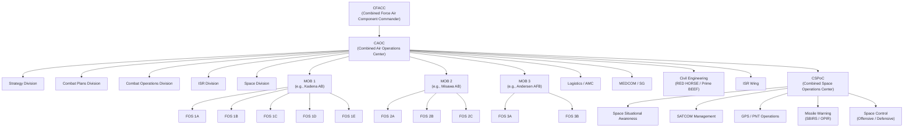
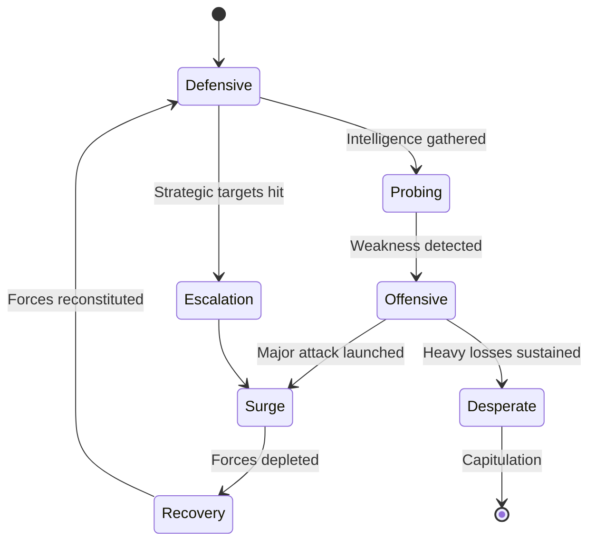
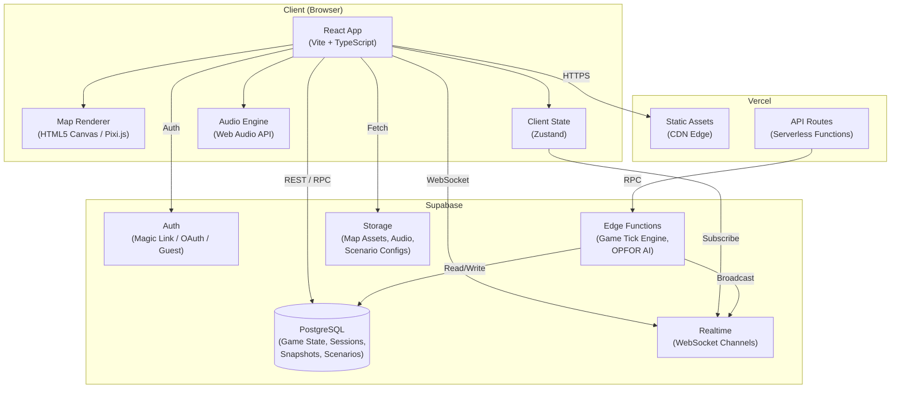
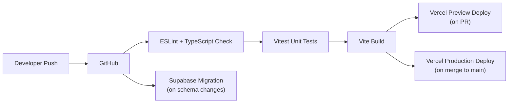

# AIR CONFLICTS — Game Design Document

**Version:** 1.0  
**Date:** June 4, 2026  
**Genre:** Real-Time Pausable Strategy / Multiplayer Operations Simulation  
**Platform:** PC (Web-based)  
**Players:** 4–9 cooperative (vs AI OPFOR)  
**Perspective:** 2D Top-Down  

---

## Table of Contents

1. [Executive Summary](#1-executive-summary)
2. [Game Pillars](#2-game-pillars)
3. [High Concept](#3-high-concept)
4. [USAF Operational Structure — Real World Reference](#4-usaf-operational-structure--real-world-reference)
5. [Player Roles ("Rooms")](#5-player-roles-rooms)
6. [Core Gameplay Loop](#6-core-gameplay-loop)
7. [Game Mechanics](#7-game-mechanics)
8. [The Air Tasking Order (ATO) Cycle](#8-the-air-tasking-order-ato-cycle)
9. [Units & Assets](#9-units--assets)
10. [Maps & Theaters of Operations](#10-maps--theaters-of-operations)
11. [OPFOR (Enemy AI)](#11-opfor-enemy-ai)
12. [Economy & Logistics Model](#12-economy--logistics-model)
13. [Damage, Repair & Attrition](#13-damage-repair--attrition)
14. [Communication & Coordination Systems](#14-communication--coordination-systems)
15. [Time & Pacing](#15-time--pacing)
16. [User Interface & Room Screens](#16-user-interface--room-screens)
17. [Art Style & Visual Design](#17-art-style--visual-design)
18. [Audio Design](#18-audio-design)
19. [Networking & Multiplayer Architecture](#19-networking--multiplayer-architecture)
20. [Victory & Loss Conditions](#20-victory--loss-conditions)
21. [Scenarios & Campaigns](#21-scenarios--campaigns)
22. [Accessibility & Onboarding](#22-accessibility--onboarding)
23. [Development Roadmap](#23-development-roadmap)
24. [Risk Assessment](#24-risk-assessment)
25. [Technology Stack](#25-technology-stack)

---

## 1. Executive Summary

**Air Conflicts** is a cooperative multiplayer real-time strategy game where 4–9 players each operate a distinct functional "room" within the United States Air Force and Space Force's theater-level command structure during a large-scale military conflict. Rather than controlling individual units on a battlefield, each player manages a specialized domain — air campaign planning, base operations, logistics, medical evacuation, intelligence, civil engineering, or space operations — and must **coordinate with other players** through realistic communication channels to prosecute an air campaign against an AI-driven enemy (OPFOR).

The game is played on large, realistic 2D top-down theater maps (South China Sea, Korean Peninsula, European Front, Middle East) and runs in **real-time with pause** functionality, allowing deliberate planning phases followed by tense execution windows.

> **The Core Fantasy:** You are not a lone general moving pieces on a board. You are *one officer in a machine*, and if your room fails, the entire campaign suffers. Victory requires every player doing their job — and talking to each other.

---

## 2. Game Pillars

### 🎖️ Authentic Operations
Mirror the real USAF command-and-control structure. Players should feel like they are staffing an actual CAOC or running a real Main Operating Base. Terminology, workflows, and organizational relationships should reflect doctrine (simplified for playability).

### 🤝 Cooperative Interdependence
No single player can win the game alone. The CAOC cannot launch sorties without fueled and armed aircraft from the MOBs. The MOBs cannot repair runways without Civil Engineering. MEDCOM cannot evacuate casualties without airlift from Logistics. Every role *needs* every other role.

### ⏱️ Tempo & Pressure
The ATO cycle creates a natural rhythm: plan → task → execute → assess. During execution windows, events cascade rapidly — SAM sites activate, aircraft take damage, runways get cratered, supplies run low. Players must triage, prioritize, and communicate under pressure.

### 🗺️ Theater-Scale Thinking
This is not a tactical dogfight game. Players think at the operational and strategic level: which targets matter most, how to sustain sortie generation rates, where to position assets for the next 24-hour cycle, how to absorb enemy strikes and keep operating.

---

## 3. High Concept

```
┌─────────────────────────────────────────────────────────────────┐
│                        THEATER MAP                              │
│                   (South China Sea, etc.)                        │
│                                                                 │
│   [OPFOR Territory]        ✈ ✈ ✈ ← Sortie Package              │
│     🔴 Targets             heading to target                    │
│     🔴 SAM Sites                                                │
│     🔴 Airfields                                                │
│                                                                 │
│   ─ ─ ─ ─ FORWARD LINE ─ ─ ─ ─ ─ ─ ─ ─ ─ ─ ─                 │
│                                                                 │
│   🟦 FOS Alpha  🟦 FOS Bravo    ← Forward Operating Sites      │
│                                                                 │
│   🟩 MOB Kadena    🟩 MOB Misawa   ← Main Operating Bases      │
│                                                                 │
│   🟨 CAOC (Al Udeid / Osan / Ramstein)  ← Command Center        │
│                                                                 │
│   🟪 Logistics Hub     🟫 MEDCOM       ← Support Functions      │
└─────────────────────────────────────────────────────────────────┘
```

Each player sees the **same theater map** but interacts with it through their **room-specific UI overlay**. The CAOC sees target priorities and ATO lines. The MOB commander sees their base layout, aircraft status, and maintenance queues. MEDCOM sees casualty reports and evacuation routes.

---

## 4. USAF Operational Structure — Real World Reference

The game's organizational model is derived from actual USAF and USSF (United States Space Force) doctrine. Below is the real-world structure simplified for gameplay:



### Key Doctrinal Concepts Modeled

| Concept | Real World | In-Game |
|---|---|---|
| **ATO (Air Tasking Order)** | 72-hour cycle document directing all air missions | Central mechanic — CAOC publishes ATOs that MOBs must execute |
| **SPINS (Special Instructions)** | Rules of engagement, airspace control | Modifiers CAOC can set that affect sortie behavior |
| **JFACC/CFACC** | Joint/Combined Force Air Component Commander | CAOC player's role |
| **Sortie Generation Rate** | How many sorties a base can produce per day | Key MOB metric — affected by maintenance, fuel, munitions, runway status |
| **BDA (Battle Damage Assessment)** | Post-strike evaluation of target destruction | ISR mechanic — determines if re-strikes are needed |
| **APOD/SPOD** | Aerial/Sea Ports of Debarkation | Logistics entry points on the map |
| **TPFDD** | Time-Phased Force Deployment Data | Logistics player's reinforcement schedule |
| **EMEDS/CASF** | Expeditionary Medical Squadron / Contingency Aeromedical Staging Facility | MEDCOM facilities at FOSs and MOBs |
| **CSPoC** | Combined Space Operations Center — coordinates all space operations in theater | CSPoC player's command center |
| **SSA** | Space Situational Awareness — tracking objects and threats in orbit | CSPoC mechanic — detects enemy ASAT threats |
| **SBIRS/OPIR** | Space-Based Infrared System / Overhead Persistent Infrared | CSPoC provides missile launch early warning to all rooms |
| **PNT** | Position, Navigation, and Timing (GPS) | CSPoC manages GPS constellation health — affects PGM accuracy |

---

## 5. Player Roles ("Rooms")

Each player occupies one **room** — a functional area with its own dedicated UI, responsibilities, and decision space. Rooms are designed so that no single room is more "fun" than others; each has its own tension, crises, and satisfaction loops.

---

### 5.1 🟨 Room 1: CAOC — Combined Air Operations Center

**Players:** 1 (Commander / CFACC role)  
**Fantasy:** *"You are the architect of the air campaign."*

#### Responsibilities
- **Campaign Strategy**: Set theater-level priorities — air superiority, interdiction, close air support, strategic attack
- **ATO Production**: Build and publish the Air Tasking Order each cycle, assigning mission types and target sets to specific MOBs/Wings
- **Airspace Management**: Designate kill boxes, restricted operating zones, air refueling tracks, and transit corridors
- **Target Prioritization**: Maintain the Joint Integrated Prioritized Target List (JIPTL) based on intelligence from the ISR room
- **Dynamic Retasking**: Redirect airborne assets during execution phase in response to pop-up threats or emerging targets
- **BDA Review**: Evaluate strike results reported by ISR and decide whether to re-strike targets

#### Key Metrics Displayed
- Theater Air Superiority Index (0–100%)
- Active sorties in flight
- Target coverage percentage
- ATO compliance rate (are MOBs meeting their tasked sorties?)

#### Failure Modes
- Publishing an ATO that demands more sorties than MOBs can generate → missions go unfilled
- Ignoring enemy air defenses → high attrition rates
- Poor airspace management → friendly fire / mid-air incidents
- Not coordinating with ISR → bombing already-destroyed or low-priority targets

---

### 5.2 🟩 Room 2–4: MOB — Main Operating Base (× up to 3 players)

**Players:** 1 per MOB (Wing Commander role)  
**Fantasy:** *"You keep the jets flying. If the flight line stops, the war stops."*

Each MOB represents a real or fictional air base with its own complement of aircraft, personnel, and infrastructure. Each MOB also manages **up to 5 Forward Operating Sites (FOSs)** — austere forward locations that extend the MOB's operational reach but require constant logistical support.

#### Responsibilities
- **Sortie Generation**: Prepare aircraft for missions tasked in the ATO — assign airframes, load munitions, schedule crews
- **Aircraft Maintenance**: Manage maintenance queues (scheduled inspections, battle damage repair, cannibalization for parts)
- **Munitions Management**: Track and allocate munitions stockpiles (JDAMs, AMRAAMs, fuel tanks, etc.) — request resupply from Logistics
- **Fuel Management**: Monitor JP-8 reserves; request tanker support or fuel convoys
- **Personnel / Crew Rest**: Track pilot fatigue, crew duty day limits, and manning levels — overtasking crews leads to accidents
- **Force Protection**: Manage base defense (ground-based air defense, hardened shelters, dispersal plans) to mitigate incoming enemy strikes
- **FOS Operations**: Deploy detachments to FOSs for forward staging — FOSs have limited infrastructure but put aircraft closer to targets

#### Base Layout (Sub-Screen)
Each MOB has an interactive base layout showing:
- Runway(s) and taxiways (can be cratered / repaired)
- Aircraft shelters and parking ramps
- Munitions storage areas (can be destroyed in attacks)
- Fuel storage (can be destroyed)
- Maintenance hangars
- Operations building
- Medical facility
- Power/Water infrastructure

#### Key Metrics Displayed
- Mission Capable (MC) rate per aircraft type
- Sortie generation rate (sorties/day)
- Fuel reserves (hours of operations remaining)
- Munitions stockpile by type
- Runway operational status
- Personnel readiness

#### Failure Modes
- Aircraft go "red" (not mission capable) faster than maintenance can turn them → sortie rate drops
- Running out of a specific munition type → cannot execute certain ATO missions
- Ignoring crew rest → increased accident rate / crew becomes unavailable
- Base gets hit and runways are cratered → no launches until CE repairs them
- FOS runs out of supplies and has no resupply route → forward ops collapse

---

### 5.3 🟪 Room 5: Logistics — Air Mobility & Supply

**Players:** 1 (Theater Logistics Commander / A4 role)  
**Fantasy:** *"Amateurs talk tactics. Professionals talk logistics."*

#### Responsibilities
- **Strategic Airlift**: Manage C-17 / C-130 fleet for moving supplies, equipment, and personnel between CONUS (continental US), theater hub, MOBs, and FOSs
- **Aerial Refueling**: Task and position KC-135 / KC-46 tanker aircraft to support ATO execution — without tankers, fighters can't reach distant targets
- **Supply Chain Management**: Fulfill resupply requests from MOBs (munitions, fuel, spare parts, rations, medical supplies)
- **TPFDD Execution**: Manage the flow of reinforcements and replacement equipment into theater on a time-phased schedule
- **Sealift Coordination**: Manage maritime prepositioning ships for bulk resupply (slower but larger capacity than airlift)
- **Route Planning**: Plan and protect logistics corridors — routes through contested airspace risk losing transports
- **Priority Allocation**: When demand exceeds airlift capacity (it always will), decide who gets what first

#### Key Metrics Displayed
- Airlift capacity (tons/day) available vs. requested
- Tanker availability and orbit coverage
- Supply pipeline status per MOB
- Resupply request queue (prioritized)
- Transport aircraft availability / maintenance status

#### Failure Modes
- MOBs run out of critical munitions → ATO missions cannot be armed
- Tankers not positioned correctly → fighters abort missions or run out of fuel
- Airlift overwhelmed → new equipment/personnel cannot reach theater
- Transport aircraft shot down on unescorted routes → cascading supply failures
- Prioritizing one MOB over another → creates political tension between players

---

### 5.4 🟫 Room 6: MEDCOM — Medical Command / Surgeon General

**Players:** 1 (Theater Surgeon General / SG role)  
**Fantasy:** *"Every number is a person. Every delay costs lives."*

#### Responsibilities
- **Casualty Tracking**: Monitor and manage all casualties across the theater — from flight crews shot down to ground personnel injured in base attacks
- **Aeromedical Evacuation (AE)**: Coordinate C-130 / C-17 AE missions to move patients from field facilities to higher-echelon care
- **EMEDS Management**: Staff and supply Expeditionary Medical Support facilities at MOBs and FOSs — each has limited bed capacity and surgical capability
- **CASF Operations**: Manage Contingency Aeromedical Staging Facilities at aerial ports for patient staging
- **Triage & Prioritization**: Categorize casualties (urgent, priority, routine, expectant) and allocate limited medical resources
- **CSAR Coordination**: Coordinate Combat Search and Rescue for downed aircrew — request helicopters/aircraft from CAOC, mark survivor locations
- **Medical Supply Requests**: Request medical supplies from Logistics — blood, surgical kits, pharmaceuticals
- **Mental Health & Morale**: Track overall force morale; sustained high casualties degrade performance across all rooms

#### Key Metrics Displayed
- Total casualties (KIA, WIA, MIA by location)
- CSAR missions active / pending
- Medical facility capacity (beds available / occupied per location)
- AE pipeline status
- Force morale index

#### Failure Modes
- CSAR not launched for downed crew → crew becomes POW/KIA, devastating to morale
- Medical facilities overwhelmed → increased mortality rate
- No medical supplies → surgeries fail, preventable deaths
- Ignoring morale → performance debuffs across all rooms
- AE aircraft not available (need coordination with Logistics) → patients stuck at field facilities

---

### 5.5 🟧 Room 7: CE — Civil Engineering (RED HORSE / Prime BEEF)

**Players:** 1 (Base Engineer / CE role)  
**Fantasy:** *"They break it. You fix it. On a clock. Under fire."*

#### Responsibilities
- **Runway Repair**: After enemy strikes crater runways, deploy Rapid Airfield Damage Repair (RADR) teams to restore operations — this directly gates whether MOBs can launch sorties
- **Infrastructure Repair**: Repair damaged fuel storage, munitions bunkers, hangars, power systems, water treatment, and communications infrastructure
- **Fortification**: Build / upgrade hardened aircraft shelters, revetments, blast walls, and bunkers to reduce damage from future attacks
- **FOS Construction**: Build up FOSs from bare bases — construct runway surfaces, fuel bladders, tent cities, and basic infrastructure
- **CBRN Response**: Respond to chemical/biological/radiological attacks — decontaminate areas and personnel, establish clean zones
- **Resource Management**: Manage construction materials, heavy equipment, and engineering personnel across all bases
- **Prioritization**: Decide which repairs are most critical — runway vs. fuel storage vs. medical facility — in coordination with MOB commanders

#### Key Metrics Displayed
- Repair queue (by base, by priority)
- Engineering team deployment status
- Construction material stockpile
- Base damage status overview (all bases)
- Estimated repair completion times

#### Failure Modes
- Runway not repaired → MOB cannot launch or recover aircraft
- Fuel storage destroyed and not repaired → even if fuel is delivered, it can't be stored
- Engineering teams spread too thin → everything takes too long
- Neglecting fortification → enemy follow-up strikes cause disproportionate damage
- Construction materials exhausted → need resupply from Logistics

---

### 5.6 🟦 Room 8: ISR — Intelligence, Surveillance & Reconnaissance

**Players:** 1 (ISR Commander / A2 role)  
**Fantasy:** *"You are the eyes of the campaign. What you don't see will kill your people."*

#### Responsibilities
- **ISR Collection Planning**: Task reconnaissance assets (RQ-4 Global Hawk, MQ-9 Reaper, U-2, satellites) to collect intelligence on enemy forces
- **Target Development**: Identify, validate, and nominate targets for the JIPTL — provide targeting data to CAOC
- **Battle Damage Assessment (BDA)**: Post-strike assessment of targets — determine if targets were destroyed, damaged, or missed
- **Threat Warning**: Detect enemy force movements, missile launches, incoming air raids, and CBRN threats — provide early warning to all rooms
- **Electronic Order of Battle**: Track enemy air defense network (SAM sites, radar installations, EW systems) — feed to CAOC for SEAD/DEAD planning
- **Weather Forecasting**: Provide weather data that affects sortie planning (cloud cover, visibility, winds, icing)
- **SIGINT/ELINT**: Monitor enemy communications and electronic emissions for intelligence
- **Fog of War Management**: The theater map starts partially obscured; ISR operations reveal enemy positions and movements

#### Key Metrics Displayed
- ISR coverage map overlay (what areas are currently observed)
- Known vs. suspected enemy Order of Battle
- Active ISR platforms and their orbits
- Pending BDA assessments
- Threat warning status (DEFCON-like alert level)
- Weather forecast overlay

#### Failure Modes
- Not enough ISR coverage → CAOC strikes unknown/empty targets, wastes sorties
- Missing enemy force movements → surprise attacks on bases
- Bad BDA → re-striking already destroyed targets or failing to re-strike surviving ones
- ISR platforms shot down in contested airspace → intelligence blackout
- Ignoring weather → sorties launched into unsurvivable conditions

---

### 5.7 🛰️ Room 9: CSPoC — Combined Space Operations Center

**Players:** 1 (Space Operations Commander / USSF role)  
**Fantasy:** *"You own the high ground — 22,000 miles above the battlefield. Without you, GPS goes dark, missiles arrive without warning, and the CAOC goes blind."*

The CSPoC represents the United States Space Force's contribution to the air campaign. In modern warfare, nearly every aspect of air operations depends on space-based assets — GPS-guided weapons, satellite communications, missile warning, weather imaging, and ISR. The CSPoC player ensures these capabilities remain available, manages the satellite constellation under threat, and provides critical space-derived services to all other rooms.

#### Responsibilities
- **GPS/PNT Management**: Monitor and maintain the GPS constellation's health over the theater. GPS accuracy directly affects PGM (precision guided munition) effectiveness. If satellites are degraded or jammed, PGMs become less accurate or inoperable — MOBs must switch to unguided weapons or abort strikes
- **Missile Warning (SBIRS/OPIR)**: Operate the Space-Based Infrared System to detect enemy ballistic and cruise missile launches. Provide early warning to all bases — seconds to minutes of warning that allows force protection measures, aircraft scrambles, and personnel sheltering. Without CSPoC, missile attacks arrive with zero warning
- **SATCOM Management**: Allocate satellite communications bandwidth across the theater. All rooms depend on SATCOM for data links, command-and-control, and real-time coordination. CSPoC must prioritize bandwidth when demand exceeds capacity (it always does during surges) and reroute through alternative satellites when assets are degraded
- **Space Situational Awareness (SSA)**: Track all objects in orbit — friendly satellites, adversary satellites, debris, and potential ASAT threats. Maintain the Orbital Order of Battle and identify when enemy satellites are maneuvering into hostile positions
- **Space Control (Defensive)**: Protect friendly satellites from enemy ASAT attacks. Defensive measures include orbital maneuvering (repositioning satellites to avoid threats), signal hardening, switching to backup constellations, and coordinating with ground-based EW to counter uplink jamming
- **Space Control (Offensive)**: When authorized by CAOC, execute offensive space operations — electronic attack against enemy satellites (jamming, spoofing), and coordinate ground-based ASAT actions. These are high-consequence decisions with escalation implications
- **Space-Based ISR Coordination**: Task spy satellites and overhead imagery assets for collection passes over target areas. Coordinate with the ISR room to fill collection gaps that airborne ISR cannot cover (denied airspace, weather-obscured areas, deep enemy territory)
- **Space Tasking Order (STO)**: Build and publish the STO each cycle — analogous to the ATO but for space operations. Includes satellite tasking, orbital maneuvers, SATCOM allocation, and defensive posture directives

#### Space Assets Managed

| Asset | Type | Quantity | Role |
|---|---|---|---|
| GPS III Satellites | Navigation | 24–31 constellation | Provide PNT to all GPS-guided weapons and navigation systems |
| SBIRS GEO | Missile Warning | 4–6 | Geosynchronous orbit IR sensors detect missile launches |
| SBIRS HEO | Missile Warning | 2–4 | Highly elliptical orbit, polar coverage |
| WGS (Wideband Global SATCOM) | Communications | 4–6 | High-bandwidth military SATCOM |
| AEHF (Advanced EHF) | Secure Communications | 3–4 | Nuclear-survivable, jam-resistant command links |
| Imagery Satellites | ISR | 4–8 | Electro-optical and radar imaging (classified analogs) |
| Weather Satellites | Meteorological | 2–4 | Provide theater weather data (supplements ISR weather) |
| Space Surveillance Sensors | SSA | Ground-based | Radars and telescopes tracking orbital objects |

#### Key Metrics Displayed
- GPS constellation health (satellites operational / total, accuracy level by theater zone)
- SBIRS missile warning status (all sensors green/yellow/red, detection latency)
- SATCOM bandwidth utilization (allocated / available / demanded by room)
- Active orbital threats (enemy ASAT systems, suspicious satellite maneuvers)
- Satellite revisit schedule (next imagery pass over key target areas)
- Space control posture (DEFCON-like space threat level)

#### Interdependencies With Other Rooms

| Room | CSPoC Provides | CSPoC Receives |
|---|---|---|
| **CAOC** | GPS accuracy status (affects ATO weapon selection), missile warning, SATCOM for C2 | Authorization for offensive space ops, priority guidance |
| **MOBs** | GPS status for PGM loadout decisions, missile warning for force protection | Requests for SATCOM bandwidth, GPS accuracy reports from field units |
| **Logistics** | SATCOM for logistics coordination, satellite weather for route planning | Nothing directly |
| **MEDCOM** | Missile warning enables casualty prevention | Nothing directly |
| **CE** | Missile warning enables pre-attack sheltering and post-attack triage prioritization | Nothing directly |
| **ISR** | Satellite imagery collection, orbital SIGINT, space-based weather | ISR collection requests for satellite passes, SIGINT coordination |

#### Failure Modes
- **GPS degradation** → PGM accuracy drops theater-wide, MOBs forced to use unguided munitions (less effective, higher collateral damage risk) or abort precision strike missions entirely
- **SBIRS offline** → No missile launch warning — enemy missile attacks arrive without any advance notice, catastrophic base damage with no time to shelter personnel or scramble aircraft
- **SATCOM saturation** → Communication bandwidth insufficient — rooms experience delayed information, coordination breaks down, real-time retasking becomes impossible
- **Satellite lost to ASAT** → Permanent capability gap until replacement (no replacement available in-game — satellites are irreplaceable strategic assets). Cascading effects depending on satellite type
- **Ignoring orbital threats** → Enemy maneuvers ASAT co-orbital weapon into kill position, destroys critical satellite
- **SATCOM misallocation** → Prioritizing one room's bandwidth needs starves others — logistics coordination fails, CAOC loses contact with airborne assets

---

### 5.8 Role Scaling (Player Count)

The game adapts to different player counts by combining or splitting roles:

| Players | Room Assignment |
|---------|----------------|
| **4** (Minimum) | CAOC + ISR + CSPoC combined, MOB ×2, Logistics + CE combined, MEDCOM (simplified) |
| **5** | CAOC + CSPoC combined, MOB ×2, Logistics + CE combined, MEDCOM + ISR combined |
| **6** | CAOC, MOB ×2, Logistics + CE combined, MEDCOM + ISR combined, CSPoC (simplified) |
| **7** (Standard) | CAOC, MOB ×2, Logistics, CE + MEDCOM combined, ISR + CSPoC combined |
| **8** | CAOC, MOB ×3, Logistics, CE, MEDCOM, ISR + CSPoC combined |
| **9** (Full) | CAOC, MOB ×3, Logistics, CE, MEDCOM, ISR, CSPoC |

When roles are combined, the combined room gets a tabbed interface for both function areas, with AI assistants helping manage the secondary role. CSPoC integrates naturally with ISR when combined, as both deal with sensor coverage and situational awareness.

---

## 6. Core Gameplay Loop

The game operates on a cyclical structure inspired by the real ATO cycle, compressed for playability:

```
┌──────────────────────────────────────────────────────┐
│                                                      │
│   ┌──────────┐    ┌──────────┐    ┌──────────┐      │
│   │  PHASE 1 │───▶│  PHASE 2 │───▶│  PHASE 3 │──┐   │
│   │ PLANNING │    │EXECUTION │    │  ASSESS  │  │   │
│   │(Pausable)│    │(Real-Time│    │(Pausable)│  │   │
│   │          │    │ Accel.)  │    │          │  │   │
│   └──────────┘    └──────────┘    └──────────┘  │   │
│        ▲                                        │   │
│        └────────────────────────────────────────┘   │
│                   ≈ 1 ATO CYCLE                      │
│             (represents ~24 hours in-game)            │
└──────────────────────────────────────────────────────┘
```

### Phase 1: Planning (5–15 min real-time, pausable)

All rooms work simultaneously to prepare for the next cycle:

| Room | Planning Phase Activity |
|------|----------------------|
| **CAOC** | Builds ATO: assigns target sets, mission types, and allocations to MOBs |
| **MOBs** | Reviews incoming ATO, assesses aircraft/munition/fuel availability, flags shortfalls |
| **Logistics** | Reviews resupply requests, plans tanker orbits, schedules airlift |
| **MEDCOM** | Reviews casualty status, plans AE missions, requests medical supplies |
| **CE** | Prioritizes repair queue, deploys engineering teams |
| **ISR** | Plans ISR collection orbits, briefs latest intelligence, updates threat picture |
| **CSPoC** | Updates satellite constellation status, plans orbital maneuvers, assesses GPS/SATCOM health, briefs missile warning posture |

**Key Mechanic:** The CAOC publishes a **draft ATO** that other rooms can review and **flag conflicts** (e.g., "We don't have enough JDAMs for 12 JDAM sorties, only 8"). The CAOC must resolve conflicts before finalizing.

### Phase 2: Execution (10–20 min real-time, time-accelerated)

The ATO goes "live." Aircraft launch, fly missions, engage targets, and return. Events cascade:
- Enemy reacts — launches counter-strikes, activates new SAM sites, scrambles interceptors
- Aircraft take damage, some are shot down, crews eject
- Bases get attacked — runways cratered, facilities damaged, casualties inflicted
- Weather changes — missions may need to divert
- Intelligence reveals new information — CAOC may need to retask airborne assets
- Supplies are consumed — fuel and munitions deplete

**All rooms are active simultaneously during execution**, managing their domains in real-time.

### Phase 3: Assessment (5–10 min, pausable)

The cycle concludes. All rooms review what happened:
- **ISR** delivers BDA reports — what targets were destroyed, damaged, or missed
- **MOBs** report aircraft status — losses, damage, maintenance needs
- **MEDCOM** reports casualties and CSAR status
- **CE** reports base damage and repair estimates
- **Logistics** reports supply consumption and pipeline status
- **CSPoC** reports satellite constellation health, any orbital threats or degradations, GPS/PGM accuracy status
- **CAOC** evaluates campaign progress against objectives

This feeds directly into the next cycle's planning phase.

---

## 7. Game Mechanics

### 7.1 Sortie Generation

The fundamental currency of the air campaign. A **sortie** is one aircraft flying one mission.

```
Sortie Generation Rate = f(
    Mission Capable Aircraft,
    Available Pilots (not fatigued/injured),
    Fuel Reserves,
    Munitions (correct type for mission),
    Runway Status (operational / degraded / denied),
    Maintenance Capacity,
    Weather
)
```

MOB commanders must balance:
- **Surge rate** (max sorties in short period — exhausts crews and maintenance)
- **Sustainable rate** (steady pace that can be maintained indefinitely)
- **Recovery rate** (reduced ops to let maintenance catch up)

### 7.2 Air-to-Air Combat (Abstracted)

Air combat is **not** directly player-controlled. When friendly and enemy aircraft meet:

1. System calculates engagement based on:
   - Aircraft type matchup (F-22 vs Su-35, etc.)
   - Numbers on each side
   - Weapons loadout
   - Electronic warfare factors
   - AWACS/GCI support (ISR coverage)
   - Rules of engagement (CAOC SPINS)
2. Results are generated with probabilistic outcomes
3. Players see results reported as combat logs and map icons

**Player influence on air combat:**
- CAOC: Which aircraft types to send, escort ratios, SEAD support
- MOB: Aircraft readiness, weapons loadout selection, crew quality
- ISR: Threat warning, AWACS coverage, EW support

### 7.3 Air-to-Ground Strikes (Abstracted)

Strike missions follow a similar abstracted model:

**Strike effectiveness** = f(weapon type, weather, target hardness, SEAD suppression, BDA accuracy, crew quality)

- Precision Guided Munitions (PGMs) → high effectiveness, limited supply
- Unguided munitions → lower effectiveness, abundant supply
- Standoff weapons (JASSM, JSOW) → can strike from outside SAM range, very limited supply

### 7.4 Enemy Air Strikes on Bases

The OPFOR will periodically attack player bases with:
- Ballistic missiles (DF-21, Scuds, Iskanders depending on theater)
- Cruise missiles (CJ-10, Kalibr, etc.)
- Bomber raids
- Special operations forces (sabotage)

**Damage Model:**
Each base has a grid of facilities. Incoming strikes hit grid squares with a CEP (Circular Error Probable) model. Damage is calculated per-facility:

| Facility | Effect When Damaged | Effect When Destroyed |
|---|---|---|
| Runway | Sortie rate reduced 50% | No launches/recoveries |
| Fuel Storage | Fuel leak (reserves drain) | No fuel available |
| Munitions Storage | Some munitions destroyed | All munitions lost (explosion) |
| Aircraft Shelter | 30% chance parked aircraft damaged | 80% chance aircraft destroyed |
| Maintenance Hangar | Maintenance rate reduced | Cannot perform heavy maintenance |
| Operations Building | Communications degraded | Coordination debuff |
| Medical Facility | Medical capacity reduced | No on-base medical care |
| Power Plant | All facilities operate at reduced efficiency | Base-wide shutdown until generator backup |
| Comms Tower | Delayed information updates | Room goes "offline" temporarily |

**Hardened shelters** reduce damage probability. **Dispersal** (spreading aircraft across parking areas) reduces losses but increases taxi time.

### 7.5 Crew Management

Pilots and ground crews are finite resources with human limitations:

- **Crew Duty Day**: Pilots have a maximum 12-hour duty day (configurable). Exceeding it increases accident probability
- **Crew Rest**: Minimum 12 hours between duty periods
- **Fatigue Accumulation**: Even within duty limits, sustained high tempo degrades performance over days
- **Qualification Levels**: Green (new), Experienced, Veteran, Instructor — affects mission success probability
- **Casualties**: Lost pilots must be replaced from theater reserves or CONUS pipeline (slow)

### 7.6 Weather System

Dynamic weather affects operations:

| Condition | Effect |
|---|---|
| Clear | Normal operations |
| Scattered Clouds | Slightly reduced precision for unguided weapons |
| Overcast | No visual bombing, PGMs only, ISR degraded |
| Thunderstorms | No operations in affected area, aircraft must divert |
| Typhoon/Hurricane | All operations cease at affected bases |
| Fog | No takeoff/landing at affected bases |
| Icing | High-altitude operations restricted, increased maintenance |

Weather forecasts are provided by ISR with a **reliability rating** — forecasts further in the future are less reliable, sometimes wrong.

---

## 8. The Air Tasking Order (ATO) Cycle

The ATO is the central coordinating document of the game. Here's how the cycle works in detail:

### 8.1 ATO Construction (CAOC)

The CAOC player builds the ATO using a drag-and-drop interface:

```
┌─────────────────────────────────────────────────┐
│              ATO BUILDER INTERFACE               │
├─────────────────────────────────────────────────┤
│                                                 │
│  MISSION PACKAGES:                              │
│  ┌─────────────────────────────────────────┐    │
│  │ PKG 1: OCA Strike — Longtian Airfield   │    │
│  │   4× F-15E (MOB Kadena) — JDAM ×8      │    │
│  │   2× F-22 (MOB Kadena) — Escort         │    │
│  │   1× EA-18G (MOB Misawa) — SEAD        │    │
│  │   TOT: 0600Z  Priority: HIGH            │    │
│  └─────────────────────────────────────────┘    │
│  ┌─────────────────────────────────────────┐    │
│  │ PKG 2: DCA CAP — Sector 7              │    │
│  │   4× F-35A (MOB Misawa) — AIM-120 ×4   │    │
│  │   Station Time: 0400Z–0800Z            │    │
│  │   Priority: CRITICAL                    │    │
│  └─────────────────────────────────────────┘    │
│  ...                                            │
│                                                 │
│  TANKER SUPPORT REQUIRED:                       │
│  AR Track Alpha: 2× KC-135 (0300Z–1200Z)      │
│  AR Track Bravo: 1× KC-46 (0500Z–1000Z)       │
│                                                 │
│  [PUBLISH DRAFT] [FINALIZE ATO]                │
└─────────────────────────────────────────────────┘
```

### 8.2 ATO Review (All Rooms)

When CAOC publishes a draft:
- **MOBs** see their tasked missions highlighted, with automated feasibility checks:
  - ✅ "4× F-15E available, 8× JDAM in stock"
  - ⚠️ "Only 3× F-35A mission-capable, need 4"  
  - ❌ "Runway cratered — cannot launch until repaired (~4 hrs)"
- **Logistics** sees tanker requirements and any special airlift needs
- **ISR** sees BDA requirements and collection needs
- Players can send **objections** or **modification requests** back to CAOC

### 8.3 ATO Execution

Once finalized, missions execute automatically on their timeline. Players monitor and respond to events:
- Aircraft taxi, take off, transit, execute missions, return
- The map shows aircraft positions, mission routes, and target areas
- **Dynamic retasking** allows CAOC to redirect airborne assets to new targets (costs time and fuel)

---

## 9. Units & Assets

### 9.1 Fighter / Attack Aircraft

| Aircraft | Role | Range | Payload | Stealth | Notes |
|---|---|---|---|---|---|
| F-22A Raptor | Air Superiority | Medium | 6 AIM-120, 2 AIM-9 | High | Best A2A, limited numbers, high maintenance |
| F-35A Lightning II | Multi-Role | Long | 4 AIM-120 / 2 JDAM (internal) | High | Versatile, sensor fusion, moderate maintenance |
| F-15E Strike Eagle | Deep Strike | Long | 12× JDAM or 24× Mk82 | None | Heavy payload, reliable workhorse |
| F-15EX Eagle II | Multi-Role | Long | 12 AIM-120 / mixed | None | Updated F-15, high weapon capacity |
| F-16C/D Viper | Multi-Role | Medium | 6× various | None | Abundant, flexible, good sortie rate |
| A-10C Thunderbolt II | CAS | Short | 16× Mk82 / GAU-8 | None | Devastating CAS, vulnerable to modern SAMs |
| F/A-18E/F Super Hornet | Multi-Role | Medium | Mixed | Low | Navy asset, carrier-deployable |
| EA-18G Growler | Electronic Attack | Medium | HARM + ECM pods | Low | Critical for SEAD/EW |

### 9.2 Bomber Aircraft

| Aircraft | Role | Range | Payload | Stealth | Notes |
|---|---|---|---|---|---|
| B-2A Spirit | Strategic Strike | Very Long | 80× JDAM or 16× JASSM | Very High | Extremely limited numbers, devastating |
| B-1B Lancer | Deep Strike | Very Long | 84× Mk82 or 24× JASSM | Low | High payload, conventional only |
| B-52H Stratofortress | Stand-off Strike | Very Long | 20× JASSM / CALCM | None | Standoff platform, ALCM carrier |

### 9.3 ISR / Support Aircraft

| Aircraft | Role | Endurance | Notes |
|---|---|---|---|
| RQ-4 Global Hawk | High-Alt ISR | 30+ hrs | Broad area surveillance, vulnerable to fighters |
| MQ-9 Reaper | Medium-Alt ISR / Strike | 14 hrs | Persistent surveillance, light strike capability |
| U-2S Dragon Lady | High-Alt ISR | 12 hrs | Highest resolution imagery, very limited numbers |
| E-3 AWACS | Airborne Early Warning | 8 hrs | Critical for air battle management |
| E-8 JSTARS | Ground Surveillance | 8 hrs | Tracks ground targets and vehicles |
| RC-135 Rivet Joint | SIGINT | 10 hrs | Intercepts enemy communications |

### 9.4 Tanker / Airlift Aircraft

| Aircraft | Role | Capacity | Notes |
|---|---|---|---|
| KC-135 Stratotanker | Aerial Refueling | 200,000 lbs fuel | Workhorse tanker, aging fleet |
| KC-46 Pegasus | Aerial Refueling | 212,000 lbs fuel | Modern tanker, boom + drogue |
| C-17 Globemaster III | Strategic Airlift | 170,900 lbs cargo | Can land on austere fields |
| C-130J Super Hercules | Tactical Airlift | 42,000 lbs cargo | FOS resupply, AE missions, versatile |
| C-5M Super Galaxy | Strategic Airlift | 281,000 lbs cargo | Outsized cargo, limited to major airfields |

### 9.5 Munitions

| Munition | Type | Guidance | Weight | Stock Level | Notes |
|---|---|---|---|---|---|
| AIM-120D AMRAAM | A2A | Active Radar | 335 lbs | Medium | Primary BVR missile |
| AIM-9X Sidewinder | A2A | IR | 188 lbs | High | WVR, high off-boresight |
| GBU-31 JDAM | A2G PGM | GPS/INS | 2,000 lbs | Medium | All-weather precision |
| GBU-38 JDAM | A2G PGM | GPS/INS | 500 lbs | High | Lighter JDAM variant |
| GBU-39 SDB | A2G PGM | GPS/INS | 250 lbs | Medium | Small Diameter Bomb, long glide range |
| AGM-158 JASSM | Stand-off | GPS/INS + IR | 2,250 lbs | Low | Stealth cruise missile, 230+ nm range |
| AGM-88 HARM | Anti-Radiation | Radar-homing | 800 lbs | Medium | Targets enemy radars (SEAD) |
| Mk-82/84 | A2G Unguided | None | 500/2,000 lbs | Very High | Cheap, inaccurate, abundant |
| CBU-105 | A2G Cluster | IR + Radar | 927 lbs | Low | Anti-armor, very effective but controversial |

Munitions are **finite and consumable**. Resupply comes through the Logistics pipeline and takes real time to arrive.

---

## 10. Maps & Theaters of Operations

Each map represents a realistic theater with real geography, real bases (or plausible fictional analogs), and a relevant adversary.

---

### 10.1 🌏 Pacific Theater: South China Sea & Japan

**OPFOR:** People's Liberation Army Air Force (PLAAF) + PLA Navy Air Force + PLA Rocket Force  
**Scale:** ~2,500 × 1,800 km  
**Scenario:** Chinese military action in the South China Sea / Taiwan Strait crisis

#### Friendly Bases
| Base | Type | Location | Aircraft Capacity | Notes |
|---|---|---|---|---|
| Kadena AB | MOB | Okinawa, Japan | 72 aircraft | Closest major base, high threat |
| Misawa AB | MOB | Northern Honshu, Japan | 54 aircraft | F-16/F-35 wing |
| Andersen AFB | MOB | Guam | 60 aircraft | Bomber hub, outside most missile range |
| Iwakuni MCAS | FOS | Western Honshu | 24 aircraft | Marine F-35B capable |
| Tinian North Field | FOS | Mariana Islands | 12 aircraft | Austere dispersal field |
| Palau IAP | FOS | Palau | 8 aircraft | Emergency divert / forward staging |

#### OPFOR Forces
- 600+ combat aircraft (J-20, J-16, J-10C, H-6K bombers)
- Extensive IADS (S-400, HQ-9, HQ-22)
- DF-21D/DF-26 anti-ship ballistic missiles (threaten bases)
- PL-15 long-range A2A missiles
- Large submarine and surface fleet (anti-access)

#### Map Features
- Taiwan (ally, limited basing available)
- Philippine Sea (vast ocean distances)
- First Island Chain (key terrain)
- Major shipping lanes (civilian traffic to avoid)
- Typhoon season weather events

#### Unique Challenges
- **Tyranny of distance**: Extreme ranges require heavy tanker support
- **Missile threat**: Kadena and Misawa within range of PLA ballistic missiles
- **Dispersal necessity**: Must spread aircraft across many FOSs to survive missile barrages
- **Limited logistics**: Everything comes by air or sea across the Pacific

---

### 10.2 🌏 Korean Peninsula

**OPFOR:** Korean People's Army Air Force (KPAAF) + KPA Ground Forces  
**Scale:** ~800 × 600 km  
**Scenario:** North Korean large-scale invasion of South Korea

#### Friendly Bases
| Base | Type | Location | Aircraft Capacity | Notes |
|---|---|---|---|---|
| Osan AB | MOB | South Korea (near Seoul) | 54 aircraft | CAOC location, close to DMZ |
| Kunsan AB | MOB | South Korea (west coast) | 48 aircraft | F-16 wing |
| Gimhae AB | MOB | South Korea (southeast) | 36 aircraft | ROK Air Force cooperation |
| Suwon AB | FOS | South Korea | 24 aircraft | Forward dispersal |
| Gwangju AB | FOS | South Korea (south) | 24 aircraft | Rear staging |
| Yokota AB | MOB | Japan | 36 aircraft | Rear logistics hub |

#### OPFOR Forces
- 800+ combat aircraft (MiG-29, Su-25, J-7, aging but numerous)
- Massive artillery (13,000+ tubes targeting Seoul)
- Dense low-altitude air defense (AAA, MANPADS)
- Hardened underground aircraft shelters
- Special operations infiltration capability

#### Map Features
- DMZ / Forward Edge of Battle Area (FEBA)
- Seoul metropolitan area (collateral damage concern)
- Mountainous terrain (radar shadows, difficult rescue)
- Dense air defense environment along the DMZ
- Underground facilities (hard targets)

#### Unique Challenges
- **Proximity**: Bases very close to enemy — short warning time
- **Volume of targets**: Massive number of artillery positions to suppress
- **CAS demand**: Ground force support is critical and constant
- **SOF threats**: Enemy special forces may attack bases directly
- **Civilian considerations**: Seoul's population constrains operations

---

### 10.3 🌍 European Theater: NATO Eastern Front

**OPFOR:** Russian Aerospace Forces (VKS) + Russian Ground Forces  
**Scale:** ~2,000 × 1,500 km  
**Scenario:** Russian aggression against NATO Baltic States / Poland

#### Friendly Bases
| Base | Type | Location | Aircraft Capacity | Notes |
|---|---|---|---|---|
| Ramstein AB | MOB | Germany | 72 aircraft | CAOC location, major hub |
| RAF Lakenheath | MOB | United Kingdom | 54 aircraft | F-15E / F-35A wing |
| Spangdahlem AB | MOB | Germany | 48 aircraft | F-16 wing |
| Łask AB | FOS | Poland | 24 aircraft | Forward rotation base |
| Ämari AB | FOS | Estonia | 12 aircraft | NATO Air Policing, high threat |
| Šiauliai AB | FOS | Lithuania | 12 aircraft | NATO Air Policing |

#### OPFOR Forces
- 300+ combat aircraft (Su-35, Su-34, Su-57, MiG-31)
- S-400 / S-300V4 air defense systems
- Iskander ballistic missiles (target NATO bases)
- Kaliningrad A2/AD bastion (denies airspace)
- Long-range cruise missiles (Kalibr, Kh-101)

#### Map Features
- Kaliningrad exclave (heavily fortified)
- Suwalki Gap (critical NATO chokepoint)
- Baltic Sea (naval/air domain)
- Dense European airspace (civilian traffic management)
- NATO Article 5 political layer

#### Unique Challenges
- **Kaliningrad A2/AD bubble**: Must suppress before air operations over Baltics
- **Nuclear escalation risk**: Hitting certain targets has political consequences (gameplay modifier)
- **Coalition complexity**: Multiple NATO nations' aircraft — coordination overhead
- **Logistics depth**: Good infrastructure but targets for cruise missiles
- **Civilian airspace**: Managing civil aviation creates constraints

---

### 10.4 🌍 Middle East Theater: Gulf Region

**OPFOR:** Fictional near-peer state ("Khadestan") with Iranian-style military  
**Scale:** ~1,500 × 1,200 km  
**Scenario:** Major regional conflict in the Persian Gulf / Strait of Hormuz crisis

#### Friendly Bases
| Base | Type | Location | Aircraft Capacity | Notes |
|---|---|---|---|---|
| Al Udeid AB | MOB | Qatar | 120 aircraft | CAOC location, massive hub |
| Al Dhafra AB | MOB | UAE | 72 aircraft | Stealth / ISR hub |
| Prince Sultan AB | MOB | Saudi Arabia | 60 aircraft | Deep south staging |
| Ali Al Salem AB | FOS | Kuwait | 24 aircraft | CAS forward base |
| Al Minhad AB | FOS | UAE | 24 aircraft | Special ops support |
| Thumrait AB | FOS | Oman | 18 aircraft | Bomber recovery |

#### OPFOR Forces
- 400+ combat aircraft (Su-30, MiG-29M, Chinese-origin J-10)
- Extensive IADS (S-300PMU2, Buk-M2, Tor-M1)
- Ballistic missiles (Shahab-3 / Fateh-110 analogs)
- Anti-ship cruise missiles (Strait of Hormuz mining)
- Drone swarms (small UAS harassment)
- Proxy forces (asymmetric attacks on bases)

#### Map Features
- Strait of Hormuz (critical chokepoint)
- Desert terrain (good visibility, few landmarks)
- Oil infrastructure (collateral damage consequences)
- Mountain ranges (radar shadows, adversary hideouts)
- Extreme heat (affects personnel, aircraft performance)

#### Unique Challenges
- **Drone swarm threat**: Small UAS saturate base defenses
- **Chemical weapons risk**: OPFOR may use chemical weapons on bases
- **Oil infrastructure protection**: Destroying enemy assets near oil fields has strategic consequences
- **Heat**: Aircraft performance degraded, personnel fatigue accelerated
- **Long distances**: Vast desert creates logistics challenges

---

## 11. OPFOR (Enemy AI)

The enemy is entirely AI-controlled and operates as a dynamic, adaptive adversary.

### 11.1 AI Behavior Model

The OPFOR AI follows a **state-based decision model** with strategic, operational, and tactical layers:



### 11.2 OPFOR Capabilities

| Capability | Effect |
|---|---|
| **Air Strikes** | Bomber and fighter-bomber attacks on player bases |
| **Missile Strikes** | Ballistic and cruise missile attacks (hardest to defend) |
| **Air Superiority Sweeps** | Fighter patrols attempting to intercept player aircraft |
| **SAM Ambushes** | Hiding mobile SAM systems and activating them when player aircraft are in range |
| **Electronic Warfare** | Jamming player radars, communications, GPS |
| **Deception** | Decoy targets, false emissions, dummy airfields |
| **SOF/Sabotage** | Ground attacks on forward operating sites |
| **CBRN** | Chemical/biological attacks on bases (theater-dependent) |

### 11.3 Difficulty Scaling

| Difficulty | OPFOR Behavior |
|---|---|
| **Cadet** | Predictable, limited missiles, slow reaction, weak IADS |
| **Regular** | Standard doctrine, moderate missile inventory, reactive |
| **Veteran** | Adaptive tactics, missile saturation attacks, mobile SAMs |
| **Ace** | Aggressive, deceptive, coordinated multi-axis attacks, hardened IADS |
| **Nightmare** | Near-peer capability, overwhelming missile salvos, advanced EW, AI learns from player patterns |

---

## 12. Economy & Logistics Model

There is no "gold" currency. The economy is entirely based on **physical resources** that must be physically moved:

### 12.1 Resource Types

| Resource | Unit | Consumed By | Source |
|---|---|---|---|
| JP-8 (Fuel) | Gallons | All aircraft operations | Logistics pipeline, local reserves |
| Munitions (by type) | Individual weapons | Combat sorties | Logistics pipeline, prepositioned stocks |
| Spare Parts | Maintenance Units (MU) | Aircraft maintenance | Logistics pipeline |
| Construction Materials | Engineering Units (EU) | Base repair/construction | Logistics pipeline |
| Medical Supplies | Medical Units | Casualty treatment | Logistics pipeline |
| Rations/Water | Personnel Days | Personnel sustenance | Logistics pipeline |
| Replacement Personnel | Individuals | Replacing casualties | CONUS pipeline (slow) |
| Replacement Aircraft | Individual airframes | Replacing losses | CONUS pipeline (very slow) |

### 12.2 Supply Chain

```
CONUS (Factory) ──► APOD (Theater Entry) ──► Distribution Hub ──► MOB ──► FOS
                         │                        │
                    (C-5/C-17               (C-130/Convoy)
                     Sealift)
```

- **CONUS to Theater**: 3–7 day transit (airlift) or 14–30 day transit (sealift)
- **Hub to MOB**: 4–12 hour transit (airlift) or 8–24 hours (ground convoy)
- **MOB to FOS**: 2–6 hour transit (C-130 or ground convoy)

The Logistics player manages this pipeline, prioritizing what goes where. **Airlift capacity is always the bottleneck.**

### 12.3 Consumption Rates (Example)

| Activity | Fuel Cost | Munitions Cost |
|---|---|---|
| F-15E strike sortie (4 hrs) | 12,000 gal | 4× JDAM |
| F-22 DCA sortie (4 hrs) | 8,000 gal | 4× AIM-120 (if engaged) |
| KC-135 tanker orbit (8 hrs) | 80,000 gal | None |
| C-17 airlift mission | 30,000 gal | None |
| Base idle consumption (24 hrs) | 50,000 gal | None |

---

## 13. Damage, Repair & Attrition

### 13.1 Aircraft Damage States

```
    ┌───────────┐
    │  MISSION   │ ◄── Ready to fly
    │  CAPABLE   │
    └─────┬─────┘
          │ Scheduled maintenance or minor damage
    ┌─────▼─────┐
    │  NOT       │ ◄── In maintenance queue
    │  MISSION   │     (hours to days to repair)
    │  CAPABLE   │
    └─────┬─────┘
          │ Heavy battle damage
    ┌─────▼─────┐
    │  DEPOT     │ ◄── Needs depot-level repair
    │  LEVEL     │     (days to weeks, or write-off)
    │  REPAIR    │
    └─────┬─────┘
          │ Destroyed
    ┌─────▼─────┐
    │  LOST      │ ◄── Gone permanently
    └───────────┘
```

### 13.2 Base Damage & Repair

When a base takes a strike:
1. Impact points are calculated (number of munitions × CEP)
2. Facilities in impact areas are damaged/destroyed
3. CE teams assess damage and add to repair queue
4. Repairs take time based on:
   - Damage severity
   - Available engineering teams
   - Construction materials on hand
   - Ongoing attacks interrupting repairs

**Runway Repair Timeline (Example):**

| Damage | Repair Time (1 team) | Repair Time (2 teams) |
|---|---|---|
| Small crater (1) | 2 hours | 1 hour |
| Multiple craters (3) | 6 hours | 3 hours |
| Heavy cratering (6+) | 14 hours | 7 hours |
| Runway destroyed | 24+ hours | 12+ hours |

### 13.3 Attrition Tracking

The game tracks cumulative attrition across the campaign:
- **Aircraft attrition rate**: Losses per 1,000 sorties (historically 2–10 per 1,000)
- **Personnel casualties**: KIA, WIA, MIA tracked by base and type
- **Equipment attrition**: Vehicles, ground equipment, facilities

High attrition rates trigger morale penalties and may trigger strategic-level events (political pressure to cease operations, reinforcement surges, etc.).

---

## 14. Communication & Coordination Systems

### 14.1 Communication Channels

Players communicate through multiple channels, mimicking real military communications:

| Channel | Participants | Use | Mechanic |
|---|---|---|---|
| **Command Net** | All rooms | Major decisions, strategic coordination | Text chat + voice (integrated) |
| **ATO Channel** | CAOC ↔ MOBs | ATO tasking, feasibility, modifications | Structured message system |
| **Logistics Net** | MOBs ↔ Logistics | Supply requests, delivery coordination | Request/fulfill system |
| **Medical Net** | All ↔ MEDCOM | Casualty reports, CSAR requests, AE coordination | Alert-based system |
| **Intel Net** | ISR → All | Threat warnings, intelligence updates, BDA | Broadcast system |
| **Engineering Net** | CE ↔ MOBs | Damage reports, repair requests, status updates | Priority queue system |
| **Space Net** | CSPoC → All, CAOC ↔ CSPoC | Satellite status, GPS degradation, missile warning, ASAT alerts | Alert + status broadcast |
| **Guard (Emergency)** | Any → All | MAYDAY, CSAR initiation, base under attack | Interrupt alert (flashes all screens) |

### 14.2 Structured Messages

Many interactions use structured message templates (like real military message traffic) rather than free-text:

**Example: Resupply Request (MOB → Logistics)**
```
FROM: MOB KADENA
TO: LOGISTICS
TYPE: RESUPPLY REQUEST
PRIORITY: URGENT
ITEM: GBU-31 JDAM (2,000 lb)
QTY REQUESTED: 48
QTY ON HAND: 12
CONSUMPTION RATE: 16/cycle
CYCLES REMAINING AT CURRENT RATE: <1
JUSTIFICATION: ATO Cycle 4 requires 32 JDAM sorties
```

These structured messages auto-populate fields where possible and create an auditable log.

### 14.3 Information Fog

Not all rooms see all information by default. Each room has **primary visibility** into its own domain and **limited visibility** into others:

| Room | Full Visibility | Partial Visibility | Blind Without ISR |
|---|---|---|---|
| CAOC | ATO, campaign status | MOB readiness (summary) | Enemy dispositions |
| MOB | Own base, own aircraft | ATO tasking | Other MOBs, enemy |
| Logistics | Supply chain, transport fleet | MOB supply levels | Enemy interdiction threats |
| MEDCOM | Casualty data, medical facilities | Base damage (summary) | CSAR survivor locations |
| CE | Base damage (all), repair teams | Material stockpiles | Incoming attack warning |
| ISR | Intelligence picture, ISR assets | Enemy dispositions | Nothing (this IS the seeing room) |
| CSPoC | Satellite constellation, orbital threats, GPS/PNT status | Missile warning data (summary) | Ground-level tactical details |

This creates natural information asymmetry that drives communication.

---

## 15. Time & Pacing

### 15.1 Time Scale

| In-Game Time | Real Time (1× speed) | Typical Speed |
|---|---|---|
| 1 hour | 2 minutes | — |
| 1 ATO cycle (24 hours) | 48 minutes | — |
| Planning phase | Unlimited (paused) | Paused |
| Execution phase | 10–20 minutes | 2×–4× |
| Assessment phase | 5–10 minutes | Paused |
| Full scenario (7–14 days) | 3–6 hours | Mixed |

### 15.2 Time Controls

- **Pause**: Any player can request a pause. Requires majority vote (or host override). The game auto-pauses for certain critical events.
- **Speed 1×**: Real-time (1 game-hour = 2 real-minutes). Used during intense combat.
- **Speed 2×**: Double speed. Standard execution pace.
- **Speed 4×**: Quad speed. Used during routine transit/maintenance periods.
- **Speed 8×**: Fast-forward. Used to skip through quiet periods overnight.

### 15.3 Auto-Pause Events

The game automatically pauses and alerts all players when:
- 🔴 A base is under attack
- 🔴 An aircraft is shot down (CSAR trigger)
- 🟡 A critical supply hits zero at any base
- 🟡 A runway becomes non-operational
- 🟡 Intelligence detects a major enemy force movement
- 🟢 An ATO cycle boundary is reached (transition between phases)

Players can configure which auto-pause events trigger for their room.

---

## 16. User Interface & Room Screens

### 16.1 Common Elements (All Rooms)

Every room shares a common framework:

```
┌──────────────────────────────────────────────────────────┐
│ ⏱ GAME TIME: D+3 14:37Z  │ ATO CYCLE: 4  │ ▶ 2× SPEED │
├──────────────────────────────────────────────────────────┤
│                                                          │
│   ┌─────────────────────┐  ┌──────────────────────────┐  │
│   │                     │  │                          │  │
│   │    THEATER MAP      │  │    ROOM-SPECIFIC         │  │
│   │    (Shared View)    │  │    DASHBOARD             │  │
│   │                     │  │                          │  │
│   │    - Click to zoom  │  │    (Unique per role)     │  │
│   │    - Layers toggle  │  │                          │  │
│   │    - Own markers    │  │                          │  │
│   │                     │  │                          │  │
│   └─────────────────────┘  └──────────────────────────┘  │
│                                                          │
├──────────────────────────────────────────────────────────┤
│ 💬 COMMS PANEL │ 📋 MESSAGES │ ⚠ ALERTS │ 📊 REPORTS   │
│ [Command Net ▼]                                         │
│ > CAOC: ATO Cycle 4 draft published. Review by 14:45Z  │
│ > LOGISTICS: Tanker PKG confirmed for AR Track Alpha     │
│ > MOB KADENA: Runway Alpha back online, 2 craters remain │
└──────────────────────────────────────────────────────────┘
```

### 16.2 Map Layers (Toggleable)

Each room can toggle map layers relevant to their function:

| Layer | Description | Primary User |
|---|---|---|
| Terrain | Base geography, terrain elevation | All |
| Bases | Friendly base locations and status | All |
| OPFOR Known | Confirmed enemy positions | CAOC, ISR |
| OPFOR Suspected | Unconfirmed enemy positions | ISR |
| SAM Rings | Enemy SAM engagement envelopes | CAOC, ISR |
| Flight Routes | Active sortie routes | CAOC, MOBs |
| Tanker Tracks | AR (air refueling) track positions | CAOC, Logistics |
| Logistics Routes | Supply corridors, airlift routes | Logistics |
| Weather | Current and forecast weather overlay | ISR, CAOC |
| CSAR | Downed crew positions and rescue status | MEDCOM |
| Damage | Base damage heat map | CE |
| ISR Coverage | Current ISR platform coverage areas | ISR |
| Kill Boxes | Designated engagement areas | CAOC |
| Airspace Control | Restricted areas, transit corridors | CAOC |
| Satellite Orbits | Friendly satellite ground tracks and coverage windows | CSPoC |
| GPS Coverage | PNT accuracy heat map (affected by jamming/ASAT) | CSPoC, CAOC |
| Missile Warning | SBIRS/OPIR detection zones and active alerts | CSPoC |
| Space Threats | Known enemy ASAT systems and orbital debris fields | CSPoC |

### 16.3 Room-Specific Dashboards

Each room's right panel contains its unique interface. Key examples:

#### CAOC Dashboard
- **Campaign Scorecard**: Air superiority %, targets destroyed %, ground situation
- **ATO Builder**: Drag-and-drop mission package builder
- **JIPTL**: Prioritized target list with status indicators
- **Force Status Board**: Summary of all MOB aircraft availability
- **Airspace Control Order**: Manage zones, corridors, kill boxes

#### MOB Dashboard
- **Flight Line Status**: All aircraft shown as cards with status (MC, NMC, in-flight, maintenance)
- **Sortie Board**: Scheduled, launching, airborne, recovering sorties
- **Munitions Inventory**: Bar charts by munition type
- **Fuel Gauge**: Visual fuel remaining with burn rate projection
- **Base Map**: Zoomed view of own base showing facility status
- **Crew Board**: Pilot status (available, flying, resting, injured)

#### Logistics Dashboard
- **Supply Chain Overview**: Pipeline visualization showing resources in transit
- **Request Queue**: Prioritized list of all pending supply requests from all MOBs
- **Fleet Status**: All transport and tanker aircraft with status and location
- **Capacity Gauge**: Airlift tons available vs. demanded
- **Route Planner**: Draw and manage logistics corridors on the map

#### MEDCOM Dashboard
- **Casualty Board**: All casualties by location, status, and category
- **CSAR Tracker**: Active and pending combat search and rescue operations
- **Facility Status**: Bed capacity and surgical capability at each medical facility
- **AE Pipeline**: Aeromedical evacuation flights in progress
- **Morale Index**: Force-wide morale with contributing factors breakdown

#### CE Dashboard
- **Repair Queue**: All pending repairs across all bases, prioritized
- **Team Deployment**: Where engineering teams are and what they're working on
- **Material Inventory**: Construction materials by type and location
- **Damage Assessment**: Incoming damage reports with photos/details
- **Fortification Planner**: Plan and queue hardening projects

#### ISR Dashboard
- **Collection Deck**: ISR platform tasking and orbit management
- **Target Folder**: Detailed target information with imagery
- **BDA Reports**: Post-strike assessment queue and results
- **Threat Board**: Known and suspected enemy order of battle
- **Weather Panel**: Current conditions and forecast at all locations

#### CSPoC Dashboard
- **Constellation Status Board**: All friendly satellites displayed with health, orbit, and operational status (green/yellow/red)
- **Orbital Map**: 2D/projected orbital tracks showing satellite ground coverage windows and revisit times
- **GPS/PNT Health**: Theater-wide GPS accuracy heat map; shows jamming effects and degraded zones
- **Missile Warning Display**: SBIRS/OPIR sensor feed showing detected infrared launch events with trajectory predictions
- **SATCOM Allocation**: Communication satellite bandwidth allocation across rooms/bases; capacity vs. demand
- **Space Threat Board**: Tracked enemy ASAT systems (ground-based and co-orbital), known hostile satellite activity, debris fields
- **Space Tasking Order (STO)**: Plan and queue satellite maneuvers, constellation adjustments, and defensive repositioning

---

## 17. Art Style & Visual Design

### 17.1 Overall Aesthetic

The game uses a **modern military command-and-control** aesthetic:

- **Color Palette**: Dark navy/charcoal backgrounds with high-contrast overlays — MIL-STD symbology colors (blue for friendly, red for enemy, green for operational, amber for warning, red for critical)
- **Typography**: Clean, monospaced fonts for data displays (reminiscent of military C2 systems), sans-serif for UI elements
- **Map Style**: Topographic/satellite-hybrid style with muted natural colors, inspired by real military planning maps and GIS systems
- **Iconography**: NATO military map symbols (APP-6 standard) for units, supplemented with clear aircraft silhouettes for individual platforms

### 17.2 2D Top-Down Map

- **Zoom Levels**: Theater (full map) → Regional → Base Area → Base Layout
- **At theater level**: Bases are icons, aircraft are small moving dots with trail lines, SAM rings are translucent circles
- **At regional level**: Individual aircraft become visible as silhouettes, base details emerge
- **At base level**: Full base layout visible — runways, taxiways, facilities, parked aircraft, damage overlays

### 17.3 UI Design Language

- **Panels**: Frosted glass / translucent dark panels with subtle borders
- **Data Visualization**: Gauges, bar charts, heat maps, timeline views — all in the military C2 style
- **Animations**: Smooth but not flashy — aircraft icons glide along routes, explosions are brief flashes with expanding damage circles, alerts pulse with urgency
- **Status Colors**: Green (good) → Yellow (caution) → Red (critical) → Black (destroyed/offline)

### 17.4 Visual Effects

| Effect | Trigger | Description |
|---|---|---|
| Sortie launch | Aircraft takes off | Small contrail emanates from base |
| Strike | Weapons impact target | Brief flash, expanding circle, smoke puff |
| SAM launch | Enemy SAM engages | Red streak from SAM site to aircraft |
| Base attack | Missiles impact base | Multiple flashes, screen shake for MOB player |
| Aircraft loss | Aircraft destroyed | Icon flashes and fades, "X" marker remains |
| Runway crater | Strike hits runway | Dark crater marks on runway surface |
| Repair activity | CE team working | Small wrench/gear animation on facility |
| Weather | Storm system | Animated cloud overlay with lightning |
| CSAR | Rescue initiated | Pulsing beacon at survivor location |

---

## 18. Audio Design

### 18.1 Ambient Audio

- **CAOC**: Subdued hum of electronics, distant radio chatter, keyboard clicks, occasional phone ring
- **MOB**: Flight line sounds — distant jet engines, vehicle traffic, alarm klaxons during attacks
- **Logistics**: Cargo aircraft engines, loading equipment, radio communications
- **MEDCOM**: Hospital ambient — equipment beeps, distant PA announcements, helicopter rotors (AE)
- **CE**: Construction sounds — heavy equipment, welding, radio chatter
- **ISR**: Quiet technical environment — computer processing sounds, radar sweeps, alert tones

### 18.2 Alert Sounds

| Alert | Sound | Priority |
|---|---|---|
| Base under attack | Klaxon alarm, escalating | Critical |
| Aircraft down (CSAR) | Distinct emergency tone + "MAYDAY" | Critical |
| Runway closed | Short alert chime | High |
| Supply critical | Warning tone | High |
| New intelligence | Soft notification chime | Medium |
| ATO published | Comm beep | Medium |
| Repair complete | Positive chime | Low |

### 18.3 Music

- **Planning Phase**: Contemplative, tense ambient music — electronic/orchestral hybrid
- **Execution Phase**: Gradually intensifying score that builds with combat events
- **Assessment Phase**: Reflective, subdued theme
- **Critical Events**: Dynamic stingers that punctuate major events (base hit, heavy losses, major victory)

---

## 19. Networking & Multiplayer Architecture

### 19.1 Architecture

- **Client-Server Model**: React frontend deployed on **Vercel**, with game state managed through **Supabase** (Postgres + Realtime subscriptions). The authoritative game simulation runs on a **Supabase Edge Function** (Deno runtime) that ticks the game state forward and broadcasts updates via Supabase Realtime channels.
- **Tick Rate**: Game state updates at 10 ticks/second (adequate for operational-level pacing). During paused/planning phases, state is updated on-demand via RPC calls.
- **Sync**: All players subscribe to the same Supabase Realtime channel for game state updates. Room-specific data is filtered client-side based on the player's assigned role and visibility rules (see Section 14.3).
- **Latency Tolerance**: Game is turn-/phase-based at the macro level and operational (not twitch) at the micro level — tolerant of up to 500ms latency. Supabase Realtime WebSockets provide low-latency push updates.

### 19.2 Session Management

- **Lobby**: Host creates a game session (stored in Supabase `game_sessions` table), selects map/scenario/difficulty, opens room slots. Other players join via a **shareable lobby URL** (Vercel-hosted).
- **Room Selection**: Players authenticate via **Supabase Auth** (magic link, OAuth, or anonymous guest), then claim rooms (first-come or host assigns). Room assignments stored in `game_players` table.
- **Ready Check**: All players must ready up before game starts. Ready state tracked via Realtime presence.
- **Drop-in/Drop-out**: If a player disconnects (Realtime presence timeout), their room is managed by AI autopilot until they reconnect or another player takes over. Reconnection is seamless — player re-authenticates and rejoins the Realtime channel.
- **Save/Load**: Game state is persisted in Supabase Postgres. Host can explicitly save snapshots; autosave occurs every ATO cycle boundary. Games can be resumed across sessions by loading from the `game_snapshots` table.

### 19.3 Anti-Grief

Since this is cooperative:
- **Vote to Pause**: Prevents one player from forcing pause spam. Votes tracked in Realtime broadcast.
- **Role Performance Metrics**: If a player is clearly AFK or sabotaging, other players can vote to convert their room to AI control. Votes persisted to prevent abuse.
- **Host Controls**: Host can reassign rooms, adjust difficulty mid-game, or kick players via Supabase RPC functions that validate host identity.

---

## 20. Victory & Loss Conditions

### 20.1 Campaign Objectives

Each scenario has a set of **strategic objectives** that collectively determine victory:

| Objective Type | Example | Weight |
|---|---|---|
| **Air Superiority** | Achieve and maintain >70% air superiority index | 25% |
| **Target Destruction** | Destroy 80% of prioritized target list | 25% |
| **Force Preservation** | Maintain >50% of initial force strength | 20% |
| **Base Operations** | Keep at least 2 MOBs operational at all times | 15% |
| **Personnel** | Keep total casualties below threshold | 15% |

### 20.2 Victory Levels

| Level | Criteria | Description |
|---|---|---|
| **Decisive Victory** | All objectives met, <20% attrition | Textbook campaign, minimal losses |
| **Victory** | Primary objectives met, <35% attrition | Successful campaign with acceptable losses |
| **Marginal Victory** | Primary objectives met, >35% attrition | Mission accomplished but at heavy cost |
| **Stalemate** | Some objectives met, some failed | Inconclusive — neither side achieves goals |
| **Defeat** | Primary objectives failed | Campaign fails — enemy achieves their goals |
| **Catastrophic Defeat** | All bases lost or >80% attrition | Total operational collapse |

### 20.3 Loss Triggers (Immediate)

The game ends immediately in defeat if:
- All MOBs are simultaneously non-operational (all runways cratered + no repair capability)
- Aircraft losses exceed 90%
- CAOC is destroyed (decapitation strike)
- A scenario-specific critical event occurs (e.g., Taiwan falls, Seoul is captured)

---

## 21. Scenarios & Campaigns

### 21.1 Scenario Structure

Each scenario defines:
- **Theater/Map**: Which geographic region
- **OPFOR Composition**: Enemy forces, capabilities, behavior tendency
- **Friendly Forces**: Starting aircraft, bases, supply levels
- **Objectives**: What must be accomplished
- **Duration**: Expected number of ATO cycles (7–21)
- **Special Rules**: Scenario-specific constraints (ROE limitations, nuclear escalation risk, coalition requirements)

### 21.2 Example Scenarios

#### "Pacific Storm" (Pacific Theater — Introductory)
- **Duration**: 7 ATO cycles
- **Situation**: China has seized features in the South China Sea. USAF must establish air superiority and interdict naval forces.
- **Forces**: Moderate (2 MOBs, standard loadout)
- **Difficulty**: Cadet / Regular
- **Special**: Tutorial messages guide new players through first 2 cycles

#### "Iron Rain" (Korea — Standard)
- **Duration**: 14 ATO cycles
- **Situation**: North Korea has launched a full-scale invasion. USAF must support ground forces while suppressing enemy air and artillery.
- **Forces**: Heavy (3 MOBs, extensive FOS network)
- **Difficulty**: Regular / Veteran
- **Special**: CAS demand is extremely high; ground situation evolves based on air support quality

#### "Baltic Shield" (Europe — Advanced)
- **Duration**: 14 ATO cycles
- **Situation**: Russia has invaded the Baltic States. NATO must stop the advance and maintain air superiority against a near-peer adversary.
- **Forces**: Moderate (2 MOBs + NATO augmentation over time)
- **Difficulty**: Veteran / Ace
- **Special**: Kaliningrad A2/AD must be suppressed; nuclear escalation meter adds tension

#### "Desert Crucible" (Middle East — Expert)
- **Duration**: 21 ATO cycles
- **Situation**: Khadestan has closed the Strait of Hormuz and launched attacks against Gulf states. Extended campaign with complex logistics.
- **Forces**: Heavy but distant from CONUS resupply
- **Difficulty**: Ace / Nightmare
- **Special**: Drone swarm attacks, CBRN events, oil infrastructure protection requirements

### 21.3 Campaign Mode

Linked scenarios where outcomes carry forward:
- Aircraft losses persist between scenarios
- Veteran crews gain experience bonuses
- Supply stockpiles carry over
- Strategic situation evolves based on previous results

---

## 22. Accessibility & Onboarding

### 22.1 Tutorial System

- **Solo Tutorial Scenarios**: Each room has a dedicated 15–20 minute solo tutorial that teaches the core mechanics of that role
- **Guided First Game**: "Pacific Storm" scenario includes integrated tutorial prompts for the first 2 ATO cycles
- **AI Co-pilots**: In any game, players can enable an AI assistant that suggests actions and highlights urgent items
- **Tooltips**: Every UI element has detailed tooltips explaining what it does and why it matters
- **Glossary**: In-game military terminology glossary with definitions and context

### 22.2 Difficulty Ramps

New players are supported by:
- **Simplified Mode**: Reduces the number of resource types and automates some sub-systems
- **AI Assistants**: Per-room AI that handles routine tasks and alerts for critical decisions
- **Suggested Actions**: UI highlights recommended actions in green
- **Forgiving Timing**: Longer planning phases, slower execution, more auto-pauses

### 22.3 Accessibility Features

- **Colorblind Modes**: Deuteranopia, Protanopia, Tritanopia — all color-coded information has shape/icon alternatives
- **Screen Reader Support**: All interactive elements labeled for screen readers
- **Scalable UI**: Font size and panel scaling options
- **Key Remapping**: Full keyboard shortcut customization
- **Reduced Motion**: Option to minimize animations

---

## 23. Development Roadmap

### Phase 1: Prototype (Months 1–4)
- [ ] **Project Setup**: Vite + React + TypeScript scaffold, Supabase project creation, Vercel deployment pipeline
- [ ] **Supabase Schema v1**: `game_sessions`, `game_state`, `game_players`, `messages` tables + RLS policies
- [ ] **Auth Flow**: Supabase Auth integration (magic link + anonymous guest)
- [ ] **Theater Map Renderer**: React + HTML5 Canvas (or Pixi.js) for 2D top-down map with zoom/pan
- [ ] Core game loop: Planning → Execution → Assessment
- [ ] One map (Pacific Theater)
- [ ] Two rooms functional (CAOC + 1 MOB) as React route-based views
- [ ] Basic ATO system (React drag-and-drop UI)
- [ ] Simple OPFOR AI (runs in Supabase Edge Function)
- [ ] Single-player (controlling both rooms)
- [ ] Basic 2D map with placeholder art
- [ ] **CI/CD**: GitHub → Vercel auto-deploy on push to `main`

### Phase 2: Multiplayer Foundation (Months 5–8)
- [ ] **Supabase Realtime**: WebSocket channels for game state sync, chat, and presence
- [ ] **Game Simulation Engine**: Edge Function tick loop with Supabase Postgres state persistence
- [ ] **Lobby System**: Create/join/browse games via Vercel-hosted UI with Supabase queries
- [ ] All 6 room types functional (CAOC, MOB, Logistics, MEDCOM, CE, ISR) as React components
- [ ] Communication system (Supabase Realtime chat + structured message templates)
- [ ] Complete unit roster and munitions system (typed data models in TypeScript)
- [ ] Role scaling for 4–8 players
- [ ] Save/load system (Supabase `game_snapshots` table)
- [ ] **Zustand or Jotai** state management for client-side game state

### Phase 3: Content & Polish (Months 9–12)
- [ ] All 4 maps/theaters implemented (GeoJSON or custom map data in Supabase Storage)
- [ ] Complete scenario library (4+ scenarios, stored as JSON configs)
- [ ] Advanced OPFOR AI (adaptive, difficulty levels — Edge Function logic)
- [ ] Full art pass (CSS custom properties design system, military C2 aesthetic)
- [ ] Audio design (Web Audio API — ambient, alerts, music)
- [ ] Tutorial system (React overlay + step-by-step guidance)
- [ ] Campaign mode (linked scenarios with persistent state in Supabase)
- [ ] **Performance**: React.memo, virtualized lists, Canvas rendering optimization

### Phase 4: Refinement & Launch (Months 13–16)
- [ ] Balance tuning (extensive playtesting)
- [ ] Accessibility features (ARIA labels, keyboard nav, colorblind modes)
- [ ] Performance optimization (Lighthouse audits, bundle splitting, lazy routes)
- [ ] **Vercel Analytics** + **Supabase Dashboard** monitoring
- [ ] Community feedback integration
- [ ] Mod support (scenario editor — JSON schema + validation)
- [ ] **Production Supabase**: Upgrade to Pro plan, connection pooling, edge caching
- [ ] Launch on Vercel with custom domain

---

## 24. Risk Assessment

| Risk | Likelihood | Impact | Mitigation |
|---|---|---|---|
| **Complexity overwhelms players** | High | High | Strong tutorials, AI assistants, simplified mode, graduated difficulty |
| **One room is "boring" relative to others** | Medium | High | Ensure each room has unique crises and satisfaction; playtesting and rebalancing |
| **Multiplayer coordination too demanding** | Medium | High | Structured message system reduces freeform coordination overhead; AI backfill for missing players |
| **Balancing OPFOR difficulty** | High | Medium | Multiple difficulty levels, dynamic difficulty adjustment during play |
| **Scope creep** | High | High | Clear phase milestones; cut to 2 rooms and 1 map for MVP if needed |
| **Networking issues (desync, latency)** | Medium | Medium | Authoritative server model; operational (not twitch) pacing is forgiving |
| **Sensitivity of real-world conflict depiction** | Medium | Medium | Use fictional state names where sensitive; focus on operational mechanics, not politics; consult sensitivity readers |
| **Player retention in long sessions** | Medium | Medium | Save/load system; scenario length options (short/medium/long); satisfying per-cycle completion feelings |

---

## Appendix A: Glossary of Military Terms

| Term | Definition |
|---|---|
| **ASAT** | Anti-Satellite Weapon — systems designed to destroy or disable satellites |
| **ATO** | Air Tasking Order — the master document directing all air missions for a 24-hour period |
| **BDA** | Battle Damage Assessment — evaluation of damage inflicted on targets |
| **CAOC** | Combined Air Operations Center — the command facility directing the air campaign |
| **CAS** | Close Air Support — air strikes in support of ground forces in contact with the enemy |
| **CFACC** | Combined Force Air Component Commander — the senior air commander in theater |
| **CSAR** | Combat Search and Rescue — recovery of downed aircrew |
| **CSPoC** | Combined Space Operations Center — the command facility coordinating all space operations in theater |
| **DCA** | Defensive Counter Air — missions to defend friendly airspace (CAPs) |
| **DEAD** | Destruction of Enemy Air Defenses — missions to destroy SAM sites |
| **EMEDS** | Expeditionary Medical Support — deployable medical facility |
| **FOS** | Forward Operating Site — small, austere airfield near the fight (up to 5 per MOB) |
| **IADS** | Integrated Air Defense System — enemy's networked SAM/radar system |
| **ISR** | Intelligence, Surveillance, and Reconnaissance |
| **JDAM** | Joint Direct Attack Munition — GPS-guided bomb |
| **JIPTL** | Joint Integrated Prioritized Target List — the ranked target list |
| **MC** | Mission Capable — aircraft status indicating it can fly its assigned mission |
| **MOB** | Main Operating Base — large permanent airfield with full infrastructure |
| **NMC** | Not Mission Capable — aircraft cannot fly due to maintenance or damage |
| **OCA** | Offensive Counter Air — missions attacking enemy air forces (airfields, aircraft) |
| **OPFOR** | Opposing Force — the enemy |
| **OPIR** | Overhead Persistent Infrared — satellite-based missile launch detection sensor |
| **PGM** | Precision Guided Munition |
| **PNT** | Position, Navigation, and Timing — the services provided by GPS satellites |
| **RADR** | Rapid Airfield Damage Repair |
| **ROE** | Rules of Engagement — constraints on when/how force can be used |
| **SATCOM** | Satellite Communications — military communication via satellite relay |
| **SBIRS** | Space-Based Infrared System — constellation of missile warning satellites |
| **SEAD** | Suppression of Enemy Air Defenses — missions to suppress (not destroy) SAMs |
| **SPINS** | Special Instructions — supplementary orders modifying the ATO |
| **SSA** | Space Situational Awareness — tracking and characterizing objects in orbit |
| **STO** | Space Tasking Order — the master document directing all space operations for a cycle |
| **TPFDD** | Time-Phased Force Deployment Data — the schedule for deploying forces to theater |
| **USSF** | United States Space Force — the service branch responsible for space operations |

---

## Appendix B: Reference Materials

- USAF Air Force Doctrine Publication (AFDP) 3-0: *Operations and Planning*
- AFDP 3-30: *Command and Control*
- AFDP 3-03: *Counterland Operations*
- AFDP 3-04: *Countersea Operations*
- AFDP 3-70: *Strategic Attack*
- AFDP 4-0: *Combat Support*
- USSF Space Doctrine Publication (SDP) 3-0: *Operations*
- USSF Space Capstone Publication: *Spacepower*
- JP 3-14: *Space Operations*
- JP 3-30: *Joint Air Operations*
- NATO APP-6: *Joint Military Symbology*
- *The Air Campaign* by John A. Warden III
- *Airpower Advantage* by Benjamin S. Lambeth
- *Space Warfare in the 21st Century* by Joan Johnson-Freese

---

## 25. Technology Stack

This section defines the technical architecture, frameworks, libraries, and services used to build Air Conflicts.

### 25.1 Core Stack

| Layer | Technology | Version / Notes |
|---|---|---|
| **Language** | TypeScript | Strict mode, shared types between client and server |
| **Frontend Framework** | React 19+ | Functional components, hooks, Suspense for data loading |
| **Build Tool** | Vite 6+ | Fast HMR, optimized production builds, TypeScript support out of the box |
| **Deployment** | Vercel | Edge-optimized hosting, preview deployments per PR, custom domain |
| **Backend / BaaS** | Supabase | Postgres database, Realtime subscriptions, Auth, Edge Functions, Storage |
| **Styling** | Vanilla CSS + CSS Custom Properties | Military C2 design system with CSS variables for theming |

### 25.2 Architecture Diagram



### 25.3 Frontend Architecture

#### Project Structure
```
src/
├── main.tsx                    # App entry point
├── App.tsx                     # Root component + Router
├── vite-env.d.ts
│
├── assets/                     # Static assets (icons, fonts, sounds)
│   ├── icons/
│   ├── fonts/
│   └── audio/
│
├── styles/                     # Global CSS
│   ├── index.css               # CSS reset + custom properties (design tokens)
│   ├── typography.css           # Font definitions + text styles
│   └── animations.css           # Keyframe animations
│
├── config/                     # Static game configuration
│   ├── aircraft.ts              # Aircraft type definitions
│   ├── munitions.ts             # Munitions catalog
│   ├── scenarios/               # Scenario JSON configs
│   └── maps/                    # Map data (GeoJSON, base layouts)
│
├── types/                      # Shared TypeScript types
│   ├── game.ts                  # Core game state types
│   ├── units.ts                 # Aircraft, personnel, equipment types
│   ├── rooms.ts                 # Room role definitions
│   ├── messages.ts              # Communication message types
│   ├── maps.ts                  # Map / theater types
│   └── supabase.ts              # Generated Supabase DB types
│
├── lib/                        # Utility libraries
│   ├── supabase.ts              # Supabase client singleton
│   ├── gameEngine.ts            # Client-side game logic helpers
│   ├── combatResolver.ts        # Combat calculation functions
│   ├── weatherSystem.ts         # Weather generation + effects
│   └── mapUtils.ts              # Coordinate math, distance, projections
│
├── hooks/                      # Custom React hooks
│   ├── useGameState.ts          # Subscribe to game state via Realtime
│   ├── useRoom.ts               # Current player's room context
│   ├── useMessages.ts           # Chat / structured message hooks
│   ├── useATO.ts                # ATO builder state management
│   ├── useMapControls.ts        # Pan, zoom, layer toggle
│   └── useAudio.ts              # Audio playback hooks
│
├── stores/                     # Zustand state stores
│   ├── gameStore.ts             # Authoritative game state mirror
│   ├── uiStore.ts               # UI state (panels open, selected items)
│   └── settingsStore.ts         # User preferences (audio, accessibility)
│
├── components/                 # Reusable UI components
│   ├── common/                  # Buttons, cards, gauges, status indicators
│   ├── map/                     # TheaterMap, MapLayer, BaseMarker, etc.
│   ├── hud/                     # TopBar, CommsPanel, AlertBar
│   ├── ato/                     # ATOBuilder, MissionPackageCard, etc.
│   └── charts/                  # FuelGauge, MunitionsBar, ReadinessChart
│
├── rooms/                      # Room-specific page components
│   ├── CAOC/                    # CAOC dashboard + sub-views
│   ├── MOB/                     # MOB dashboard + base layout
│   ├── Logistics/               # Logistics dashboard
│   ├── MEDCOM/                  # MEDCOM dashboard
│   ├── CE/                      # Civil Engineering dashboard
│   └── ISR/                     # ISR dashboard
│
└── pages/                      # Top-level route pages
    ├── Landing.tsx              # Marketing / login page
    ├── Lobby.tsx                # Game browser + creation
    ├── GameSession.tsx          # Active game container (renders room)
    └── PostGame.tsx             # After-action report
```

#### Routing

Using **React Router v7**:

| Route | Component | Description |
|---|---|---|
| `/` | `Landing` | Landing page with login/signup |
| `/lobby` | `Lobby` | Browse, create, or join game sessions |
| `/game/:sessionId` | `GameSession` | Active game — renders the player's assigned room |
| `/game/:sessionId/debrief` | `PostGame` | After-action report and stats |

#### State Management

**Zustand** for client-side state management with three stores:

1. **`gameStore`**: Mirror of authoritative server game state, updated via Supabase Realtime subscriptions. Immutable updates for React rendering performance.
2. **`uiStore`**: Ephemeral UI state — which panels are open, selected aircraft, map zoom level, active comm channel.
3. **`settingsStore`**: Persisted user preferences — audio volume, colorblind mode, key bindings. Stored in `localStorage` and synced to Supabase user profile.

#### Map Rendering

The 2D top-down theater map is the most performance-critical component. Two rendering approaches (choose during prototyping):

| Approach | Pros | Cons |
|---|---|---|
| **HTML5 Canvas** (manual) | Full control, lightweight, no dependencies | More code to write, manual hit-testing |
| **PixiJS** (via `@pixi/react`) | GPU-accelerated, sprite batching, built-in interaction | Larger bundle, learning curve |

Both approaches render the map on a `<canvas>` element overlaid with React DOM for UI panels. Map layers (terrain, units, SAM rings, weather) are rendered as separate canvas layers for efficient partial redraws.

### 25.4 Backend Architecture (Supabase)

#### Database Schema (Key Tables)

```sql
-- Game sessions (lobby + active games)
CREATE TABLE game_sessions (
    id UUID PRIMARY KEY DEFAULT gen_random_uuid(),
    host_id UUID REFERENCES auth.users(id),
    scenario_id TEXT NOT NULL,
    theater TEXT NOT NULL,  -- 'pacific' | 'korea' | 'europe' | 'middle_east'
    difficulty TEXT NOT NULL DEFAULT 'regular',
    status TEXT NOT NULL DEFAULT 'lobby',  -- 'lobby' | 'active' | 'paused' | 'completed'
    current_cycle INT DEFAULT 0,
    current_phase TEXT DEFAULT 'planning',  -- 'planning' | 'execution' | 'assessment'
    game_time_z TIMESTAMPTZ,  -- In-game Zulu time
    speed_multiplier INT DEFAULT 1,
    created_at TIMESTAMPTZ DEFAULT now(),
    updated_at TIMESTAMPTZ DEFAULT now()
);

-- Players in a session + their room assignment
CREATE TABLE game_players (
    id UUID PRIMARY KEY DEFAULT gen_random_uuid(),
    session_id UUID REFERENCES game_sessions(id) ON DELETE CASCADE,
    user_id UUID REFERENCES auth.users(id),
    display_name TEXT NOT NULL,
    room_type TEXT NOT NULL,  -- 'caoc' | 'mob_1' | 'mob_2' | 'mob_3' | 'logistics' | 'medcom' | 'ce' | 'isr'
    is_ready BOOLEAN DEFAULT false,
    is_connected BOOLEAN DEFAULT true,
    joined_at TIMESTAMPTZ DEFAULT now(),
    UNIQUE(session_id, room_type)
);

-- Authoritative game state (JSON blob, versioned)
CREATE TABLE game_state (
    id UUID PRIMARY KEY DEFAULT gen_random_uuid(),
    session_id UUID REFERENCES game_sessions(id) ON DELETE CASCADE,
    version BIGINT NOT NULL DEFAULT 1,
    state JSONB NOT NULL,  -- Full game state: bases, aircraft, supplies, OPFOR, weather, etc.
    updated_at TIMESTAMPTZ DEFAULT now(),
    UNIQUE(session_id)
);

-- Game snapshots for save/load
CREATE TABLE game_snapshots (
    id UUID PRIMARY KEY DEFAULT gen_random_uuid(),
    session_id UUID REFERENCES game_sessions(id) ON DELETE CASCADE,
    cycle INT NOT NULL,
    label TEXT,  -- e.g., 'Autosave Cycle 3' or 'Pre-assault save'
    state JSONB NOT NULL,
    created_at TIMESTAMPTZ DEFAULT now()
);

-- Structured messages between rooms
CREATE TABLE game_messages (
    id UUID PRIMARY KEY DEFAULT gen_random_uuid(),
    session_id UUID REFERENCES game_sessions(id) ON DELETE CASCADE,
    sender_room TEXT NOT NULL,
    channel TEXT NOT NULL,  -- 'command' | 'ato' | 'logistics' | 'medical' | 'intel' | 'engineering' | 'guard'
    message_type TEXT NOT NULL,  -- 'chat' | 'resupply_request' | 'damage_report' | 'csar_alert' | 'ato_draft' | etc.
    payload JSONB NOT NULL,
    created_at TIMESTAMPTZ DEFAULT now()
);

-- ATO (Air Tasking Order) documents
CREATE TABLE air_tasking_orders (
    id UUID PRIMARY KEY DEFAULT gen_random_uuid(),
    session_id UUID REFERENCES game_sessions(id) ON DELETE CASCADE,
    cycle INT NOT NULL,
    status TEXT NOT NULL DEFAULT 'draft',  -- 'draft' | 'review' | 'finalized' | 'executing' | 'completed'
    mission_packages JSONB NOT NULL DEFAULT '[]',
    tanker_plan JSONB DEFAULT '{}',
    spins JSONB DEFAULT '{}',
    objections JSONB DEFAULT '[]',
    created_at TIMESTAMPTZ DEFAULT now(),
    finalized_at TIMESTAMPTZ
);
```

#### Supabase Realtime Channels

| Channel | Purpose | Subscribers |
|---|---|---|
| `game:{sessionId}:state` | Game state diffs (tick updates) | All players in session |
| `game:{sessionId}:chat:{channel}` | Chat messages per comm channel | Players with channel access |
| `game:{sessionId}:alerts` | Critical alerts (base attack, CSAR, etc.) | All players |
| `game:{sessionId}:ato` | ATO draft/review/finalize events | CAOC + all MOBs |
| `game:{sessionId}:presence` | Player online/offline status | All players |

#### Edge Functions (Supabase Deno Runtime)

| Function | Trigger | Purpose |
|---|---|---|
| `game-tick` | Invoked by client or CRON (during execution phase) | Advances game simulation by one tick — moves aircraft, resolves combat, consumes resources, generates OPFOR actions |
| `opfor-ai` | Called by `game-tick` | Evaluates OPFOR strategy state machine, decides and executes enemy actions |
| `resolve-combat` | Called by `game-tick` when aircraft encounter enemies | Calculates air-to-air and air-to-ground outcomes with probabilistic model |
| `weather-update` | Called by `game-tick` every N ticks | Advances weather system, generates forecasts |
| `validate-ato` | Called when CAOC submits ATO | Checks ATO feasibility against current game state, returns conflicts |
| `save-snapshot` | Called at cycle boundaries or on-demand | Serializes full game state to `game_snapshots` |

#### Row Level Security (RLS)

All tables use Supabase RLS policies:
- Players can only read/write data for sessions they belong to
- Only the host can modify `game_sessions` settings
- Messages are filtered by channel access rules
- Game state writes are restricted to Edge Functions (service role)

### 25.5 Deployment & DevOps

#### Vercel Configuration

```
# vercel.json
{
  "framework": "vite",
  "buildCommand": "npm run build",
  "outputDirectory": "dist",
  "rewrites": [
    { "source": "/(.*)", "destination": "/index.html" }
  ],
  "headers": [
    {
      "source": "/assets/(.*)",
      "headers": [
        { "key": "Cache-Control", "value": "public, max-age=31536000, immutable" }
      ]
    }
  ]
}
```

#### Environment Variables

| Variable | Location | Purpose |
|---|---|---|
| `VITE_SUPABASE_URL` | Vercel + `.env.local` | Supabase project URL |
| `VITE_SUPABASE_ANON_KEY` | Vercel + `.env.local` | Supabase anonymous/public API key |
| `SUPABASE_SERVICE_ROLE_KEY` | Supabase Edge Functions only | Full-access key for server-side operations |

#### CI/CD Pipeline



### 25.6 Key Libraries & Dependencies

| Category | Library | Purpose |
|---|---|---|
| **UI Framework** | `react`, `react-dom` | Component rendering |
| **Routing** | `react-router` | Client-side routing |
| **State Management** | `zustand` | Lightweight, hook-based global state |
| **Backend Client** | `@supabase/supabase-js` | Supabase client (auth, DB, realtime, storage) |
| **Map Rendering** | `pixi.js` + `@pixi/react` (or raw Canvas) | GPU-accelerated 2D rendering for theater map |
| **Drag & Drop** | `@dnd-kit/core` | ATO builder drag-and-drop interactions |
| **Charts** | `recharts` or custom SVG | Data visualization (fuel gauges, munitions bars) |
| **Audio** | `howler.js` | Cross-browser audio playback (ambient, alerts, music) |
| **Date/Time** | `date-fns` | In-game Zulu time formatting and calculations |
| **Icons** | `lucide-react` | UI iconography (supplementing custom military symbols) |
| **Testing** | `vitest` + `@testing-library/react` | Unit and component testing |
| **Linting** | `eslint` + `typescript-eslint` | Code quality enforcement |
| **Type Gen** | `supabase gen types` | Auto-generate TypeScript types from DB schema |

### 25.7 Performance Considerations

| Concern | Strategy |
|---|---|
| **Bundle Size** | Vite code splitting + lazy route loading. Heavy rooms loaded on-demand. |
| **Map Rendering** | Canvas/PixiJS renders at 30fps during execution, 10fps during planning. Spatial indexing for click-testing. |
| **Realtime Data** | Supabase Realtime sends diffs, not full state. Client applies patches to Zustand store. |
| **Memory** | Game state is structured to avoid deep nesting. Aircraft arrays use flat indexed structures. |
| **Mobile** | Not a primary target, but responsive layout ensures basic functionality on tablets. |
| **Offline** | Service worker caches static assets. Game requires active connection for multiplayer. |

### 25.8 Supabase Cost Estimation

| Tier | Suitability | Key Limits |
|---|---|---|
| **Free** | Development + small playtests (≤3 concurrent games) | 500MB DB, 50MB storage, 500K Edge Function invocations/month |
| **Pro ($25/mo)** | Production launch, moderate player base | 8GB DB, 100GB storage, 2M Edge Function invocations, daily backups |
| **Team ($599/mo)** | Scale if game gains traction | Priority support, SOC2, advanced logging |

The game's operational pacing (10 ticks/sec × ~30 min execution phase × ~8 players) generates approximately **18,000 Realtime messages per game session**, well within Supabase Pro limits.

---

*This document is a living reference and will be updated as design evolves through prototyping and playtesting.*
