# AIR CONFLICTS — Implementation Phases

**Companion Document to:** [GDD.md](./GDD.md)  
**Version:** 1.0  
**Date:** June 4, 2026  
**Stack:** React 19 + TypeScript + Vite 6 · Supabase · Vercel  

---

## Overview

This document breaks the Air Conflicts development into **4 major phases** spanning approximately **16 months**. Each phase is subdivided into **2-week sprints** with concrete deliverables, acceptance criteria, and dependency chains. Every sprint ends with a **playable build** — the game should be testable from Sprint 2 onward.

```
Phase 1          Phase 2              Phase 3             Phase 4
PROTOTYPE        MULTIPLAYER          CONTENT & POLISH    REFINEMENT & LAUNCH
Months 1–4       Months 5–8           Months 9–12         Months 13–16
8 sprints         8 sprints            8 sprints            8 sprints
──────────────── ──────────────────── ─────────────────── ───────────────────
Solo playable    Multiplayer core     All content in       Balanced, polished,
CAOC + 1 MOB     All 9 rooms          All 4 theaters       production-ready
Pacific map      Lobby + sessions     OPFOR AI v2          Public launch
Basic ATO        Comms + save/load    Audio + tutorials    Mod support
```

---

## Phase 1: Prototype

**Duration:** Months 1–4 (Sprints 1–8)  
**Goal:** A solo-playable prototype with the CAOC and one MOB room on the Pacific Theater map, demonstrating the core Planning → Execution → Assessment loop.  
**Exit Criteria:** One person can play a full 7-cycle scenario ("Pacific Storm") controlling CAOC + MOB Kadena, with basic OPFOR AI generating opposition.

---

### Sprint 1 — Project Scaffold & Infrastructure (Weeks 1–2)

#### Objectives
Set up the entire development infrastructure so all subsequent work has a stable foundation.

#### Deliverables

| # | Task | Details | Acceptance Criteria |
|---|---|---|---|
| 1.1 | **Vite + React + TypeScript project** | `npx create-vite` with React-TS template. ESLint + Prettier config. Strict TypeScript. | `npm run dev` serves a blank page. `npm run build` produces zero errors. |
| 1.2 | **Project structure** | Create folder skeleton: `src/pages`, `src/components`, `src/rooms`, `src/hooks`, `src/stores`, `src/lib`, `src/types`, `src/config`, `src/styles`, `src/assets` | All directories exist. Index files created for each module. |
| 1.3 | **CSS design system** | `index.css` with CSS custom properties for colors (military palette), typography (monospace + sans-serif), spacing scale, status colors (green/yellow/red/black). Import Google Fonts (JetBrains Mono, Inter). | Visual style matches military C2 aesthetic. Dark background with high-contrast elements. |
| 1.4 | **Supabase project** | Create Supabase project. Generate TypeScript types stub. Configure `.env.local` with `VITE_SUPABASE_URL` and `VITE_SUPABASE_ANON_KEY`. | Supabase client connects successfully from the React app. |
| 1.5 | **Vercel deployment** | Connect GitHub repo to Vercel. Configure `vercel.json` with SPA rewrites. Set environment variables. | Push to `main` auto-deploys to a `.vercel.app` URL. Preview deploys on PRs. |
| 1.6 | **React Router setup** | Routes: `/` (Landing placeholder), `/lobby` (placeholder), `/game/:sessionId` (placeholder). | Navigation between routes works. URL bar reflects current route. |
| 1.7 | **Zustand stores** | Create `gameStore`, `uiStore`, `settingsStore` with initial empty state shapes. | Stores instantiate without errors. DevTools integration working. |

#### Dependencies
- None (first sprint)

---

### Sprint 2 — TypeScript Data Models & Game State Shape (Weeks 3–4)

#### Objectives
Define all core game data types and a static initial game state for the Pacific Theater scenario.

#### Deliverables

| # | Task | Details | Acceptance Criteria |
|---|---|---|---|
| 2.1 | **Core type definitions** | `types/game.ts`: `GameState`, `GameSession`, `GamePhase`, `ATOCycle`, `TimeState`. `types/units.ts`: `Aircraft`, `AircraftType`, `AircraftStatus`, `Pilot`, `CrewStatus`. `types/rooms.ts`: `RoomType`, `RoomAssignment`, `PlayerRole`. | All types compile. No `any` types used. |
| 2.2 | **Base & facility types** | `types/bases.ts`: `Base`, `MOB`, `FOS`, `Facility`, `FacilityType`, `FacilityStatus`, `Runway`, `DamageState`. | Types cover all facility types from GDD Section 7.4. |
| 2.3 | **Munitions & supply types** | `types/supplies.ts`: `MunitionType`, `MunitionStock`, `FuelReserve`, `SupplyRequest`, `ResourceType`. | Every munition from GDD Section 9.5 has a typed entry. |
| 2.4 | **OPFOR types** | `types/opfor.ts`: `OpforUnit`, `OpforAIState`, `ThreatType`, `SAMSite`, `EnemyAircraft`. | OPFOR state machine states from GDD Section 11.1 represented. |
| 2.5 | **Map & geography types** | `types/maps.ts`: `Theater`, `TheaterConfig`, `MapCoordinate`, `MapRegion`, `AirspaceZone`, `KillBox`. | Pacific Theater can be represented with these types. |
| 2.6 | **Message types** | `types/messages.ts`: `GameMessage`, `MessageChannel`, `StructuredMessage`, `ResupplyRequest`, `DamageReport`, `ATODraft`. | All 8 communication channels from GDD Section 14.1 have typed message payloads. |
| 2.7 | **Space operations types** | `types/space.ts`: `Satellite`, `SatelliteType`, `Constellation`, `GPSAccuracy`, `SBIRSStatus`, `SATCOMAllocation`, `OrbitalThreat`, `SpaceTaskingOrder`. | All CSPoC assets from GDD Section 5.7 represented. |
| 2.8 | **Static game configs** | `config/aircraft.ts`, `config/munitions.ts`, `config/scenarios/pacific-storm.ts`. Define all aircraft types, munitions catalog, and Pacific Storm scenario as typed constants. | Configs import cleanly. Pacific Storm scenario includes Kadena MOB with 5 FOSs, 72 aircraft across types. |
| 2.9 | **Initial game state factory** | `lib/gameStateFactory.ts`: Function that takes a `ScenarioConfig` and produces a full `GameState` with all bases populated, aircraft assigned, supplies stocked, OPFOR positioned. | Calling `createGameState(PACIFIC_STORM)` returns a valid, complete `GameState` object. |

#### Dependencies
- Sprint 1 complete (project structure exists)

---

### Sprint 3 — Theater Map Renderer v1 (Weeks 5–6)

#### Objectives
Build the 2D top-down map component with pan, zoom, and basic layer rendering.

#### Deliverables

| # | Task | Details | Acceptance Criteria |
|---|---|---|---|
| 3.1 | **Map canvas component** | `components/map/TheaterMap.tsx` — full-viewport `<canvas>` element with React wrapper. | Canvas fills the game viewport area. No scrollbars. |
| 3.2 | **Pan & zoom controls** | Mouse drag to pan. Scroll wheel to zoom (4 zoom levels: theater → regional → base area → base layout). Smooth interpolation. | User can navigate the entire Pacific Theater map. Zoom levels transition smoothly. |
| 3.3 | **Pacific Theater base map** | Static map data for the Pacific Theater — coastlines, ocean, island outlines for Japan, Taiwan, Philippines, Guam, Marianas. Muted topographic coloring. | Geography is recognizable and geographically accurate. |
| 3.4 | **Base markers** | Render MOBs as blue squares and FOSs as smaller blue diamonds at correct geographic positions. Labels with base names. Status color coding (green/yellow/red). | All 6 Pacific Theater bases visible at theater zoom level. Markers scale appropriately with zoom. |
| 3.5 | **OPFOR markers** | Red NATO symbology icons for known enemy positions (airfields, SAM sites). Use APP-6 style symbology. | Enemy bases and SAM sites visible with correct symbology. |
| 3.6 | **Layer toggle system** | `components/map/LayerControls.tsx` — checkbox panel to toggle visibility of map layers (terrain, bases, OPFOR, SAM rings, flight routes). | Each layer can be independently shown/hidden. State persists in `uiStore`. |
| 3.7 | **SAM rings** | Render translucent red circles around SAM sites showing engagement envelopes. | SAM coverage areas clearly visible. Overlapping rings render correctly. |
| 3.8 | **Coordinate system** | `lib/mapUtils.ts` — Convert between lat/lon, pixel coordinates, and game grid. Distance calculation (nm). | Distance from Kadena to Taiwan calculates as ~400nm (approximately correct). |

#### Dependencies
- Sprint 2 (map types and base data exist)

---

### Sprint 4 — CAOC Room v1 (Weeks 7–8)

#### Objectives
Build the CAOC room interface with the ATO builder, target list, and campaign scorecard.

#### Deliverables

| # | Task | Details | Acceptance Criteria |
|---|---|---|---|
| 4.1 | **Room layout shell** | `rooms/CAOC/CAOCDashboard.tsx` — Split view: theater map (left 60%) + dashboard panel (right 40%). Top bar with game time, ATO cycle, speed controls. Bottom comms panel. | Layout matches GDD Section 16.1 wireframe. Responsive within the viewport. |
| 4.2 | **Campaign scorecard** | Display: Air Superiority Index, Targets Destroyed %, Force Strength %, Active Sorties. Pull from `gameStore`. | All 4 metrics display and update when game state changes. |
| 4.3 | **JIPTL (Target List)** | `components/ato/TargetList.tsx` — Scrollable prioritized list of targets. Each shows: name, type, location, status (untouched/damaged/destroyed), priority (critical/high/medium/low). | Targets are sortable by priority. Status colors match GDD conventions. Clicking a target highlights it on the map. |
| 4.4 | **ATO Builder v1** | `components/ato/ATOBuilder.tsx` — Create mission packages. Select: target, aircraft type, quantity, munition loadout, MOB assignment, TOT (time on target), priority. | User can create a mission package with all required fields. Package is added to the ATO draft. |
| 4.5 | **ATO mission package cards** | `components/ato/MissionPackageCard.tsx` — Display a mission package as a card: target, aircraft composition, weapons, TOT, assigned MOB. Editable. Deletable. | Cards render all fields. Edit and delete buttons work. |
| 4.6 | **ATO publish flow** | "Publish Draft" button serializes ATO to game state. "Finalize ATO" locks it and transitions game phase. | ATO lifecycle: draft → published → finalized. State updates propagate to `gameStore`. |
| 4.7 | **Airspace control overlay** | Draw kill boxes and transit corridors on the map. CAOC can create/edit/delete zones. | Zones render as semi-transparent colored rectangles on the map. |
| 4.8 | **useATO hook** | `hooks/useATO.ts` — Encapsulates ATO state: current draft, mission packages, tanker requirements, validation. | Hook provides clean API for all ATO operations. |

#### Dependencies
- Sprint 3 (map renderer exists for the split-view layout)
- Sprint 2 (ATO and mission types defined)

---

### Sprint 5 — MOB Room v1 (Weeks 9–10)

#### Objectives
Build the MOB room interface with flight line management, sortie board, and supply gauges.

#### Deliverables

| # | Task | Details | Acceptance Criteria |
|---|---|---|---|
| 5.1 | **MOB dashboard layout** | `rooms/MOB/MOBDashboard.tsx` — Split view with map (showing base and nearby area) + dashboard. Tabbed sub-panels. | Layout matches GDD MOB Dashboard spec. Tabs switch between sub-views. |
| 5.2 | **Flight line status** | `components/mob/FlightLine.tsx` — All aircraft as cards: tail number, type, status (MC/NMC/in-flight/maintenance), sortie assignment. Color-coded by status. | All aircraft for the MOB display. Status colors correct. Cards are interactive (click for detail). |
| 5.3 | **Sortie board** | `components/mob/SortieBoard.tsx` — Timeline view showing scheduled, launching, airborne, and recovering sorties. Linked to ATO missions. | Sorties appear after ATO is finalized. Timeline progresses with game time. |
| 5.4 | **Munitions inventory** | `components/charts/MunitionsBar.tsx` — Horizontal bar chart per munition type. Shows current stock vs. initial stock. Color shifts as stock depletes. | All munition types display. Colors change: green (>50%), yellow (20–50%), red (<20%). |
| 5.5 | **Fuel gauge** | `components/charts/FuelGauge.tsx` — Circular gauge showing JP-8 reserves in gallons + estimated hours remaining at current burn rate. | Gauge updates in real-time. Burn rate calculation accounts for scheduled sorties. |
| 5.6 | **Crew board** | `components/mob/CrewBoard.tsx` — Pilot roster: name, qualification level, status (available/flying/resting/injured), crew duty day remaining. | Pilots display with correct statuses. Exceeding duty day flags pilot in red. |
| 5.7 | **Base layout view** | `components/mob/BaseLayout.tsx` — Zoomed 2D view of the air base: runways, taxiways, shelters, fuel/munitions storage, facilities. Each facility clickable for status. | Base layout visually recognizable. Facility status colors work. Damaged facilities show damage overlay. |
| 5.8 | **FOS management** | Sub-tab showing all assigned FOSs (up to 5) with summary: aircraft deployed, supply levels, runway status. Quick-deploy button to send detachments. | All 5 FOS slots visible. Deploy/recall detachment workflow functions. |
| 5.9 | **Resupply request form** | Structured message composer for requesting supplies from Logistics. Auto-fills current stock, consumption rate, cycles remaining. | Form generates a valid `ResupplyRequest` message. Preview before send. |

#### Dependencies
- Sprint 4 (ATO system exists — MOB receives ATO tasks)
- Sprint 2 (aircraft, munition, base types)

---

### Sprint 6 — Game Engine Core (Weeks 11–12)

#### Objectives
Build the client-side game simulation engine that processes time advancement, sortie execution, resource consumption, and basic combat resolution.

#### Deliverables

| # | Task | Details | Acceptance Criteria |
|---|---|---|---|
| 6.1 | **Game clock** | `lib/gameClock.ts` — Manages in-game Zulu time. Supports pause, 1×, 2×, 4×, 8× speeds. Emits ticks at configurable rate. | Clock advances correctly at each speed. Pause stops all time progression. |
| 6.2 | **Phase state machine** | `lib/phaseManager.ts` — Manages Planning → Execution → Assessment cycle. Auto-transitions at cycle boundaries. Triggers auto-pause events. | Phases transition correctly. Auto-pause fires on configured events. |
| 6.3 | **Sortie execution engine** | `lib/sortieEngine.ts` — Processes sortie lifecycle: aircraft taxi → takeoff → transit → execute mission → transit → recovery → maintenance. Calculates fuel consumption per leg. | Sorties progress through all states on the timeline. Fuel is deducted correctly. |
| 6.4 | **Combat resolver** | `lib/combatResolver.ts` — Air-to-air: probabilistic outcomes based on aircraft matchup, numbers, weapons, AWACS support. Air-to-ground: effectiveness based on weapon type, weather, target hardness, SEAD. | Combat produces plausible results. F-22 vs Su-35 favors F-22. PGMs in clear weather are highly effective. |
| 6.5 | **Resource consumption** | `lib/resourceManager.ts` — Deduct fuel, munitions, spare parts as sorties execute. Track consumption rates. Generate supply alerts when resources hit thresholds. | Resources deplete at correct rates from GDD Section 12.3. Alerts fire at 20% remaining. |
| 6.6 | **Weather system v1** | `lib/weatherSystem.ts` — Simple weather model: clear/cloudy/overcast/storms. Changes over time. Affects sortie execution and PGM accuracy. | Weather changes between cycles. Storms prevent operations in affected areas. |
| 6.7 | **Crew fatigue system** | `lib/crewManager.ts` — Track pilot duty hours, rest periods, fatigue accumulation. Flag pilots exceeding duty day limits. | Pilots become unavailable after 12-hour duty day. Fatigue increases accident probability. |
| 6.8 | **Game state reducer** | `lib/gameStateReducer.ts` — Pure function: `(state, action) => newState`. All game state changes flow through this reducer. Actions: TICK, LAUNCH_SORTIE, RESOLVE_COMBAT, CONSUME_RESOURCES, etc. | Reducer handles all action types. State transitions are deterministic. |
| 6.9 | **useGameState hook** | `hooks/useGameState.ts` — Wires game clock ticks to the reducer and updates `gameStore`. | Game state updates in Zustand on every tick. React components re-render correctly. |

#### Dependencies
- Sprint 5 (MOB room displays sortie and resource data)
- Sprint 4 (CAOC ATO drives sortie scheduling)

---

### Sprint 7 — OPFOR AI v1 & Base Damage (Weeks 13–14)

#### Objectives
Implement basic enemy AI that generates opposition and a base damage system that creates meaningful consequences for MOB players.

#### Deliverables

| # | Task | Details | Acceptance Criteria |
|---|---|---|---|
| 7.1 | **OPFOR state machine** | `lib/opforAI.ts` — Implements Defensive → Probing → Offensive → Surge → Recovery state machine from GDD Section 11.1. State transitions based on game conditions. | OPFOR transitions between states based on player actions and force levels. |
| 7.2 | **Enemy air patrols** | OPFOR generates DCA (defensive counter air) patrols over its territory. Intercepts player sorties that enter contested airspace. | Player aircraft encounter enemy fighters when flying through OPFOR airspace. Combat resolves automatically. |
| 7.3 | **Enemy strikes on bases** | OPFOR launches missile strikes and bomber raids against player bases. Frequency and intensity based on AI state and difficulty. | Bases receive incoming attacks during execution phase. Attacks target specific facilities. |
| 7.4 | **Base damage model** | `lib/baseDamage.ts` — Implements facility damage from GDD Section 7.4. CEP-based hit calculation. Per-facility damage states (operational/damaged/destroyed). | Strikes crater runways, destroy fuel/munitions storage, damage shelters per GDD damage table. |
| 7.5 | **Runway cratering** | Runway receives crater overlays. Cratered runways reduce or prevent sortie generation. Links to CE repair queue (stubbed). | Cratered runway visually shows damage. Sortie generation blocked until repaired. |
| 7.6 | **Aircraft losses** | Aircraft can be shot down (air-to-air) or destroyed on ground (base attack). Lost aircraft are permanently removed. Pilot fate: KIA, ejected (CSAR), or safe recovery. | Aircraft count decreases. Pilot status updates. Map shows "X" markers at loss locations. |
| 7.7 | **Attack warning system** | Auto-pause when base is under attack. Alert notification with klaxon visual/audio cue. Attack timeline showing incoming munitions. | Game pauses. All-room alert fires. Attack plays out with visible impacts on base layout. |
| 7.8 | **Difficulty levels** | Implement Cadet and Regular difficulty from GDD Section 11.3. Cadet: slow OPFOR, limited missiles. Regular: standard doctrine. | Cadet is noticeably easier than Regular. OPFOR behavior differs between levels. |

#### Dependencies
- Sprint 6 (game engine processes ticks and combat)
- Sprint 5 (base layout displays damage)

---

### Sprint 8 — Solo Integration & Pacific Storm Scenario (Weeks 15–16)

#### Objectives
Integrate all Sprint 1–7 work into a playable solo experience. Tune and bug-fix for the Phase 1 milestone.

#### Deliverables

| # | Task | Details | Acceptance Criteria |
|---|---|---|---|
| 8.1 | **Solo mode controller** | Player controls both CAOC and MOB rooms. Tab switcher to alternate between rooms. AI handles the room the player isn't actively viewing (simple autopilot for unfocused room). | Player can switch between CAOC and MOB seamlessly. Unfocused room doesn't catastrophically fail. |
| 8.2 | **Pacific Storm scenario** | Full scenario config: 7 ATO cycles, Kadena MOB (72 aircraft, 5 FOSs), OPFOR with 200 aircraft + SAM network + missile launchers. Objectives: air superiority + 10 priority targets. | Scenario loads and is playable from start to finish. Victory/defeat determination works. |
| 8.3 | **Victory/defeat screen** | `pages/PostGame.tsx` — After-action report: objectives met/failed, attrition rate, sorties flown, targets destroyed, casualties. Victory level determination. | Screen displays after scenario ends. Victory level (Decisive/Victory/Marginal/Stalemate/Defeat) calculates correctly. |
| 8.4 | **HUD polish** | Top bar: game time (Zulu), ATO cycle number, current phase, speed controls (pause/1×/2×/4×/8×), alerts counter. | All HUD elements display and update in real-time. Speed controls work. |
| 8.5 | **Alert system** | `components/hud/AlertBar.tsx` — Scrolling alert feed at bottom of screen. Alert types: base attack, aircraft down, supply critical, runway closed, ATO published. | Alerts appear at correct times. Different severity levels have distinct styling. |
| 8.6 | **Tutorial hints** | Simple tooltip-based guidance for first 2 ATO cycles of Pacific Storm. Highlights: "Build your first ATO", "Review MOB readiness", "Finalize and execute". | Hints appear at correct moments. Can be dismissed. Don't reappear after dismissal. |
| 8.7 | **Bug bash & tuning** | Fix all P0/P1 bugs. Tune: sortie generation rates, combat probabilities, OPFOR aggression, resource consumption rates. | Zero crash bugs. Game is playable for 7 cycles without game-breaking issues. |
| 8.8 | **Phase 1 demo build** | Tag release `v0.1.0`. Deploy to Vercel production. | Build is live and playable at the Vercel URL. |

#### Dependencies
- All prior sprints (integration sprint)

---

### 🚩 Phase 1 Milestone Gate

| Criterion | Requirement | Verification |
|---|---|---|
| **Playable solo** | One player can complete a 7-cycle scenario | Tester completes Pacific Storm |
| **Two rooms functional** | CAOC and MOB both operational | Both rooms display correct data and accept input |
| **Core loop works** | Planning → Execution → Assessment cycle runs | Phases transition correctly for all 7 cycles |
| **Map renders** | Pacific Theater visible with bases, OPFOR, SAM rings | Visual inspection at all zoom levels |
| **ATO system** | CAOC can build, publish, finalize ATO; MOB receives tasks | ATO missions generate sorties that execute |
| **Combat resolves** | Air-to-air and air-to-ground produce outcomes | Sortie results appear in combat logs |
| **OPFOR reacts** | Enemy AI generates patrols and base attacks | OPFOR activity occurs during execution phase |
| **Deployed** | Accessible via Vercel URL | URL loads and is playable |

---

## Phase 2: Multiplayer Foundation

**Duration:** Months 5–8 (Sprints 9–16)  
**Goal:** Full 4–9 player multiplayer with all 9 room types (CAOC, MOB ×3, Logistics, MEDCOM, CE, ISR, CSPoC), lobby system, communications, and save/load.  
**Exit Criteria:** 6 players can join a lobby, select rooms, play 3 ATO cycles together with real-time state sync, chat, and structured messages.

---

### Sprint 9 — Supabase Auth & Lobby System (Weeks 17–18)

| # | Task | Details | Acceptance Criteria |
|---|---|---|---|
| 9.1 | **Supabase Auth** | Magic link login + anonymous guest mode. User profile with display name. Session persistence. | Users can sign in, see their name, and remain logged in across page refreshes. |
| 9.2 | **Database schema v1** | Create tables: `game_sessions`, `game_players`, `game_state`, `game_snapshots`, `game_messages`, `air_tasking_orders`. RLS policies for all tables. | Tables exist in Supabase. RLS prevents cross-session data access. |
| 9.3 | **Lobby page** | `pages/Lobby.tsx` — Browse open games (list with filters). Create new game (select scenario, theater, difficulty). Join existing game via link or lobby list. | User can create a game, see it in the lobby, and join it. |
| 9.4 | **Room selection** | After joining, player selects an available room. Room assignments stored in `game_players`. Visual display of which rooms are taken/open. | Players can claim rooms. Claimed rooms show as unavailable. Room limits enforced. |
| 9.5 | **Ready check** | All players must click "Ready". Host sees all player ready states. "Start Game" button activates when all ready. | Game only starts when all players are ready. Ready state syncs in real-time. |
| 9.6 | **Shareable lobby link** | Generate unique URL (`/game/{sessionId}`) that players can share to invite others. | Clicking a lobby link auto-joins the game session. |

---

### Sprint 10 — Supabase Realtime & State Sync (Weeks 19–20)

| # | Task | Details | Acceptance Criteria |
|---|---|---|---|
| 10.1 | **Realtime channels** | Set up Supabase Realtime channels: `game:{id}:state`, `game:{id}:chat:*`, `game:{id}:alerts`, `game:{id}:ato`, `game:{id}:presence`. | Channels create and subscribe without errors. |
| 10.2 | **Presence tracking** | Player online/offline status via Realtime presence. Automatic detection of disconnects. | Connected players show green. Disconnected players show gray within 10 seconds. |
| 10.3 | **Game state sync** | Host's game engine publishes state diffs to Realtime. Other players subscribe and apply diffs to local `gameStore`. | All players see the same game state. Map positions, supply levels, and alerts are identical across clients. |
| 10.4 | **Authoritative host model** | Host client runs the game engine. Other clients are display-only for simulation but can send action requests (place ATO orders, send messages). Host validates and applies actions. | Non-host players cannot modify game state directly. Actions are request-response via Realtime. |
| 10.5 | **Time sync** | All clients show the same game clock. Pause/speed changes sync instantly. | Clock displays identical across all connected clients (within 1-second tolerance). |
| 10.6 | **Reconnection** | If a player disconnects and reconnects, they re-sync to current game state seamlessly. | Reconnected player sees current state, not stale state. No duplicate messages. |

---

### Sprint 11 — Logistics & MEDCOM Rooms (Weeks 21–22)

| # | Task | Details | Acceptance Criteria |
|---|---|---|---|
| 11.1 | **Logistics dashboard** | `rooms/Logistics/LogisticsDashboard.tsx` — Supply chain pipeline visualization, request queue, tanker fleet status, airlift capacity gauge, route planner. | All 5 dashboard panels from GDD Section 16.3 render with live data. |
| 11.2 | **Resupply fulfillment** | Logistics player receives requests from MOBs. Can approve, partially fill, or defer. Approved resupply schedules a C-17/C-130 airlift mission. | Resupply request appears in queue. Approval triggers transport aircraft dispatch. Supplies arrive after transit time. |
| 11.3 | **Tanker management** | Position tanker aircraft on AR tracks. Tanker availability directly affects sortie range. | Tankers render on map at AR tracks. Sorties that need refueling check tanker availability. |
| 11.4 | **MEDCOM dashboard** | `rooms/MEDCOM/MEDCOMDashboard.tsx` — Casualty board, CSAR tracker, facility status, AE pipeline, morale index. | All 5 dashboard panels render. Casualty data updates in real-time. |
| 11.5 | **CSAR system** | When a pilot ejects, MEDCOM receives a CSAR alert. Can dispatch rescue mission. Time-sensitive: delay increases KIA probability. | CSAR alert fires on pilot ejection. Rescue mission dispatch works. Outcome (rescued/KIA/POW) determined by response time. |
| 11.6 | **Morale system** | `lib/moraleSystem.ts` — Force morale index calculated from: casualties, CSAR outcomes, supply levels, mission success rate. Low morale applies performance debuffs. | Morale number displays on MEDCOM dashboard. Debuffs apply at low morale thresholds. |

---

### Sprint 12 — CE & ISR Rooms (Weeks 23–24)

| # | Task | Details | Acceptance Criteria |
|---|---|---|---|
| 12.1 | **CE dashboard** | `rooms/CE/CEDashboard.tsx` — Repair queue, team deployment map, material inventory, damage assessment, fortification planner. | All 5 dashboard panels render. Repair queue updates when bases take damage. |
| 12.2 | **Repair system** | CE player assigns engineering teams to repair tasks. Repair takes time based on damage severity and team count. Runway repair is highest impact. | Assigning a team starts a timer. Completion restores facility status. Runway repair re-enables sortie generation. |
| 12.3 | **Fortification system** | CE can build hardened shelters and revetments during planning phases. Reduces future damage probability. Uses construction materials. | Building fortifications consumes materials and time. Subsequent attacks on fortified facilities have reduced damage. |
| 12.4 | **ISR dashboard** | `rooms/ISR/ISRDashboard.tsx` — Collection deck, target folder, BDA reports, threat board, weather panel. | All 5 dashboard panels render. ISR platform icons visible on map. |
| 12.5 | **ISR collection system** | Task ISR platforms (RQ-4, MQ-9, U-2) to orbit areas. Platforms reveal fog of war in their sensor range. Over time, identify enemy positions. | ISR orbits render on map. Fog of war clears in covered areas. Enemy units become "Known" after sufficient observation. |
| 12.6 | **BDA reporting** | After strikes, ISR performs BDA. Results may differ from expected (target survived, partially destroyed, fully destroyed). Feeds back to CAOC for re-strike decisions. | BDA reports generated after strikes. CAOC sees updated target status. |
| 12.7 | **Fog of war** | Map areas outside ISR coverage are obscured. Enemy positions in fog are hidden or show as "suspected" (last known position). | Uncovered areas are darkened on the map. Moving into fog risks encountering unknown threats. |

---

### Sprint 13 — CSPoC Room (Weeks 25–26)

| # | Task | Details | Acceptance Criteria |
|---|---|---|---|
| 13.1 | **CSPoC dashboard** | `rooms/CSPoC/CSPoCDashboard.tsx` — Constellation status, orbital map, GPS/PNT health, missile warning display, SATCOM allocation, space threat board, STO builder. | All 7 dashboard panels from GDD Section 16.3 render. |
| 13.2 | **GPS constellation model** | `lib/gpsConstellation.ts` — Model 24–31 GPS satellites. Theater GPS accuracy calculated from visible satellites, degradation, and jamming. Accuracy directly modifies PGM effectiveness. | GPS accuracy heat map displays on the map. Degraded areas show reduced PGM accuracy. |
| 13.3 | **SBIRS missile warning** | `lib/missileWarning.ts` — SBIRS detects enemy missile launches with N seconds warning. Warning broadcasts to all rooms. Without SBIRS, attacks arrive with zero warning. | Missile launches detected. Warning time displayed. If SBIRS degraded, warning time reduced proportionally. |
| 13.4 | **SATCOM bandwidth** | `lib/satcomManager.ts` — Finite SATCOM bandwidth pool. Rooms consume bandwidth for operations. CSPoC allocates priority. Exceeding capacity degrades all rooms' communication. | SATCOM gauge shows usage vs. capacity. Over-allocation causes visible degradation (delayed updates, message lag). |
| 13.5 | **Space threats & ASAT** | Enemy can target satellites with ASAT weapons. CSPoC detects threats and can maneuver satellites. Lost satellites are permanent. | ASAT alerts appear on space threat board. Maneuver action available. Destroyed satellite removes capability permanently. |
| 13.6 | **Offensive space ops** | CSPoC can jam enemy satellites (degrades OPFOR coordination). Requires CAOC authorization (escalation implications). | Jamming action available with CAOC approval gate. Effects reduce OPFOR combat effectiveness. |
| 13.7 | **STO (Space Tasking Order)** | CSPoC builds STO each cycle — satellite tasking, orbital maneuvers, SATCOM allocation. Published alongside ATO. | STO builder functional. Published STO affects GPS/SATCOM/SBIRS behavior for the cycle. |

---

### Sprint 14 — Communication System (Weeks 27–28)

| # | Task | Details | Acceptance Criteria |
|---|---|---|---|
| 14.1 | **Chat system** | Real-time text chat via Supabase Realtime. Channels: Command Net (all), plus role-specific channels per GDD Section 14.1 (ATO, Logistics, Medical, Intel, Engineering, Space, Guard). | Messages appear instantly across all subscribed clients. Channel switching works. |
| 14.2 | **Structured messages** | Template-based messages: Resupply Request, Damage Report, CSAR Alert, ATO Draft Objection, SATCOM Request. Auto-populated fields. | Structured messages generate correct payloads. Recipients see formatted message cards, not raw data. |
| 14.3 | **Guard (emergency) channel** | Any player can broadcast on Guard. Triggers interrupt alert across all screens — visual flash + audio cue. Used for MAYDAY, base under attack. | Guard messages flash all screens. Cannot be ignored. Distinct from normal messages. |
| 14.4 | **Message history** | `game_messages` table stores all messages. Scrollable history per channel. Search/filter by type, sender, time. | Message history persists across sessions. Search returns relevant results. |
| 14.5 | **Notification badges** | Unread message count badges on channel tabs. Priority-based ordering (Guard > urgent > normal). | Badges update in real-time. Clearing a channel resets the badge. |
| 14.6 | **Voice chat integration** | Optional: integrate WebRTC-based voice chat or link to external voice (Discord integration prompt). | Voice chat works for at least the Command Net channel. Fallback to text if voice unavailable. |

---

### Sprint 15 — Save/Load & Role Scaling (Weeks 29–30)

| # | Task | Details | Acceptance Criteria |
|---|---|---|---|
| 15.1 | **Manual save** | Host can save current game state to `game_snapshots`. Save dialog with label field. | Save creates a snapshot in Supabase. Snapshot contains full game state. |
| 15.2 | **Autosave** | Automatic snapshot at every ATO cycle boundary (end of assessment phase). | Autosaves appear in snapshot list. Labeled "Autosave — Cycle N". |
| 15.3 | **Load from snapshot** | Host can load any saved snapshot. All players receive new state. Game resumes from loaded state. | Loading a snapshot resets game state for all players. Time, supplies, positions all match the snapshot. |
| 15.4 | **Session resume** | If all players disconnect, game state persists in Supabase. Players can rejoin later and resume. | Closing all browsers, then reopening the game URL, shows the correct state. |
| 15.5 | **Role scaling (4–9)** | Implement combined room logic from GDD Section 5.8. When roles are combined, tabbed interface switches between function areas. AI autopilot for secondary role. | 4-player game correctly combines roles. Tabs switch between function areas. AI autopilot handles basic tasks for unattended secondary roles. |
| 15.6 | **AI autopilot** | Simple AI for unoccupied rooms: auto-approve critical resupply, auto-assign repair teams to runways, auto-launch CSAR, maintain satellite constellation. | AI-controlled rooms don't cause game-over conditions. Resources are managed at a basic level. |

---

### Sprint 16 — Multiplayer Integration & Testing (Weeks 31–32)

| # | Task | Details | Acceptance Criteria |
|---|---|---|---|
| 16.1 | **6-player playtest** | Full 6-player game: CAOC, MOB ×2, Logistics + CE combined, ISR + CSPoC combined, MEDCOM. 3 ATO cycles. | All 6 players see synced state. All rooms functional. No desync or crashes. |
| 16.2 | **Drop-in/drop-out** | Player disconnects → AI takes over room. Player reconnects → resumes control. New player joins mid-game → takes over AI-controlled room. | Disconnect/reconnect tested for each room type. No state corruption. |
| 16.3 | **Host migration** | If host disconnects, designate a new host. Game state transfers to new host's engine. | Host migration tested. Game continues without data loss. |
| 16.4 | **Anti-grief: vote to pause** | Pause requires majority vote. Spam protection (cooldown between pause requests). | Pause voting UI works. Spam is prevented. |
| 16.5 | **Performance baseline** | Measure: Realtime message rate, state diff size, client-side render performance (FPS), memory usage. | Documented baseline. 30+ FPS during execution. State diffs < 10KB per tick. |
| 16.6 | **Phase 2 demo build** | Tag release `v0.2.0`. Deploy to Vercel production. | Build is live. 6-player multiplayer tested and functional. |

---

### 🚩 Phase 2 Milestone Gate

| Criterion | Requirement | Verification |
|---|---|---|
| **Multiplayer works** | 4–9 players can join and play simultaneously | 6-player playtest completed |
| **All 9 rooms** | CAOC, MOB ×3, Logistics, MEDCOM, CE, ISR, CSPoC all functional | Each room tested independently |
| **Communications** | Chat + structured messages work across all channels | Messages verified in 6-player test |
| **Save/load** | Games can be saved, loaded, and resumed | Save → disconnect → reconnect → load verified |
| **Role scaling** | Combined rooms work with tabbed interface + AI | 4-player test with combined roles |
| **State sync** | All players see identical game state | Visual comparison across 3+ clients |
| **Deployed** | v0.2.0 on Vercel | URL loads for all players simultaneously |

---

## Phase 3: Content & Polish

**Duration:** Months 9–12 (Sprints 17–24)  
**Goal:** All 4 theater maps, complete scenario library, advanced OPFOR AI, full art direction, audio design, tutorials, and campaign mode.  
**Exit Criteria:** All 4 scenarios are playable with polished UI, audio, and advanced AI. Tutorial system guides new players.

---

### Sprint 17 — Korea & Europe Maps (Weeks 33–34)

| # | Task | Details | Acceptance Criteria |
|---|---|---|---|
| 17.1 | **Korean Peninsula map** | Map data, coastlines, terrain, DMZ line. Bases: Osan, Kunsan, Gimhae (MOBs) + Suwon, Gwangju (FOSs) + Yokota. Up to 5 FOSs per MOB. | Map renders with correct geography. All bases positioned accurately. |
| 17.2 | **Korea scenario config** | "Iron Rain" scenario: 14 cycles, 800+ OPFOR aircraft, massive artillery, heavy CAS demand. | Scenario loads and runs. OPFOR generates artillery suppression targets. |
| 17.3 | **European Theater map** | Map data for Central/Eastern Europe. Bases: Ramstein, Lakenheath, Spangdahlem (MOBs) + Łask, Ämari, Šiauliai (FOSs). Kaliningrad exclave as fortified OPFOR zone. | Map renders. Kaliningrad A2/AD bubble visible as dense SAM coverage. |
| 17.4 | **Europe scenario config** | "Baltic Shield" scenario: 14 cycles, S-400 network, Iskander threats, nuclear escalation meter. | Scenario loads. Escalation meter mechanic functional. |

---

### Sprint 18 — Middle East Map & Scenario Mechanics (Weeks 35–36)

| # | Task | Details | Acceptance Criteria |
|---|---|---|---|
| 18.1 | **Middle East Theater map** | Gulf region geography. Bases: Al Udeid, Al Dhafra, Prince Sultan (MOBs) + Ali Al Salem, Al Minhad, Thumrait (FOSs). | Map renders. Strait of Hormuz chokepoint clearly visible. |
| 18.2 | **Middle East scenario** | "Desert Crucible": 21 cycles, drone swarms, CBRN events, oil infrastructure protection. | Scenario loads. Drone swarm mechanic creates unique gameplay pressure. |
| 18.3 | **Drone swarm mechanic** | Small UAS groups that saturate base defenses. Cannot be intercepted by fighters. Countered by ground-based C-UAS systems (CE buildable). | Drone swarms appear. C-UAS construction available in CE room. Undefended bases take drone attrition. |
| 18.4 | **CBRN events** | Chemical/biological attack on bases. Triggers decontamination (CE), casualty surge (MEDCOM), operations slowdown. | CBRN attack triggers multi-room consequences. CE decontamination mechanic works. |
| 18.5 | **Escalation meter** | Political consequences for certain OPFOR target strikes (nuclear facilities, civilian infrastructure). Meter fills → political constraints → potential scenario-ending events. | Escalation meter displayed in CAOC. Hitting restricted targets raises the meter. |

---

### Sprint 19 — Advanced OPFOR AI (Weeks 37–38)

| # | Task | Details | Acceptance Criteria |
|---|---|---|---|
| 19.1 | **Adaptive tactics** | OPFOR learns from player patterns: if player always strikes from one axis, OPFOR concentrates SAMs there. If player ignores SEAD, OPFOR deploys more mobile SAMs. | Observable adaptation over 3+ cycles. OPFOR adjusts SAM positioning and patrol routes. |
| 19.2 | **Multi-axis attacks** | OPFOR coordinates simultaneous attacks from multiple directions to overwhelm defense. | Multi-axis attacks observed at Veteran+ difficulty. |
| 19.3 | **SAM ambushes** | Mobile SAM systems hide, then activate when player aircraft are in range. | "Pop-up" SAMs surprise player sorties. Losses increase if SEAD not included in packages. |
| 19.4 | **Deception** | OPFOR deploys decoy targets, false radar emissions, and dummy airfields. ISR must distinguish real from fake. | Decoys appear in ISR coverage. BDA may report "target destroyed" for a decoy. |
| 19.5 | **Veteran & Ace difficulty** | Full implementation of Veteran and Ace difficulty levels from GDD Section 11.3. | Veteran is noticeably harder than Regular. Ace provides intense challenge. |
| 19.6 | **OPFOR space threats** | At higher difficulties, OPFOR deploys ASAT capabilities and GPS jammers. Creates pressure on CSPoC. | ASAT events occur at Veteran+. GPS jamming degrades PGM accuracy in affected zones. |

---

### Sprint 20 — Art Direction & Visual Polish (Weeks 39–40)

| # | Task | Details | Acceptance Criteria |
|---|---|---|---|
| 20.1 | **Military C2 design system** | Finalize CSS custom properties: colors, typography, spacing, component styles. Dark navy background. High-contrast status colors. Frosted glass panels. | All UI elements use design system tokens. Visual consistency across all rooms. |
| 20.2 | **NATO symbology icons** | APP-6 style icon set for: fighter aircraft, bomber, ISR, SAM, airfield, naval vessel, ground unit, HQ. SVG format. | Icons render at all zoom levels. Correct symbology for each unit type. |
| 20.3 | **Aircraft silhouettes** | Top-down silhouettes for all player aircraft types (F-22, F-35, F-15E, F-16, etc.). Used at regional zoom level. | Silhouettes distinguishable at 1× zoom. Correct proportions. |
| 20.4 | **Map visual upgrade** | Topographic-style terrain coloring. Ocean depth gradients. Terrain elevation shading. Country borders. City markers for major population centers. | Maps look professional and military-grade. |
| 20.5 | **Visual effects** | Sortie contrails, strike flashes, SAM streaks, runway craters, explosion effects, repair animations. Per GDD Section 17.4. | All 9 visual effects from the GDD implemented. Effects are subtle but clear. |
| 20.6 | **Panel animations** | Smooth panel open/close. Alert pulse animations. Status color transitions. Loading indicators. | UI feels responsive and polished. No jarring transitions. |
| 20.7 | **Responsive layout** | All rooms adapt to different viewport sizes (1280px minimum). Side panels collapsible. | Game playable at 1280×720 through 4K. Panels collapse gracefully. |

---

### Sprint 21 — Audio Design (Weeks 41–42)

| # | Task | Details | Acceptance Criteria |
|---|---|---|---|
| 21.1 | **Audio engine** | `lib/audioEngine.ts` using Howler.js. Sound categories: ambient, alerts, UI, music. Per-category volume controls. | Audio plays without glitches. Volume sliders work. Mute button silences all audio. |
| 21.2 | **Ambient audio per room** | CAOC: electronics hum, radio chatter. MOB: jet engines, flight line. Logistics: cargo sounds. MEDCOM: hospital beeps. CE: construction. ISR: quiet tech. CSPoC: mission control ambient. | Each room has distinct ambient audio. Room transitions crossfade smoothly. |
| 21.3 | **Alert sounds** | Distinct sounds for: base attack (klaxon), aircraft down (MAYDAY tone), runway closed, supply critical, new intelligence, ATO published, repair complete, ASAT warning. | Each alert type has a unique, identifiable sound. Critical alerts are louder/more urgent. |
| 21.4 | **Music system** | Phase-appropriate music: planning (contemplative), execution (building tension), assessment (reflective). Dynamic intensity based on combat events. | Music transitions between phases. Intensity increases during heavy combat. |
| 21.5 | **Audio settings** | Settings panel with sliders: master, music, ambient, alerts, UI sounds. Persist in `settingsStore`. | Settings saved to localStorage. Applied immediately. |

---

### Sprint 22 — Tutorial System (Weeks 43–44)

| # | Task | Details | Acceptance Criteria |
|---|---|---|---|
| 22.1 | **Per-room tutorials** | Solo tutorial scenario for each room (15–20 min each). Guided walkthrough of core mechanics. | Each room has a standalone tutorial. Tutorial covers all primary responsibilities. |
| 22.2 | **Pacific Storm guided mode** | First 2 ATO cycles of Pacific Storm include step-by-step overlay hints. Contextual guidance for CAOC and MOB. | Hints trigger at correct moments. Can be dismissed. Don't interfere with gameplay. |
| 22.3 | **AI co-pilot system** | Optional AI assistant per room. Suggests actions, highlights urgent items, warns about critical thresholds. Configurable aggressiveness. | AI suggestions appear in a side panel. Suggestions are contextually appropriate. Can be turned off. |
| 22.4 | **Tooltips** | Every interactive UI element has a detailed tooltip: what it does, why it matters, keyboard shortcut. | Tooltips appear on hover after 500ms delay. Content is helpful and accurate. |
| 22.5 | **In-game glossary** | Searchable glossary of all military terms from GDD Appendix A. Accessible from any room via hotkey. | Glossary opens as overlay. Search works. All 38+ terms included. |
| 22.6 | **Simplified mode** | Reduce resource types (combine spare parts + construction materials). Automate crew rest management. AI handles routine supply requests. | Simplified mode toggle in game creation. Noticeably fewer things to manage. |

---

### Sprint 23 — Campaign Mode (Weeks 45–46)

| # | Task | Details | Acceptance Criteria |
|---|---|---|---|
| 23.1 | **Campaign structure** | Linked scenarios: Pacific Storm → Iron Rain → Baltic Shield → Desert Crucible. Each scenario's outcome affects the next. | Campaign menu shows scenario chain. Completion of one unlocks the next. |
| 23.2 | **Persistent state** | Aircraft losses, veteran crew bonuses, and supply stockpiles carry forward between campaign scenarios. | Starting scenario 2, aircraft count reflects losses from scenario 1. Veteran crews have experience bonus. |
| 23.3 | **Campaign briefing** | Pre-scenario briefing screen: strategic situation, inherited force status, new objectives, special rules. | Briefing displays before each scenario. Inherited state is clearly communicated. |
| 23.4 | **Campaign scoring** | Cumulative campaign score across all scenarios. Final campaign grade: Distinguished, Meritorious, Satisfactory, Unsatisfactory. | Score accumulates. Final grade calculated and displayed on campaign completion screen. |
| 23.5 | **Campaign save** | Campaign progress saved between scenarios. Can resume a campaign from any completed scenario checkpoint. | Campaign save/load works. Progress persists in Supabase. |

---

### Sprint 24 — Phase 3 Integration & Polish (Weeks 47–48)

| # | Task | Details | Acceptance Criteria |
|---|---|---|---|
| 24.1 | **Cross-theater testing** | Play each scenario end-to-end. Verify all theater-specific mechanics (escalation meter, drone swarms, CBRN). | All 4 scenarios completable without game-breaking bugs. |
| 24.2 | **Performance optimization** | React.memo for heavy components. Canvas render budgeting. Virtualized lists for long data tables. Lazy loading for room components. | 30+ FPS during execution phase with 200+ entities on map. Initial load < 3 seconds. |
| 24.3 | **Audio/visual sync** | Ensure VFX and SFX trigger in sync. Alert sounds match visual alerts. Music transitions are smooth. | No audible glitches. Visual and audio events are synchronized. |
| 24.4 | **Full art pass review** | Review all screens against GDD art direction spec. Fix inconsistencies in colors, typography, spacing, iconography. | UI matches military C2 aesthetic throughout. No placeholder art remaining. |
| 24.5 | **Bug bash** | Dedicated bug-fixing sprint. Triage all known issues. Fix all P0/P1 bugs. Document known P2/P3 issues. | Zero P0 bugs. Zero P1 bugs. P2/P3 documented with workarounds. |
| 24.6 | **Phase 3 demo build** | Tag release `v0.3.0`. Deploy to Vercel. | All content playable. All 4 theaters available. Campaign mode functional. |

---

### 🚩 Phase 3 Milestone Gate

| Criterion | Requirement | Verification |
|---|---|---|
| **4 theaters** | Pacific, Korea, Europe, Middle East all playable | Each scenario completed in playtest |
| **4+ scenarios** | Pacific Storm, Iron Rain, Baltic Shield, Desert Crucible | All scenarios run without critical bugs |
| **Advanced AI** | OPFOR adapts at Veteran/Ace difficulty | Observable AI adaptation in playtests |
| **Campaign mode** | Linked scenarios with persistent state | Complete a 2-scenario campaign chain |
| **Audio complete** | Ambient, alerts, music for all rooms and phases | Audio review pass completed |
| **Tutorials** | Per-room tutorials + guided first game | New player can start without external instruction |
| **Performance** | 30+ FPS, < 3s load time | Measured on mid-range hardware |
| **Visual polish** | Military C2 aesthetic, no placeholder art | Visual review pass completed |

---

## Phase 4: Refinement & Launch

**Duration:** Months 13–16 (Sprints 25–32)  
**Goal:** Balance tuning through extensive playtesting, accessibility features, production infrastructure, mod support, and public launch.  
**Exit Criteria:** Game is polished, balanced, accessible, deployed on production infrastructure, and ready for public players.

---

### Sprint 25 — Balance Playtesting Round 1 (Weeks 49–50)

| # | Task | Details | Acceptance Criteria |
|---|---|---|---|
| 25.1 | **Recruit playtesters** | 3 groups of 6–9 players. Mix of military-familiar and civilian gamers. Provide feedback forms. | At least 3 full playtest sessions completed with different groups. |
| 25.2 | **Sortie rate balancing** | Tune: aircraft maintenance times, crew rest requirements, fuel consumption rates. Ensure sustainable ops feel right. | MOB players report feeling busy but not overwhelmed at Regular difficulty. |
| 25.3 | **Combat probability tuning** | Adjust: kill probabilities, PGM effectiveness, SAM engagement rates. Ensure attrition feels realistic (2–10 losses per 1,000 sorties). | Attrition rates match GDD targets across 10+ test cycles. |
| 25.4 | **Supply consumption rates** | Balance fuel and munitions consumption against resupply rates. Logistics should feel tight but not impossible. | Logistics player can sustain ops with good management. Poor management causes supply crises within 3 cycles. |
| 25.5 | **Room engagement parity** | Verify each room has sufficient crises and decisions. Identify "boring" rooms and add pressure points. | All rooms report similar engagement levels in playtest feedback forms. |
| 25.6 | **OPFOR difficulty curve** | Ensure Cadet is learnable, Regular is engaging, Veteran is challenging, Ace is demanding. | Playtesters can complete Cadet on first attempt. Regular requires 2+ attempts for victory. |

---

### Sprint 26 — Balance Playtesting Round 2 (Weeks 51–52)

| # | Task | Details | Acceptance Criteria |
|---|---|---|---|
| 26.1 | **Apply Round 1 feedback** | Implement balance changes from Round 1 playtests. | All P0/P1 balance issues addressed. |
| 26.2 | **Scenario-specific tuning** | Each scenario has unique balance needs: Korea needs more CAS, Europe needs Kaliningrad to be hard, Middle East needs drone swarms to be threatening. | Each scenario feels distinct. Theater-specific mechanics create unique challenges. |
| 26.3 | **Space operations balance** | GPS degradation should matter but not be game-ending. Satellite loss should be impactful. SATCOM should create real allocation pressure. | CSPoC player reports meaningful decisions. GPS loss visibly impacts PGM accuracy. |
| 26.4 | **Campaign balance** | Campaign difficulty progression: Pacific Storm (easy intro) → Iron Rain → Baltic Shield → Desert Crucible (hardest). | Playtesters report increasing challenge through campaign. |
| 26.5 | **Economy validation** | Validate all resource numbers: fuel quantities, munition stocks, resupply rates, construction material costs. | No resource type is trivially abundant or impossibly scarce. |
| 26.6 | **Round 2 playtest** | Second full playtest round with adjusted balance. Collect new feedback. | Feedback shows improvement over Round 1. Remaining issues documented. |

---

### Sprint 27 — Accessibility (Weeks 53–54)

| # | Task | Details | Acceptance Criteria |
|---|---|---|---|
| 27.1 | **Colorblind modes** | Deuteranopia, Protanopia, Tritanopia modes. All color-coded information has shape/pattern alternatives (icons, hatching). | Status is distinguishable without color in all 3 modes. |
| 27.2 | **Keyboard navigation** | Full keyboard navigation for all interactive elements. Tab order is logical. Focus indicators visible. Room-specific hotkeys documented. | Game is fully playable with keyboard only (no mouse). |
| 27.3 | **Screen reader support** | ARIA labels on all interactive elements. Status changes announced. Alert text read aloud. | Screen reader can navigate all menus and read status information. |
| 27.4 | **Scalable UI** | Font size slider (80%–150%). Panel scaling. Map marker size adjustment. | All text readable at all sizes. Layout doesn't break at extreme scales. |
| 27.5 | **Reduced motion** | Option to disable all animations (contrails, explosions, panel transitions). Static alternatives for all animated elements. | All animations stop when reduced motion is enabled. Game remains fully functional. |
| 27.6 | **Key remapping** | Customizable keyboard shortcuts. Import/export keybinding profiles. | All hotkeys remappable. Profiles save/load correctly. |

---

### Sprint 28 — Production Infrastructure (Weeks 55–56)

| # | Task | Details | Acceptance Criteria |
|---|---|---|---|
| 28.1 | **Supabase Pro upgrade** | Upgrade to Pro plan. Configure connection pooling (PgBouncer). Enable point-in-time recovery. | DB performance improved. Backups verified. |
| 28.2 | **Vercel production config** | Custom domain. Edge caching for assets. Analytics enabled. Error tracking (Sentry or similar). | Custom domain resolves. Cache headers correct. Error tracking captures client errors. |
| 28.3 | **Monitoring dashboard** | Supabase Dashboard: DB size, Realtime connections, Edge Function invocations. Vercel Analytics: page views, web vitals, errors. | Dashboard accessible. Alerts configured for critical thresholds. |
| 28.4 | **Rate limiting** | API rate limits to prevent abuse: game creation, message sending, state modifications. | Excessive requests are throttled. Legitimate gameplay unaffected. |
| 28.5 | **Data privacy** | GDPR/CCPA compliance: user data deletion, data export, privacy policy. Cookie consent if required. | Users can delete their account and data. Privacy policy published. |
| 28.6 | **Load testing** | Simulate 20 concurrent game sessions (180 players). Measure: Realtime latency, DB query time, Edge Function execution time. | System handles 20 concurrent games without degradation. P95 latency < 200ms. |

---

### Sprint 29 — Mod Support & Scenario Editor (Weeks 57–58)

| # | Task | Details | Acceptance Criteria |
|---|---|---|---|
| 29.1 | **Scenario JSON schema** | Define and document the scenario configuration JSON schema. Validation with Zod or similar. | Schema documented. Example scenario provided. Validation catches malformed configs. |
| 29.2 | **Scenario editor UI** | Basic in-game editor for creating custom scenarios: place bases, define OPFOR, set objectives, configure resources. | User can create a simple custom scenario from scratch. |
| 29.3 | **Custom scenario loading** | Load and play user-created scenarios from JSON files or Supabase Storage. | Custom scenario loads and plays identically to built-in scenarios. |
| 29.4 | **Scenario sharing** | Export scenarios as JSON. Import from URL or file upload. Share codes for quick import. | Exported scenario can be imported by another player. |
| 29.5 | **Scenario validation** | Automated validation: enough starting resources, reachable targets, valid base configurations. | Invalid scenarios show clear error messages. Game refuses to load broken scenarios. |

---

### Sprint 30 — Final Playtesting & Polish (Weeks 59–60)

| # | Task | Details | Acceptance Criteria |
|---|---|---|---|
| 30.1 | **Round 3 playtest** | Full playtest with all balance changes, accessibility features, and polished audio/visual. 4 groups of 6–9 players. | Feedback overwhelmingly positive. Critical issues < 3. |
| 30.2 | **Onboarding flow** | First-time user experience: account creation → tutorial recommendation → first game. | New user can start playing within 5 minutes of arriving at the site. |
| 30.3 | **Loading optimization** | Code splitting per room. Lazy-loaded routes. Preloaded critical assets. Bundle analysis and tree-shaking. | Initial load < 2 seconds. Room switch < 500ms. Total bundle < 2MB (gzipped). |
| 30.4 | **Lighthouse audit** | Target: Performance > 90, Accessibility > 95, Best Practices > 95, SEO > 90. | All Lighthouse scores meet targets. |
| 30.5 | **Cross-browser testing** | Chrome, Firefox, Safari, Edge. Minimum viewport 1280×720. | Game works on all 4 browsers without visual or functional bugs. |
| 30.6 | **Final bug bash** | Fix all remaining P0/P1/P2 bugs. Document known limitations as P3. | Zero P0/P1/P2 bugs remaining. |

---

### Sprint 31 — Launch Preparation (Weeks 61–62)

| # | Task | Details | Acceptance Criteria |
|---|---|---|---|
| 31.1 | **Landing page** | Marketing-quality landing page at `/`: game description, screenshots, feature highlights, "Play Now" button, FAQ. | Landing page is visually impressive. Communicates game concept in 10 seconds. |
| 31.2 | **SEO optimization** | Title tags, meta descriptions, Open Graph tags, structured data. Sitemap.xml. | Social media link previews show correct title, description, and image. |
| 31.3 | **Social sharing** | Share buttons for lobby links. After-action report shareable as image/link. | Shared links include game preview. After-action screenshots render correctly. |
| 31.4 | **Changelog / version display** | In-app version number and link to changelog. | Version visible in settings. Changelog accessible. |
| 31.5 | **Terms of service** | TOS and community guidelines published. Agree-on-signup flow. | Legal docs reviewed and published. Users must agree before playing. |
| 31.6 | **Launch checklist** | Verify: custom domain, SSL, error tracking, monitoring, backups, rate limits, privacy policy, TOS, analytics. | All checklist items green. |

---

### Sprint 32 — Launch 🚀 (Weeks 63–64)

| # | Task | Details | Acceptance Criteria |
|---|---|---|---|
| 32.1 | **Soft launch** | Deploy `v1.0.0` to production. Invite beta testers (100 players). Monitor for 48 hours. | No critical issues in first 48 hours. Server handles load. |
| 32.2 | **Monitor & hotfix** | Active monitoring for the first week. Hotfix any critical issues within 4 hours. | Response time to critical bugs < 4 hours. |
| 32.3 | **Public launch** | Remove beta restrictions. Open to all players. Announce on relevant communities. | Game accessible to the public. Registration and gameplay functional. |
| 32.4 | **Post-launch metrics** | Track: DAU/MAU, average session length, games completed, popular scenarios, room selection distribution. | Metrics dashboard populated within 24 hours of launch. |
| 32.5 | **Post-launch feedback** | In-game feedback form. Monitor community channels. Prioritize top issues for first patch. | Feedback collection active. First patch roadmap drafted within 1 week of launch. |
| 32.6 | **v1.0.1 patch plan** | Plan first patch based on launch feedback. Timeline: 2 weeks post-launch. | Patch plan documented and communicated. |

---

### 🚩 Phase 4 Milestone Gate (Launch Criteria)

| Criterion | Requirement | Verification |
|---|---|---|
| **Balanced** | All difficulties playable; all rooms engaging | 3 playtest rounds completed, feedback positive |
| **Accessible** | Colorblind modes, keyboard nav, screen reader, scalable UI | Accessibility audit passed |
| **Performant** | 30+ FPS, <2s load, <200ms P95 latency | Lighthouse > 90, load testing passed |
| **Stable** | Zero P0/P1/P2 bugs | Bug tracker verified |
| **Secure** | RLS policies, rate limiting, auth, privacy | Security review completed |
| **Production-ready** | Supabase Pro, custom domain, monitoring, backups | Infrastructure checklist green |
| **Content-complete** | 4 theaters, 4 scenarios, campaign, tutorials, audio | Content checklist verified |
| **Documented** | GDD, implementation doc, scenario schema, player guide | Documentation audit |
| **Launched** | v1.0.0 deployed and publicly accessible | Live verification |

---

## Appendix: Sprint Calendar

| Sprint | Weeks | Dates (Approx.) | Phase | Focus |
|--------|-------|-----------------|-------|-------|
| 1 | 1–2 | Month 1 | Prototype | Scaffold & Infrastructure |
| 2 | 3–4 | Month 1 | Prototype | Data Models & Types |
| 3 | 5–6 | Month 2 | Prototype | Theater Map Renderer |
| 4 | 7–8 | Month 2 | Prototype | CAOC Room v1 |
| 5 | 9–10 | Month 3 | Prototype | MOB Room v1 |
| 6 | 11–12 | Month 3 | Prototype | Game Engine Core |
| 7 | 13–14 | Month 4 | Prototype | OPFOR AI & Base Damage |
| 8 | 15–16 | Month 4 | Prototype | Solo Integration (v0.1.0) |
| 9 | 17–18 | Month 5 | Multiplayer | Auth & Lobby |
| 10 | 19–20 | Month 5 | Multiplayer | Realtime & State Sync |
| 11 | 21–22 | Month 6 | Multiplayer | Logistics & MEDCOM |
| 12 | 23–24 | Month 6 | Multiplayer | CE & ISR |
| 13 | 25–26 | Month 7 | Multiplayer | CSPoC Room |
| 14 | 27–28 | Month 7 | Multiplayer | Communication System |
| 15 | 29–30 | Month 8 | Multiplayer | Save/Load & Role Scaling |
| 16 | 31–32 | Month 8 | Multiplayer | MP Integration (v0.2.0) |
| 17 | 33–34 | Month 9 | Content | Korea & Europe Maps |
| 18 | 35–36 | Month 9 | Content | Middle East & Special Mechanics |
| 19 | 37–38 | Month 10 | Content | Advanced OPFOR AI |
| 20 | 39–40 | Month 10 | Content | Art Direction & Visual Polish |
| 21 | 41–42 | Month 11 | Content | Audio Design |
| 22 | 43–44 | Month 11 | Content | Tutorial System |
| 23 | 45–46 | Month 12 | Content | Campaign Mode |
| 24 | 47–48 | Month 12 | Content | Phase 3 Integration (v0.3.0) |
| 25 | 49–50 | Month 13 | Launch | Balance Playtest Round 1 |
| 26 | 51–52 | Month 13 | Launch | Balance Playtest Round 2 |
| 27 | 53–54 | Month 14 | Launch | Accessibility |
| 28 | 55–56 | Month 14 | Launch | Production Infrastructure |
| 29 | 57–58 | Month 15 | Launch | Mod Support & Scenario Editor |
| 30 | 59–60 | Month 15 | Launch | Final Playtesting & Polish |
| 31 | 61–62 | Month 16 | Launch | Launch Preparation |
| 32 | 63–64 | Month 16 | Launch | 🚀 Launch (v1.0.0) |

---

## Appendix: Dependency Graph

```mermaid
graph LR
    S1["Sprint 1<br/>Scaffold"] --> S2["Sprint 2<br/>Types"]
    S2 --> S3["Sprint 3<br/>Map"]
    S2 --> S4["Sprint 4<br/>CAOC"]
    S3 --> S4
    S2 --> S5["Sprint 5<br/>MOB"]
    S4 --> S5
    S5 --> S6["Sprint 6<br/>Engine"]
    S4 --> S6
    S6 --> S7["Sprint 7<br/>OPFOR"]
    S5 --> S7
    S7 --> S8["Sprint 8<br/>v0.1.0"]
    
    S8 --> S9["Sprint 9<br/>Auth/Lobby"]
    S9 --> S10["Sprint 10<br/>Realtime"]
    S10 --> S11["Sprint 11<br/>Log/Med"]
    S10 --> S12["Sprint 12<br/>CE/ISR"]
    S10 --> S13["Sprint 13<br/>CSPoC"]
    S11 --> S14["Sprint 14<br/>Comms"]
    S12 --> S14
    S13 --> S14
    S14 --> S15["Sprint 15<br/>Save/Scale"]
    S15 --> S16["Sprint 16<br/>v0.2.0"]
    
    S16 --> S17["Sprint 17<br/>Korea/EU"]
    S16 --> S18["Sprint 18<br/>ME Map"]
    S17 --> S19["Sprint 19<br/>AI v2"]
    S18 --> S19
    S19 --> S20["Sprint 20<br/>Art"]
    S20 --> S21["Sprint 21<br/>Audio"]
    S21 --> S22["Sprint 22<br/>Tutorials"]
    S22 --> S23["Sprint 23<br/>Campaign"]
    S23 --> S24["Sprint 24<br/>v0.3.0"]
    
    S24 --> S25["Sprint 25<br/>Balance 1"]
    S25 --> S26["Sprint 26<br/>Balance 2"]
    S26 --> S27["Sprint 27<br/>A11y"]
    S26 --> S28["Sprint 28<br/>Prod Infra"]
    S27 --> S29["Sprint 29<br/>Mods"]
    S28 --> S29
    S29 --> S30["Sprint 30<br/>Final Test"]
    S30 --> S31["Sprint 31<br/>Launch Prep"]
    S31 --> S32["Sprint 32<br/>🚀 v1.0.0"]
```



---

*This document tracks implementation phases for Air Conflicts. See [GDD.md](./GDD.md) for full game design details.*
