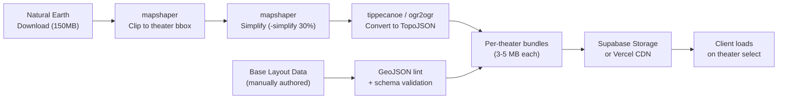
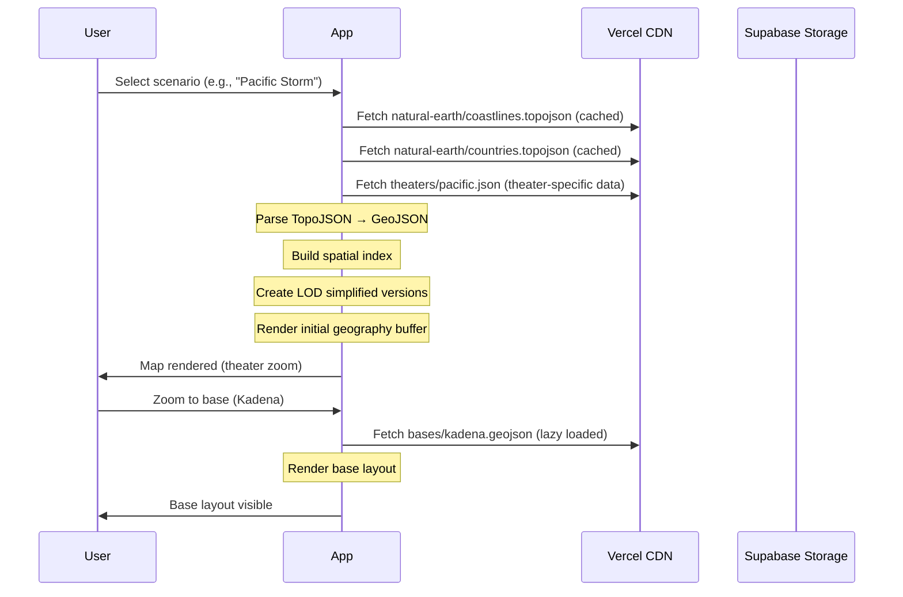

# AIR CONFLICTS — Map System Technical Specification

**Companion Document to:** [GDD.md](./GDD.md) · [IMPLEMENTATION_PHASES.md](./IMPLEMENTATION_PHASES.md)  
**Version:** 1.0  
**Date:** June 4, 2026  
**Approach:** Option B — GeoJSON Vector Data (Natural Earth + Custom Overlays)  

---

## 1. Overview

The theater map is the **central visual element** of Air Conflicts. Every player in every room looks at the same map — it is the shared situational awareness surface that connects all operations. The map must:

- Render **real-world geography** accurately (coastlines, borders, terrain, cities, airports)
- Display **military operational layers** (airbases, SAM rings, flight routes, kill boxes, airspace)
- Show **dynamic entities** in real-time (aircraft icons, missile tracks, weather, damage)
- Support **4 zoom levels** with progressive detail (theater → regional → base area → base layout)
- Maintain **30+ FPS** during execution phase with 200+ moving entities
- Work entirely **client-side** with no external tile server dependencies

The map is built using **public domain GeoJSON vector data** from Natural Earth, rendered on **HTML5 Canvas** (or PixiJS), with game-specific overlays as additional vector/sprite layers.

---

## 2. Data Sources

All geographic data comes from **Natural Earth** (naturalearthdata.com) — a public domain map dataset maintained by the North American Cartographic Information Society (NACIS). Data is free, requires no API keys, and can be bundled directly with the application.

### 2.1 Natural Earth Datasets Used

| Dataset | Resolution | File | Use |
|---|---|---|---|
| **Coastlines** | 1:10m (high) | `ne_10m_coastline.geojson` | Ocean/land boundaries for all theaters |
| **Country boundaries** | 1:10m | `ne_10m_admin_0_countries.geojson` | National borders, sovereignty areas |
| **Country labels** | 1:10m | `ne_10m_admin_0_label_points.geojson` | Country name placement |
| **Disputed areas** | 1:10m | `ne_10m_admin_0_disputed_areas.geojson` | Taiwan, contested South China Sea features |
| **State/province boundaries** | 1:10m | `ne_10m_admin_1_states_provinces.geojson` | Japanese prefectures, Korean provinces, European subdivisions |
| **Populated places** | 1:10m | `ne_10m_populated_places.geojson` | Major cities (Seoul, Tokyo, Taipei, Riyadh, Warsaw, etc.) |
| **Airports** | 1:10m | `ne_10m_airports.geojson` | Real-world airport locations for base positioning validation |
| **Roads** | 1:10m | `ne_10m_roads.geojson` | Major highways (visible at regional zoom, for geographic context) |
| **Rivers + lakes** | 1:10m | `ne_10m_rivers_lake_centerlines.geojson`, `ne_10m_lakes.geojson` | Water features for terrain context |
| **Bathymetry** | 1:10m | `ne_10m_bathymetry_*.geojson` | Ocean depth contours (Pacific and Gulf theaters) |
| **Land elevation (raster)** | 1:10m | `NE1_HR_LC_SR_W.tif` | Terrain elevation shading (converted to color palette) |
| **Urban areas** | 1:10m | `ne_10m_urban_areas.geojson` | City footprints (collateral damage zones) |
| **Reefs** | 1:10m | `ne_10m_reefs.geojson` | South China Sea features |
| **Graticules** | 1:10m | `ne_10m_graticules_1.geojson` | Lat/lon grid lines |

### 2.2 Custom Game Data (GeoJSON)

In addition to Natural Earth, the game uses custom GeoJSON files for military features:

| File | Contents | Format |
|---|---|---|
| `theaters/pacific.geojson` | Theater bounding box, base positions, OPFOR positions, SAM sites, target list coordinates | FeatureCollection |
| `theaters/korea.geojson` | Same structure for Korean Peninsula | FeatureCollection |
| `theaters/europe.geojson` | Same structure for NATO Eastern Front | FeatureCollection |
| `theaters/middle_east.geojson` | Same structure for Gulf Region | FeatureCollection |
| `bases/kadena.geojson` | Detailed base layout: runways, taxiways, shelters, facilities, parking spots | FeatureCollection |
| `bases/ramstein.geojson` | Same for each MOB/FOS | FeatureCollection |
| `bases/*.geojson` | One file per base (~24 total across all theaters) | FeatureCollection |

### 2.3 Data Size Estimates

| Category | Raw Size | Simplified (game use) | Notes |
|---|---|---|---|
| Natural Earth 10m (all needed layers) | ~150 MB | ~15–25 MB | Simplify with mapshaper to reduce polygon count |
| Theater-specific subsets (4 theaters) | — | ~3–5 MB each | Clip to theater bounding box, discard irrelevant features |
| Base layouts (24 bases) | — | ~50–100 KB each | Relatively simple polygons |
| **Total bundled** | — | **~20–30 MB** | Loaded per-theater, not all at once |

### 2.4 Data Pipeline



#### Build-Time Processing Steps

1. **Download** Natural Earth 10m datasets (one-time)
2. **Clip** each dataset to the 4 theater bounding boxes using `mapshaper`:
   ```bash
   mapshaper ne_10m_coastline.geojson \
     -clip bbox=122,20,148,46 \
     -simplify 30% keep-shapes \
     -o pacific_coastline.geojson
   ```
3. **Simplify** polygons to reduce vertex count (30–50% simplification keeps visual quality at game zoom levels)
4. **Convert** to **TopoJSON** for smaller file sizes (typically 60–80% smaller than GeoJSON through shared arc topology)
5. **Bundle** per theater: one file containing all layers for that theater
6. **Host** on Supabase Storage or Vercel CDN with immutable cache headers

---

## 3. Coordinate System & Projection

### 3.1 Source Coordinates

All Natural Earth data uses **WGS 84 (EPSG:4326)** — standard latitude/longitude in decimal degrees.

### 3.2 Map Projection

The game uses **Equirectangular (Plate Carrée) projection** for simplicity and performance:

```
screenX = (longitude - centerLon) × scale + viewportWidth / 2
screenY = (centerLat - latitude) × scale + viewportHeight / 2
```

**Why Equirectangular:**
- Trivial math (linear transform) — fast for real-time rendering of thousands of features
- Good enough for the theater scales involved (distortion is minimal at 20°–60° latitude bands)
- Easy inverse transform for mouse click → lat/lon conversion
- Military planning maps commonly use similar projections

**Why not Mercator:** Web Mercator distorts area significantly at high latitudes (Europe theater extends to 60°N). The game doesn't need Mercator's angle-preserving property since it's not a navigation tool.

### 3.3 Theater Bounding Boxes (WGS 84)

| Theater | Min Lon | Min Lat | Max Lon | Max Lat | Center | Scale Notes |
|---|---|---|---|---|---|---|
| **Pacific** | 115.0° E | 10.0° N | 150.0° E | 45.0° N | 132.5° E, 27.5° N | ~2,500 km wide |
| **Korea** | 124.0° E | 33.0° N | 132.0° E | 42.0° N | 128.0° E, 37.5° N | ~800 km wide |
| **Europe** | 5.0° E | 47.0° N | 32.0° E | 60.0° N | 18.5° E, 53.5° N | ~2,000 km wide |
| **Middle East** | 43.0° E | 20.0° N | 63.0° E | 35.0° N | 53.0° E, 27.5° N | ~1,500 km wide |

### 3.4 Coordinate Utilities

```typescript
// lib/mapUtils.ts

/** Degrees to nautical miles (simplified, equatorial) */
export const DEG_TO_NM = 60; // 1° latitude ≈ 60 nm

/** Convert lat/lon to screen pixel coordinates */
export function geoToScreen(
  lat: number,
  lon: number,
  viewport: Viewport,
  camera: Camera
): { x: number; y: number } {
  const x = (lon - camera.centerLon) * camera.scale * Math.cos(camera.centerLat * Math.PI / 180) 
            + viewport.width / 2;
  const y = (camera.centerLat - lat) * camera.scale 
            + viewport.height / 2;
  return { x, y };
}

/** Convert screen pixel to lat/lon (for mouse clicks) */
export function screenToGeo(
  screenX: number,
  screenY: number,
  viewport: Viewport,
  camera: Camera
): { lat: number; lon: number } {
  const lon = (screenX - viewport.width / 2) 
              / (camera.scale * Math.cos(camera.centerLat * Math.PI / 180)) 
              + camera.centerLon;
  const lat = camera.centerLat 
              - (screenY - viewport.height / 2) / camera.scale;
  return { lat, lon };
}

/** Great-circle distance between two points in nautical miles */
export function distanceNM(
  lat1: number, lon1: number,
  lat2: number, lon2: number
): number {
  const R = 3440.065; // Earth radius in nm
  const dLat = (lat2 - lat1) * Math.PI / 180;
  const dLon = (lon2 - lon1) * Math.PI / 180;
  const a = Math.sin(dLat / 2) ** 2 +
            Math.cos(lat1 * Math.PI / 180) * Math.cos(lat2 * Math.PI / 180) *
            Math.sin(dLon / 2) ** 2;
  return 2 * R * Math.asin(Math.sqrt(a));
}

/** Bearing from point A to point B in degrees */
export function bearing(
  lat1: number, lon1: number,
  lat2: number, lon2: number
): number {
  const dLon = (lon2 - lon1) * Math.PI / 180;
  const y = Math.sin(dLon) * Math.cos(lat2 * Math.PI / 180);
  const x = Math.cos(lat1 * Math.PI / 180) * Math.sin(lat2 * Math.PI / 180) -
            Math.sin(lat1 * Math.PI / 180) * Math.cos(lat2 * Math.PI / 180) * Math.cos(dLon);
  return ((Math.atan2(y, x) * 180 / Math.PI) + 360) % 360;
}
```

### 3.5 Latitude Correction

Because Equirectangular projection stretches longitude at higher latitudes, the `geoToScreen` function includes a `cos(latitude)` correction factor. This prevents Korea and Europe from appearing horizontally stretched compared to the Middle East and Pacific theaters.

---

## 4. Rendering Architecture

### 4.1 Canvas Layer Stack

The map uses **multiple layered `<canvas>` elements** stacked via CSS `position: absolute`. Each layer redraws independently — a moving aircraft doesn't force a coastline redraw.

```
┌──────────────────────────────────────────────┐
│              UI Overlay (React DOM)           │  z-index: 50
│  Tooltips, context menus, panel overlays     │
├──────────────────────────────────────────────┤
│           Cursor & Selection Layer            │  z-index: 40
│  Mouse hover highlights, selection boxes     │  Redraws: on mouse move
├──────────────────────────────────────────────┤
│           Dynamic Entities Layer              │  z-index: 30
│  Aircraft icons, missile tracks, explosions  │  Redraws: every frame (30fps)
├──────────────────────────────────────────────┤
│           Operational Overlay Layer           │  z-index: 20
│  SAM rings, flight routes, kill boxes,       │  Redraws: on state change
│  tanker tracks, airspace zones, weather,     │
│  ISR coverage, GPS heat map, CSAR markers    │
├──────────────────────────────────────────────┤
│           Static Features Layer               │  z-index: 10
│  Base markers, OPFOR positions, cities,      │  Redraws: on zoom/pan or
│  target markers, satellite ground stations   │  state change
├──────────────────────────────────────────────┤
│           Base Geography Layer                │  z-index: 1
│  Coastlines, country borders, rivers,        │  Redraws: only on zoom/pan
│  terrain shading, ocean, bathymetry,         │  (cached to offscreen canvas)
│  graticule grid, urban areas                 │
└──────────────────────────────────────────────┘
```

### 4.2 Layer Descriptions

#### Layer 0: Base Geography (z-index: 1)
**Redraws:** Only on zoom/pan (cached to offscreen canvas buffer)  
**Contents:**
- Ocean fill (dark navy: `#0a1628`)
- Land fill (dark olive/charcoal: `#1a1f1e` base, elevation-shaded)
- Coastlines (thin light line: `#3a5a7a`, 1px at theater, 2px at regional)
- Country borders (dashed line: `#4a6a5a`, labeled with country names)
- State/province borders (subtle dotted line, visible only at regional+ zoom)
- Rivers and lakes (dark blue: `#1a2a4a`, visible at regional+ zoom)
- Urban area polygons (slightly lighter fill: `#252a28`, visible at regional+ zoom)
- Bathymetry contours (subtle ocean depth bands: `#0a1428` → `#0a1020`)
- Lat/lon graticule grid (very subtle: `#1a2a3a`, with degree labels at edges)
- Terrain elevation shading (pre-computed gradient overlay from raster data)

**Rendering technique:** Draw to an offscreen `<canvas>`, then `drawImage()` the buffer to the visible canvas. Only re-render the buffer when zoom/pan changes. At static camera, cost is zero.

#### Layer 1: Static Features (z-index: 10)
**Redraws:** On zoom/pan or when game state changes (base status, OPFOR discovery)  
**Contents:**
- **Friendly base markers** (MOB/FOS):
  - MOB: Blue filled square with white border, 16px at theater, 24px at regional
  - FOS: Smaller blue diamond, 10px at theater, 16px at regional
  - Status ring: green (operational), yellow (degraded), red (critical), black (destroyed)
  - Label: Base name + ICAO code (e.g., "KADENA (RODN)")
  - At base zoom: transitions to full base layout view (see Section 6)
- **OPFOR bases** (known):
  - Red filled square (military airfield) / red triangle (SAM site) / red circle (other)
  - Dashed outline if "suspected" (ISR has partial info)
  - Hidden if in fog of war (ISR not covering area)
- **Target markers**:
  - JIPTL targets shown as numbered circles: untouched (white), damaged (yellow), destroyed (gray+strikethrough)
- **Cities**:
  - Population-scaled dots with labels (only cities > 500K at theater, > 100K at regional)
  - Important for collateral damage awareness
- **Command nodes**:
  - CAOC location shown as blue star icon
  - CSPoC ground station shown as blue satellite dish icon
- **Satellite ground stations** (for CSPoC):
  - Blue antenna icon at real-world ground station locations

#### Layer 2: Operational Overlays (z-index: 20)
**Redraws:** On game state change  
**Contents:**
- **SAM engagement envelopes**: Translucent red circles centered on SAM sites. Radius = engagement range (nm). Opacity decreases toward edge. Different rings for different SAM types:
  - S-400: ~200nm ring (outer), 40nm ring (inner)
  - HQ-9: ~125nm ring
  - Buk-M2: ~25nm ring
- **Flight routes**: Thin colored lines showing planned/active sortie routes
  - Blue: friendly planned route
  - Cyan: friendly active (aircraft in transit)
  - Green: recovery route (RTB)
  - White dashed: tanker track orbits
- **Kill boxes**: Semi-transparent rectangles with CAOC-assigned labels and colors
- **Airspace control zones**: Outlined areas (transit corridors, restricted zones, ROZ)
- **ISR coverage**: Semi-transparent blue circles showing active ISR platform sensor footprints
- **Weather overlay**: Semi-transparent cloud/storm patterns. Colors: white (overcast), gray (rain), dark gray + lightning icon (storms)
- **Logistics routes**: Orange dashed lines showing supply corridors
- **CSAR markers**: Flashing red beacon at survivor location + rescue circle
- **GPS coverage heat map**: Green (full accuracy) → yellow (degraded) → red (denied). Shows GPS jamming zones
- **SBIRS detection arcs**: Large semi-transparent yellow arcs showing missile warning sensor coverage
- **Satellite ground tracks**: Thin dotted lines showing orbital paths across the theater

#### Layer 3: Dynamic Entities (z-index: 30)
**Redraws:** Every frame (30fps during execution, 10fps during planning)  
**Contents:**
- **Friendly aircraft**: Blue icons
  - At theater zoom: small dot (3px) + contrail line (fading tail of last 30 seconds of movement)
  - At regional zoom: aircraft type silhouette (8–12px), rotated to heading. Callsign label on hover.
  - Color by status: blue (nominal), yellow (low fuel), red (damaged), flashing red (under fire)
  - Selected aircraft: white highlight ring + info popup
- **Enemy aircraft** (known):
  - Red icons, same scaling behavior. Only visible if detected by ISR/radar.
  - Suspected (last known position): red dashed circle at last detection point
- **Missiles in flight**:
  - Enemy ballistic missiles: red streak with arc trajectory
  - Cruise missiles: red moving dot with wake line
  - PGMs (player strikes): brief blue streak at target impact
- **Explosions / impacts**:
  - Brief flash sprite (100ms), expanding circle (300ms), fade
  - Scale based on warhead size (SDB = small, 2000lb JDAM = large, ballistic missile = very large)
- **CSAR beacons**: Pulsing circle animation at survivor location
- **Tanker aircraft**: Blue/white striped icon showing AR orbit pattern
- **Transport aircraft**: Blue cargo icon on logistics route

#### Layer 4: Cursor & Selection (z-index: 40)
**Redraws:** On mouse move  
**Contents:**
- Mouse cursor coordinate display (lat/lon + MGRS)
- Hover tooltip (unit info, base info, target info)
- Drag selection rectangle
- Measurement tool (click two points → shows distance in nm and bearing)
- Right-click context menu anchor point

#### Layer 5: UI Overlay (React DOM, z-index: 50)
**Rendered by React, not canvas:**
- Context menus (right-click on entities)
- Tooltips (hover info cards)
- Map layer toggle panel
- Zoom controls
- Mini-map (small overview in corner)
- Coordinate readout

### 4.3 Rendering Loop

```typescript
// components/map/MapRenderer.ts

class MapRenderer {
  // Canvas references
  private geoCanvas: HTMLCanvasElement;      // Layer 0
  private featuresCanvas: HTMLCanvasElement;  // Layer 1
  private overlayCanvas: HTMLCanvasElement;   // Layer 2
  private entitiesCanvas: HTMLCanvasElement;  // Layer 3
  private cursorCanvas: HTMLCanvasElement;    // Layer 4

  // Offscreen buffer for geography (expensive to render)
  private geoBuffer: OffscreenCanvas;
  private geoBufferDirty: boolean = true;

  // Camera state
  private camera: Camera = {
    centerLat: 27.5,
    centerLon: 132.5,
    scale: 50,      // pixels per degree
    zoomLevel: 0,   // 0=theater, 1=regional, 2=base-area, 3=base-layout
  };

  // Frame timing
  private lastFrameTime: number = 0;
  private targetFPS: number = 30;

  /** Main render loop — called via requestAnimationFrame */
  render(timestamp: number): void {
    const elapsed = timestamp - this.lastFrameTime;
    if (elapsed < 1000 / this.targetFPS) {
      requestAnimationFrame(this.render.bind(this));
      return;
    }
    this.lastFrameTime = timestamp;

    // Layer 0: Geography (only if camera moved)
    if (this.geoBufferDirty) {
      this.renderGeography();
      this.geoBufferDirty = false;
    }
    this.blitGeoBuffer();

    // Layer 1: Static features (only if state changed or camera moved)
    if (this.featuresDirty) {
      this.renderFeatures();
      this.featuresDirty = false;
    }

    // Layer 2: Operational overlays (only if state changed)
    if (this.overlayDirty) {
      this.renderOverlays();
      this.overlayDirty = false;
    }

    // Layer 3: Dynamic entities (EVERY FRAME during execution)
    this.renderEntities();

    requestAnimationFrame(this.render.bind(this));
  }
}
```

### 4.4 GeoJSON Rendering

```typescript
// lib/geoRenderer.ts

/** Render a GeoJSON FeatureCollection to a canvas context */
export function renderGeoJSON(
  ctx: CanvasRenderingContext2D,
  features: GeoJSON.FeatureCollection,
  camera: Camera,
  viewport: Viewport,
  style: FeatureStyle
): void {
  for (const feature of features.features) {
    switch (feature.geometry.type) {
      case 'Polygon':
        renderPolygon(ctx, feature.geometry.coordinates, camera, viewport, style);
        break;
      case 'MultiPolygon':
        for (const polygon of feature.geometry.coordinates) {
          renderPolygon(ctx, polygon, camera, viewport, style);
        }
        break;
      case 'LineString':
        renderLineString(ctx, feature.geometry.coordinates, camera, viewport, style);
        break;
      case 'MultiLineString':
        for (const line of feature.geometry.coordinates) {
          renderLineString(ctx, line, camera, viewport, style);
        }
        break;
      case 'Point':
        renderPoint(ctx, feature.geometry.coordinates, camera, viewport, style, feature.properties);
        break;
    }
  }
}

function renderPolygon(
  ctx: CanvasRenderingContext2D,
  rings: number[][][],
  camera: Camera,
  viewport: Viewport,
  style: FeatureStyle
): void {
  ctx.beginPath();
  for (const ring of rings) {
    for (let i = 0; i < ring.length; i++) {
      const { x, y } = geoToScreen(ring[i][1], ring[i][0], viewport, camera);
      if (i === 0) ctx.moveTo(x, y);
      else ctx.lineTo(x, y);
    }
    ctx.closePath();
  }
  if (style.fill) {
    ctx.fillStyle = style.fill;
    ctx.fill();
  }
  if (style.stroke) {
    ctx.strokeStyle = style.stroke;
    ctx.lineWidth = style.lineWidth ?? 1;
    if (style.lineDash) ctx.setLineDash(style.lineDash);
    ctx.stroke();
    ctx.setLineDash([]);
  }
}
```

---

## 5. Zoom Levels & Level of Detail

### 5.1 Zoom Level Definitions

| Level | Name | Scale (px/°) | Coverage | Pixel per NM | Use |
|---|---|---|---|---|---|
| **0** | Theater | 20–40 | Full theater (~2500 km) | ~0.3–0.6 | Strategic overview, campaign planning |
| **1** | Regional | 80–160 | ~500–800 km area | ~1.3–2.6 | Operational planning, sortie routing |
| **2** | Base Area | 400–800 | ~50–100 km around a base | ~6.5–13 | Base cluster view, local operations |
| **3** | Base Layout | 2000–5000 | ~5–10 km (single base) | ~33–83 | Facility-level detail, damage assessment |

### 5.2 Level-of-Detail (LOD) Table

What is visible at each zoom level:

| Feature | Theater (L0) | Regional (L1) | Base Area (L2) | Base Layout (L3) |
|---|---|---|---|---|
| **Coastlines** | Simplified (50% fewer vertices) | Full resolution | Full resolution | Full resolution |
| **Country borders** | Yes, with labels | Yes, with labels | Yes | Visible but faint |
| **State borders** | No | Yes | Yes | Visible but faint |
| **Cities** | >1M population only | >200K | >50K | All |
| **City labels** | Major capitals only | All visible cities | All | All |
| **Roads** | No | Major highways only | Highways + secondary | All roads |
| **Rivers** | No | Major rivers | All rivers | All |
| **Urban areas** | No | Major metro areas | All | All |
| **Graticule** | 5° grid | 1° grid | 0.25° grid | 0.1° grid |
| **MOB markers** | Blue square icon (16px) | Blue square (24px) + label | Expanded base symbol | Full base layout |
| **FOS markers** | Blue diamond (10px) | Blue diamond (16px) + label | Expanded symbol | Full layout |
| **OPFOR bases** | Red square (if known) | Red square + type label | Expanded + details | N/A |
| **SAM sites** | Red triangle (if known) | Red triangle + type + ring | Full ring + range labels | N/A |
| **SAM rings** | Translucent circles | Detailed rings with range arcs | Detailed + inner/outer rings | N/A |
| **Aircraft (friendly)** | Dot (3px) + contrail | Silhouette (10px) + callsign | Silhouette (16px) + info | N/A (base layout mode) |
| **Aircraft (enemy)** | Red dot (3px) | Red silhouette (10px) | Red silhouette + type | N/A |
| **Flight routes** | Thin lines, no waypoints | Lines + waypoint markers | Lines + waypoints + alt/speed | N/A |
| **Kill boxes** | Outlined rectangles | Labeled rectangles | Detailed + sub-zones | N/A |
| **Target markers** | Numbered dots | Numbered circles + name | Full target card on click | N/A |
| **Weather** | Large cloud masses | Cloud masses + precipitation | Detailed local weather | N/A |
| **Missile tracks** | Fast red streak | Red streak + trajectory arc | Detailed track + impact point | N/A |

### 5.3 Zoom Transitions

Zoom transitions use **smooth interpolation** (ease-in-out over 300ms):

```typescript
function smoothZoom(
  currentScale: number,
  targetScale: number,
  duration: number = 300
): void {
  const startTime = performance.now();
  const startScale = currentScale;

  function animate(now: number) {
    const t = Math.min((now - startTime) / duration, 1);
    const eased = t < 0.5
      ? 2 * t * t                    // ease-in
      : 1 - Math.pow(-2 * t + 2, 2) / 2; // ease-out
    
    camera.scale = startScale + (targetScale - startScale) * eased;
    geoBufferDirty = true;
    
    if (t < 1) requestAnimationFrame(animate);
  }
  requestAnimationFrame(animate);
}
```

### 5.4 Double-Click Zoom

- Double-click on map: zoom in one level, centered on click point
- Double-right-click: zoom out one level
- Scroll wheel: continuous zoom (snaps to nearest level on release)
- Pinch gesture (tablet): continuous zoom

---

## 6. Base Layout View (Zoom Level 3)

When a player zooms into a specific base (or clicks the "Base Map" button in the MOB dashboard), the map transitions to a **detailed base layout** rendered from the base's custom GeoJSON file.

### 6.1 Base Layout Data Structure

```typescript
// types/baseLayout.ts

interface BaseLayout {
  id: string;                    // e.g., 'kadena'
  icao: string;                  // e.g., 'RODN'
  name: string;                  // e.g., 'Kadena Air Base'
  location: { lat: number; lon: number };
  elevation_ft: number;          // e.g., 143
  
  runways: Runway[];
  taxiways: Taxiway[];
  parkingAprons: ParkingApron[];
  facilities: Facility[];
  perimeter: GeoJSON.Polygon;    // Base boundary
  
  // FOSs managed by this MOB
  fos: FOSDefinition[];          // Up to 5
}

interface Runway {
  id: string;                    // e.g., 'RWY_05L_23R'
  designation: string;           // e.g., '05L/23R'
  geometry: GeoJSON.LineString;  // Centerline
  width_m: number;               // e.g., 45
  length_m: number;              // e.g., 3700
  surface: 'concrete' | 'asphalt' | 'matting';
  status: 'operational' | 'degraded' | 'cratered' | 'destroyed';
  craters: CraterOverlay[];      // Active damage
  arrestingGear: boolean;
}

interface Facility {
  id: string;
  type: FacilityType;
  name: string;
  geometry: GeoJSON.Polygon;     // Building footprint
  status: 'operational' | 'damaged' | 'destroyed';
  damagePercent: number;         // 0–100
  hardened: boolean;             // Has HAS/revetment protection
  repairTeamAssigned: boolean;
}

type FacilityType = 
  | 'hangar'           // Aircraft shelter (hardened or soft)
  | 'fuel_storage'     // JP-8 tank farm
  | 'munitions_storage'// Ammo dump (hardened)
  | 'maintenance'      // Aircraft maintenance facility
  | 'tower'            // Air traffic control tower
  | 'ops_center'       // Wing operations center
  | 'medical'          // Base clinic / EMEDS
  | 'power_plant'      // Base electrical generation
  | 'water_treatment'  // Water supply
  | 'comm_facility'    // Communications equipment
  | 'radar'            // Air traffic / weather radar
  | 'fire_station'     // Crash/fire/rescue
  | 'billeting'        // Personnel quarters
  | 'dining'           // Dining facility
  | 'supply_warehouse' // General supply storage
  | 'c_uas'            // Counter-UAS system (buildable)
  | 'sam_battery'      // Base air defense (Patriot/THAAD)
  | 'parking_shelter'  // Hardened aircraft shelter (HAS)
;
```

### 6.2 Base Layout Rendering

At Zoom Level 3, the base layout replaces the normal map view:

```
┌────────────────────────────────────────────────────┐
│ ← Back to Theater Map                              │
│                                                    │
│  ┌──── RWY 05L/23R ─────────────────────────┐     │
│  │▓▓▓▓▓▓▓▓▓▓▓▓▓▓▓▓▓▓▓▓▓▓▓▓▓▓▓▓▓▓▓▓▓▓▓▓▓▓▓│     │
│  │▓▓▓▓▓▓▓▓▓▓▓▓▓▓▓▓▓▓▓▓▓▓▓▓▓▓▓▓▓▓▓▓▓▓▓▓▓▓▓│     │
│  └──────────────────────────────────────────┘     │
│          │         │         │                     │
│       ┌──┘    ┌────┘    ┌───┘    ← Taxiways      │
│       │       │         │                          │
│  ┌────┴──┐ ┌──┴───┐ ┌──┴───┐                     │
│  │ HAS 1 │ │ HAS 2│ │ HAS 3│  ← Hardened shelters│
│  │ F-15E │ │ F-22A│ │ F-35A│     (aircraft inside)│
│  │  ✅   │ │  ✅  │ │  ⚠️  │     (status icons)  │
│  └───────┘ └──────┘ └──────┘                      │
│                                                    │
│  ⛽ FUEL          💣 MUNITIONS      🏥 MEDICAL    │
│  ███████░░░       ██████░░░░░       ✅ Operational │
│  73% (412K gal)   58% (JDAM:48)                    │
│                                                    │
│  🔧 MAINTENANCE   📡 COMMS          🗼 TOWER      │
│  ✅ Operational   ✅ Operational    ⚠️ Damaged     │
│                                                    │
│  💥 CRATER ×2 on RWY 05L (CE team en route, ~2hr) │
│  🚧 REPAIR: HAS 4 (45% complete)                  │
└────────────────────────────────────────────────────┘
```

**Rendering details:**
- Runway: Gray/dark rectangle. Crater overlays as dark circles with debris texture. Threshold markings, center line.
- Taxiways: Thinner gray paths connecting runway to parking areas.
- Hangars/HAS: Rounded rectangles with aircraft silhouette inside (if occupied). Status-colored border.
- Fuel farm: Tank circles with fill level indicator.
- Munitions bunkers: Rectangles with earth-mound coloring (hardened).
- Damaged facilities: Orange/red tint overlay, cracked/destroyed texture, fire animation if recently hit.
- Repair teams: Animated wrench icon on facilities being repaired, progress bar.
- Parked aircraft: Tiny top-down silhouettes at parking spots. Color by status.

### 6.3 Real Base Reference Data

Base layouts are **inspired by real satellite imagery** but simplified for gameplay. Key reference points:

| Base | Real ICAO | Runway Config | Notable Features | Reference Source |
|---|---|---|---|---|
| Kadena AB | RODN | 2 parallel runways (05L/23R, 05R/23L) | Largest USAF base in Pacific. Distinctive flight line layout. 5 HAS clusters. | Google Earth / OpenStreetMap |
| Misawa AB | RJSM | 1 runway (10/28) | Compact base, F-16/F-35 mix | Google Earth |
| Andersen AFB | PGUA | 2 parallel runways (06L/24R, 06R/24L) | Massive bomber apron, "Arc Light" hardstands | Google Earth |
| Osan AB | RKSO | 1 runway (09/27) | Very close to DMZ, CAOC for Korea | Google Earth |
| Ramstein AB | ETAR | 1 runway (08/26) | NATO CAOC, large C-17 parking | Google Earth |
| Al Udeid AB | OTBH | 2 runways (16/34, 15/33) | Massive base, CAOC for CENTCOM | Google Earth |

Each base layout GeoJSON is manually authored using real base imagery as reference, with simplified geometry suitable for game rendering.

---

## 7. Theater-Specific Map Details

### 7.1 Pacific Theater

```
┌──────────────────────────────────────────────────────────────┐
│                                                              │
│    JAPAN                                                     │
│    ● Tokyo                                                   │
│       ◆ Misawa AB (MOB)                                     │
│           ◇ FOS                                              │
│       ◆ Kadena AB (MOB) ← OKINAWA                          │
│           ◇ FOS ×5                                          │
│                                                              │
│    ┈┈┈┈┈ FIRST ISLAND CHAIN ┈┈┈┈┈                           │
│                                                              │
│    TAIWAN                                                    │
│    ● Taipei    ○ Taichung                                   │
│                    ▲ OPFOR J-20 CAPs                        │
│              ╱╲  ╱╲                                          │
│    SOUTH    ╱  ╲╱  ╲  ← SAM rings (red circles)            │
│    CHINA   ╱ OPFOR  ╲                                       │
│    SEA    ╱  BASES   ╲                                      │
│          ◢██████████◣                                       │
│          ████CHINA████   ● Shanghai                         │
│          ████████████████                                    │
│                                                              │
│    PHILIPPINES                                               │
│    ● Manila                                                  │
│                                                              │
│                          ◆ Andersen AFB (MOB) ← GUAM        │
│                              ◇ Tinian (FOS)                 │
│                              ◇ Palau (FOS)                  │
│                                                              │
│    ┈┈┈┈ shipping lanes ┈┈┈┈                                │
│                                                              │
│    ⬡ KEY:  ◆=MOB  ◇=FOS  ●=City  ▲=OPFOR Air  △=SAM      │
└──────────────────────────────────────────────────────────────┘
```

**Special map features:**
- Ocean depth gradients (shallow shelves vs. deep Pacific)
- Typhoon weather patterns (seasonal cloud systems)
- Shipping lane markers (civilian traffic to avoid)
- Taiwan territorial sea boundary line
- SCS (South China Sea) nine-dash line area (contested)
- First Island Chain reference line (strategic concept)

### 7.2 Korean Peninsula

```
┌─────────────────────────────────────────────┐
│   CHINA                                     │
│                                             │
│   ████████NORTH KOREA████████               │
│   ████████████████████████████              │
│   ██ ▲▲▲ HARDENED AIRFIELDS ██              │
│   ██ △△△△△△ DENSE AAA/SAMS ██              │
│   ████████████████████████████              │
│   ══════════ DMZ ════════════  ← FEBA      │
│   ■■■■ ARTILLERY FAN ■■■■■■■              │
│       ● SEOUL (25M people)                  │
│     ◆ Osan AB (MOB + CAOC)                 │
│         ◇ Suwon (FOS)                      │
│                                             │
│     ◆ Kunsan AB (MOB)                      │
│         ◇ Gwangju (FOS)                    │
│                                             │
│     ◆ Gimhae AB (MOB)                      │
│                                             │
│            SOUTH KOREA                      │
│   ● Busan                                  │
│                                             │
│              SEA OF JAPAN                   │
│                                             │
│         ◆ Yokota AB (MOB, Japan)            │
│                                             │
└─────────────────────────────────────────────┘
```

**Special map features:**
- DMZ line (thick red dashed line, geographically accurate)
- FEBA (Forward Edge of Battle Area) line that shifts based on ground war simulation
- Artillery fan overlay from DMZ toward Seoul (threat visualization)
- Mountainous terrain elevation clearly visible (affects radar shadows, CSAR difficulty)
- Underground facility markers (tunnel icons for hardened targets)
- Dense urban overlay for Seoul metropolitan area (collateral damage zone)

### 7.3 European Theater

```
┌──────────────────────────────────────────────────────┐
│                                                      │
│    ◆ RAF Lakenheath (MOB)   NORTH SEA               │
│       UK ●London                                    │
│                                                      │
│    BELGIUM    GERMANY      POLAND                    │
│                ◆ Ramstein (MOB+CAOC)                │
│                ◆ Spangdahlem (MOB)   ◇ Łask (FOS)  │
│                                                      │
│                        BALTIC SEA                    │
│              ┌────────────────────┐                  │
│    DENMARK   │ ╔════════════════╗ │                  │
│              │ ║  KALININGRAD   ║ │ ◇ Šiauliai (FOS)│
│              │ ║  A2/AD BASTION ║ │   LITHUANIA     │
│              │ ║  S-400 ×4     ║ │                  │
│              │ ║  Iskander ×2  ║ │ ◇ Ämari (FOS)   │
│              │ ╚════════════════╝ │   ESTONIA       │
│              └────────────────────┘                  │
│                    ↕ SUWALKI GAP                     │
│                                                      │
│                            RUSSIA                    │
│              BELARUS                                 │
│                        ▲▲▲ Su-35 CAPs               │
│                        △△△ S-300/S-400              │
│              ● Minsk                                 │
│                            ● Moscow                  │
│    CZECH     ● Warsaw                                │
│    REP.        POLAND                                │
│                                                      │
│    ⬡ KEY:  ═══ A2/AD bubble  ↕ Critical chokepoint │
└──────────────────────────────────────────────────────┘
```

**Special map features:**
- Kaliningrad exclave rendered with heavy red border and dense SAM ring overlay
- Suwalki Gap corridor highlighted (60km NATO chokepoint)
- NATO country borders color-coded (Article 5 allies in blue tint)
- Dense civilian airspace markers (EUROCONTROL corridors)
- Baltic Sea naval domain (separate from air domain)
- Escalation-sensitive target markers (nuclear sites, civilian infrastructure)

### 7.4 Middle East Theater

```
┌──────────────────────────────────────────────────────┐
│                                                      │
│    IRAQ        IRAN / "KHADESTAN"                    │
│    ● Baghdad   ████████████████████                  │
│                ██ ▲▲ Su-30 BASES ██                  │
│                ██ △△ S-300PMU2   ██                  │
│                ██ ⚡ DF-21 analog ██                  │
│                ████████████████████                  │
│                ● Tehran                              │
│                                                      │
│    KUWAIT                                            │
│    ◇ Ali Al Salem    ══════════════                  │
│                     ║ STRAIT OF ║  ← Critical       │
│    SAUDI            ║  HORMUZ   ║     chokepoint    │
│    ARABIA           ══════════════                  │
│    ● Riyadh                                         │
│                      UAE                             │
│    ◆ Prince Sultan (MOB)   ◆ Al Dhafra (MOB)       │
│                              ◇ Al Minhad (FOS)     │
│    QATAR                                            │
│    ◆ Al Udeid (MOB + CAOC)                         │
│                                                      │
│    OMAN                                             │
│    ◇ Thumrait (FOS)                                │
│                                                      │
│    ⛽ Oil infrastructure markers throughout Gulf     │
│    🛢️ ↕ Shipping lanes through Strait of Hormuz     │
└──────────────────────────────────────────────────────┘
```

**Special map features:**
- Strait of Hormuz rendered as narrow passage with shipping lane markers
- Oil infrastructure markers (refineries, platforms, pipelines) — collateral damage sensitive
- Desert terrain (sand color palette, sparse features)
- Mountain range terrain (Zagros Mountains) with elevation shading
- Heat haze effect (subtle visual distortion at base-level zoom)
- Drone swarm launch point markers (enemy UAS staging areas)

---

## 8. Dynamic Map Features

### 8.1 Aircraft Movement

Aircraft move along their planned routes in real-time during execution phase:

```typescript
interface AircraftMapState {
  id: string;
  position: { lat: number; lon: number };
  heading: number;          // degrees true
  altitude_ft: number;      
  speed_kts: number;
  routeWaypoints: { lat: number; lon: number }[];
  currentWaypointIndex: number;
  status: 'taxiing' | 'takeoff' | 'transit' | 'on-station' | 'engaging' | 'rtb' | 'recovery';
  trailPositions: { lat: number; lon: number; timestamp: number }[]; // Last 60s of positions
}
```

**Movement interpolation:**
- Position updates come from the game engine at 10 ticks/second
- The renderer interpolates between ticks for smooth 30fps visual movement
- Trail/contrail is rendered from `trailPositions` array as a fading polyline

### 8.2 SAM Engagement Visualization

When a SAM site engages an aircraft:

1. **Detection**: SAM ring turns brighter red around the engaging site
2. **Launch**: Red streak animates from SAM position toward aircraft
3. **Intercept/Miss**: Flash at aircraft position (hit) or streak passes and fades (miss)
4. **Duration**: ~2–4 seconds real-time at 2× speed

### 8.3 Strike Visualization

When player aircraft strike a target:

1. **Approach**: Aircraft icon on route toward target
2. **Weapons release**: Brief blue streak from aircraft toward target
3. **Impact**: Yellow flash at target, expanding circle, small smoke puff
4. **BDA pending**: Target marker changes to "?" until ISR assesses
5. **BDA complete**: Target marker updates to damaged/destroyed status

### 8.4 Weather System

Weather is rendered as semi-transparent cloud overlay polygons:

```typescript
interface WeatherSystem {
  id: string;
  type: 'clear' | 'scattered' | 'overcast' | 'rain' | 'storm' | 'typhoon';
  polygon: GeoJSON.Polygon;       // Cloud coverage area
  movement: { speed_kts: number; heading: number };
  ceilingFt: number;              // Cloud base altitude
  visibility_nm: number;
  opacity: number;                // 0.0 (clear) to 0.8 (storm)
  lightningActive: boolean;
}
```

**Rendering:**
- Cloud polygons filled with semi-transparent white/gray
- Storm systems: darker gray + animated lightning bolt sprites
- Rain: diagonal line texture overlay
- Typhoon: spiral cloud pattern (Pacific theater special event)
- Weather moves across the map over time following heading/speed

### 8.5 Fog of War

Areas not covered by ISR are obscured:

```typescript
// Fog of war is rendered as a full-theater dark overlay with "holes" cut for ISR coverage

function renderFogOfWar(ctx: CanvasRenderingContext2D, viewport: Viewport): void {
  // Fill entire canvas with dark fog
  ctx.fillStyle = 'rgba(0, 0, 0, 0.6)';
  ctx.fillRect(0, 0, viewport.width, viewport.height);
  
  // Cut holes for ISR coverage areas using compositing
  ctx.globalCompositeOperation = 'destination-out';
  
  for (const isrAsset of gameState.isrPlatforms) {
    if (isrAsset.status !== 'on-station') continue;
    const { x, y } = geoToScreen(isrAsset.position.lat, isrAsset.position.lon, viewport, camera);
    const radiusPx = isrAsset.sensorRange_nm * camera.scale / DEG_TO_NM;
    
    // Soft-edged circle
    const gradient = ctx.createRadialGradient(x, y, radiusPx * 0.7, x, y, radiusPx);
    gradient.addColorStop(0, 'rgba(0, 0, 0, 1)');
    gradient.addColorStop(1, 'rgba(0, 0, 0, 0)');
    ctx.fillStyle = gradient;
    ctx.beginPath();
    ctx.arc(x, y, radiusPx, 0, Math.PI * 2);
    ctx.fill();
  }
  
  // Also cut holes for base radar coverage
  for (const base of gameState.friendlyBases) {
    // Similar circle for radar range (~200nm for AWACS, ~50nm for base radar)
  }
  
  ctx.globalCompositeOperation = 'source-over'; // Reset
}
```

---

## 9. Interaction System

### 9.1 Mouse Interactions

| Action | Behavior |
|---|---|
| **Left click** on empty map | Deselect current selection |
| **Left click** on entity | Select entity (aircraft, base, target, SAM) → shows info panel |
| **Double click** on base | Zoom to base layout view |
| **Double click** on empty map | Zoom in one level at click point |
| **Right click** on entity | Context menu (room-specific actions) |
| **Right click** on empty map | Context menu (create waypoint, mark position) |
| **Mouse drag** | Pan map |
| **Scroll wheel** | Zoom in/out |
| **Hover** over entity | Tooltip with summary info |
| **Ctrl + click** | Add to multi-selection |
| **Shift + drag** | Box select (multiple entities) |

### 9.2 Context Menus (Room-Specific)

**CAOC right-click on map:**
- Create kill box here
- Create transit corridor here
- Set waypoint for selected flight
- Mark as restricted zone

**CAOC right-click on target:**
- Add to JIPTL
- Assign strike mission
- Request BDA (→ ISR)
- Set priority: Critical / High / Medium / Low

**MOB right-click on own aircraft:**
- Assign to sortie
- Ground (remove from schedule)
- View maintenance status
- Schedule crew rest

**ISR right-click on map area:**
- Task ISR orbit here
- Request satellite pass (→ CSPoC)
- Set priority collection area

**CSPoC right-click on map area:**
- View GPS accuracy here
- View SATCOM coverage here
- Task satellite imagery pass
- View SBIRS coverage

### 9.3 Map Mini-Map

A small overview map in the bottom-left corner:

```
┌────────┐
│ ·  ·   │ ← Full theater, 150×100px
│   ▫    │ ← Current viewport shown as white rectangle
│  · ·   │ ← Dots = bases
└────────┘
```

- Click on mini-map to jump to that location
- Viewport rectangle shows current view
- Always visible at zoom levels 1–3 (hidden at theater level since you can see everything)

---

## 10. Performance Optimization

### 10.1 Spatial Indexing

For hit-testing (mouse clicks, hover detection) with 200+ entities:

```typescript
// lib/spatialIndex.ts

/** Simple grid-based spatial index for map entities */
class SpatialGrid {
  private cells: Map<string, MapEntity[]> = new Map();
  private cellSize: number; // Degrees per cell

  constructor(cellSize: number = 0.5) {
    this.cellSize = cellSize;
  }

  insert(entity: MapEntity): void {
    const key = this.cellKey(entity.position.lat, entity.position.lon);
    if (!this.cells.has(key)) this.cells.set(key, []);
    this.cells.get(key)!.push(entity);
  }

  /** Find entities near a point (for click/hover detection) */
  queryRadius(lat: number, lon: number, radiusDeg: number): MapEntity[] {
    const results: MapEntity[] = [];
    const minCellX = Math.floor((lon - radiusDeg) / this.cellSize);
    const maxCellX = Math.floor((lon + radiusDeg) / this.cellSize);
    const minCellY = Math.floor((lat - radiusDeg) / this.cellSize);
    const maxCellY = Math.floor((lat + radiusDeg) / this.cellSize);

    for (let cx = minCellX; cx <= maxCellX; cx++) {
      for (let cy = minCellY; cy <= maxCellY; cy++) {
        const entities = this.cells.get(`${cx},${cy}`);
        if (entities) results.push(...entities);
      }
    }
    return results;
  }

  private cellKey(lat: number, lon: number): string {
    return `${Math.floor(lon / this.cellSize)},${Math.floor(lat / this.cellSize)}`;
  }
}
```

### 10.2 Geometry Culling

Only render features visible in the current viewport:

```typescript
function isFeatureVisible(
  feature: GeoJSON.Feature,
  viewportBbox: [number, number, number, number] // [minLon, minLat, maxLon, maxLat]
): boolean {
  const bbox = featureBbox(feature); // Pre-computed bounding box
  return !(bbox[2] < viewportBbox[0] || bbox[0] > viewportBbox[2] ||
           bbox[3] < viewportBbox[1] || bbox[1] > viewportBbox[3]);
}
```

- Pre-compute bounding boxes for all GeoJSON features at load time
- Skip rendering any feature whose bbox doesn't intersect the viewport
- At theater zoom, this eliminates ~0% of features; at base zoom, it eliminates ~95%

### 10.3 Geometry Simplification by Zoom

```typescript
function getSimplificationTolerance(zoomLevel: number): number {
  switch (zoomLevel) {
    case 0: return 0.05;   // Theater: aggressive simplification (~50% fewer vertices)
    case 1: return 0.01;   // Regional: moderate simplification
    case 2: return 0.002;  // Base area: light simplification
    case 3: return 0;      // Base layout: full resolution
    default: return 0.01;
  }
}
```

Use the **Douglas-Peucker algorithm** at load time to create simplified versions of each coastline/border polygon per zoom level. Store 2–3 LOD versions in memory.

### 10.4 Offscreen Canvas Buffering

```typescript
// Geography layer is expensive (thousands of polygon vertices)
// Render once to offscreen buffer, blit to visible canvas until camera moves

const geoBuffer = new OffscreenCanvas(viewportWidth * 1.5, viewportHeight * 1.5);
const geoCtx = geoBuffer.getContext('2d')!;

// Render buffer 1.5× viewport size so small pans don't require re-render
// Only re-render when camera moves beyond buffer edge
```

### 10.5 Performance Budgets

| Phase | Target FPS | Entity Canvas Budget | Overlay Canvas Budget | Geo Canvas Budget |
|---|---|---|---|---|
| Planning (paused) | 10 | 2ms | 5ms | 0ms (cached) |
| Execution (1×) | 30 | 5ms | 2ms | 0ms (cached) |
| Execution (4×) | 30 | 5ms | 2ms | 0ms (cached) |
| Zoom/Pan transition | 30 | 2ms | 2ms | 15ms (re-render) |

Total budget per frame at 30fps: **33ms**. Target: use no more than **20ms** to leave headroom.

---

## 11. File Structure

```
src/
├── config/
│   └── maps/
│       ├── natural-earth/           # Processed Natural Earth data
│       │   ├── coastlines.topojson  # Global coastlines (simplified)
│       │   ├── countries.topojson   # Country boundaries + properties
│       │   ├── cities.geojson       # Populated places (filtered to >50K)
│       │   ├── airports.geojson     # Airport points
│       │   └── ...
│       │
│       ├── theaters/                # Per-theater game data
│       │   ├── pacific.json         # Theater config + clipped geography
│       │   ├── korea.json
│       │   ├── europe.json
│       │   └── middle_east.json
│       │
│       └── bases/                   # Individual base layouts
│           ├── kadena.geojson
│           ├── misawa.geojson
│           ├── andersen.geojson
│           ├── osan.geojson
│           ├── kunsan.geojson
│           ├── gimhae.geojson
│           ├── ramstein.geojson
│           ├── lakenheath.geojson
│           ├── spangdahlem.geojson
│           ├── al-udeid.geojson
│           ├── al-dhafra.geojson
│           ├── prince-sultan.geojson
│           └── ... (all FOSs)
│
├── components/
│   └── map/
│       ├── TheaterMap.tsx           # Main map container (manages canvas stack)
│       ├── MapRenderer.ts           # Core rendering engine (class, not React)
│       ├── GeoRenderer.ts           # GeoJSON → Canvas rendering
│       ├── EntityRenderer.ts        # Aircraft, missile, explosion rendering
│       ├── OverlayRenderer.ts       # SAM rings, routes, weather, fog of war
│       ├── BaseLayoutRenderer.ts    # Zoom level 3 base detail view
│       ├── LayerControls.tsx        # Layer toggle panel (React)
│       ├── MiniMap.tsx              # Overview mini-map (React + small canvas)
│       ├── MapTooltip.tsx           # Hover tooltip (React)
│       ├── MapContextMenu.tsx       # Right-click menu (React)
│       ├── CoordinateDisplay.tsx    # Lat/lon readout (React)
│       └── ZoomControls.tsx         # Zoom buttons (React)
│
├── hooks/
│   └── useMapControls.ts            # Pan, zoom, click, hover, selection state
│
├── lib/
│   ├── mapUtils.ts                  # Coordinate math (geoToScreen, distanceNM, bearing)
│   ├── spatialIndex.ts              # Grid-based spatial indexing
│   ├── geoSimplify.ts              # Douglas-Peucker simplification
│   ├── topojsonParser.ts           # TopoJSON → GeoJSON client-side conversion
│   └── mapStyles.ts                 # Color palettes, line styles, icon definitions
│
└── types/
    ├── maps.ts                      # Theater, MapCoordinate, MapRegion, etc.
    └── baseLayout.ts                # Runway, Facility, CraterOverlay, etc.
```

---

## 12. Map Style Constants

```typescript
// lib/mapStyles.ts

export const MAP_COLORS = {
  // Base geography
  ocean: '#0a1628',
  oceanDeep: '#060e1e',
  land: '#1a1f1e',
  landElevated: '#252a24',
  landMountain: '#2a2f28',
  coastline: '#3a5a7a',
  countryBorder: '#4a6a5a',
  stateBorder: '#2a3a2e',
  river: '#1a2a4a',
  lake: '#0e1a30',
  urbanArea: '#252a28',
  graticule: '#1a2a3a',

  // Military - Friendly (Blue Force)
  friendlyBase: '#4a90d9',
  friendlyBaseLabel: '#7ab8ff',
  friendlyAircraft: '#5b9bd5',
  friendlyRoute: '#4a80c0',
  friendlyRouteActive: '#60c0e0',
  friendlySelected: '#ffffff',

  // Military - OPFOR (Red Force)
  opforBase: '#d94a4a',
  opforAircraft: '#e05050',
  opforSAMRing: 'rgba(200, 40, 40, 0.15)',
  opforSAMRingBorder: 'rgba(200, 40, 40, 0.4)',
  opforMissile: '#ff3030',
  opforSuspected: 'rgba(200, 80, 80, 0.5)',

  // Status
  statusGreen: '#4caf50',
  statusYellow: '#ffc107',
  statusRed: '#f44336',
  statusBlack: '#333333',

  // Overlays
  killBox: 'rgba(255, 200, 50, 0.15)',
  killBoxBorder: 'rgba(255, 200, 50, 0.6)',
  transitCorridor: 'rgba(80, 140, 200, 0.1)',
  transitCorridorBorder: 'rgba(80, 140, 200, 0.4)',
  isrCoverage: 'rgba(80, 180, 255, 0.08)',
  isrCoverageBorder: 'rgba(80, 180, 255, 0.3)',
  weatherCloud: 'rgba(180, 180, 200, 0.3)',
  weatherStorm: 'rgba(80, 80, 100, 0.5)',
  fogOfWar: 'rgba(0, 0, 0, 0.6)',
  gpsGood: 'rgba(76, 175, 80, 0.1)',
  gpsDegraded: 'rgba(255, 193, 7, 0.15)',
  gpsDenied: 'rgba(244, 67, 54, 0.2)',

  // Effects
  explosion: '#ffcc00',
  contrail: 'rgba(200, 220, 255, 0.3)',
  csarBeacon: '#ff6600',

  // UI
  tooltipBg: 'rgba(10, 15, 25, 0.92)',
  tooltipBorder: '#3a5a7a',
  selectionBox: 'rgba(255, 255, 255, 0.3)',
} as const;

export const MAP_FONTS = {
  countryLabel: 'bold 14px "Inter", sans-serif',
  cityLabel: '11px "Inter", sans-serif',
  baseLabel: 'bold 12px "JetBrains Mono", monospace',
  coordinateReadout: '10px "JetBrains Mono", monospace',
  targetLabel: 'bold 10px "Inter", sans-serif',
  graticuleLabel: '9px "JetBrains Mono", monospace',
} as const;

export const NATO_SYMBOLS = {
  // APP-6 style symbology icon references
  friendlyAirfield: '⬜',   // Blue filled square (actual SVG icons in production)
  friendlyFOS: '◇',         // Blue diamond
  friendlyFighter: '✈',     // Aircraft silhouette
  friendlyBomber: '✈',      // Larger silhouette
  friendlyISR: '👁',        // Eye icon
  friendlyTanker: '⛽',     // Fuel icon
  friendlyTransport: '📦',  // Cargo icon
  opforAirfield: '🟥',      // Red filled square
  opforSAM: '△',            // Red triangle
  opforFighter: '✈',        // Red aircraft
  opforMissile: '→',        // Red arrow
  caocHQ: '⭐',             // Blue star
  cspocStation: '📡',       // Satellite dish
  csarBeacon: '🆘',         // Rescue beacon
  crater: '⊗',              // Crater symbol
} as const;
```

---

## 13. Data Loading Strategy

### 13.1 Loading Sequence



### 13.2 Caching Strategy

| Asset | Cache Policy | Size | Notes |
|---|---|---|---|
| Natural Earth (global) | `immutable, max-age=1yr` | ~10 MB | Never changes |
| Theater data | `max-age=1week` | ~3–5 MB each | Changes only on game updates |
| Base layouts | `max-age=1week` | ~50–100 KB each | Lazy loaded on zoom |
| Map style constants | Bundled in JS | ~5 KB | Part of app bundle |

Total initial load for starting a game: **~15 MB** (Natural Earth globals + one theater).  
Base layouts load lazily when zoomed in: **~50–100 KB** per base.

---

## 14. Validation Checklist

Before each theater map ships, verify:

| Check | Criterion | Method |
|---|---|---|
| **Geographic accuracy** | Coastlines match real satellite imagery within ~5km | Visual comparison with Google Maps |
| **Base positions** | MOBs/FOSs placed at correct real-world airfield locations | Cross-reference with airport ICAO coords |
| **Country borders** | All national boundaries correct and labeled | Visual review |
| **City positions** | Major cities at correct locations with correct names | Cross-reference with populated places dataset |
| **Scale verification** | Distance measurement tool: Kadena to Taiwan ≈ 400nm | Use `distanceNM()` function |
| **SAM ranges** | S-400 ring = ~200nm, HQ-9 = ~125nm, etc. | Measure ring radius against known specs |
| **Visual clarity** | All elements distinguishable at every zoom level | Playtest at each zoom level |
| **Performance** | 30+ FPS with 200 entities at execution speed | Performance profiling in Chrome DevTools |
| **Colorblind safe** | All information conveyed by shape/icon, not only color | Test with colorblind simulation |

---

*This document specifies the map system for Air Conflicts. See [GDD.md](./GDD.md) for game design details and [IMPLEMENTATION_PHASES.md](./IMPLEMENTATION_PHASES.md) for build schedule.*
